# 第一章 java代码的运行机制

## 一、java代码如何运行

​	首先假设咱们写好了一份Java代码，那这份Java代码中，是不是会包含很多的“.java”为后缀的代码文件。比如User.java，OrderService.java，CustomerManager.java 。其实咱们Java程序员平时在Eclipse、Intellij IDEA等开发工具中，就有很多类似这样的Java源代码文件  。

​	接下来你要部署到线上的机器上去运行，一般来说，都是把代码给打成“.jar”后缀的jar包，或者是“.war”后缀的war包，然后呢，就是把你打包好的jar包或者是war包给放到线上机器去部署。这个部署就有很多种途径了，但是最基本的一种方式，就是通过`Tomcat`这类容器来部署代码，也可以是你自己手动通过“java”命令来运行一个jar包中的代码。 

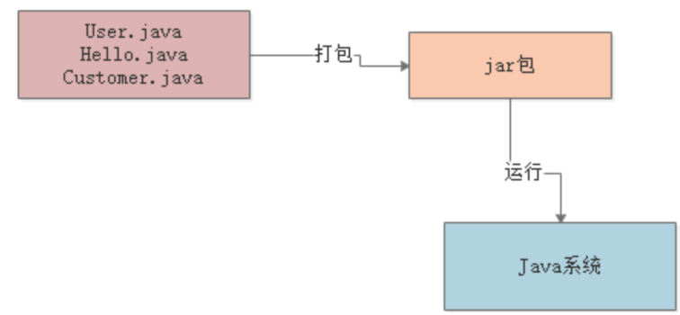

​	但是实际上这里有一个非常关键的步骤，那就是**“编译"**。也就是说，在我们写好的“.java”代码打包的过程中，一般就会把代码编译成“.class”后缀的字节码文件，比如“User.class”，“Hello.class”，”Customer.class“。然后这个“.class”后缀的字节码文件，他才是可以被运行起来的！  

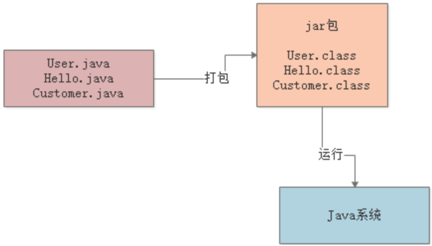

​	对于编译好的这些“.class”字节码，是怎么让他们运行起来的呢？这个时候就需要使用诸如“java -jar”之类的命令来运行我们写好的代码了。此时一旦你采用“java”命令，实际上此时就会启动一个JVM进程。这个JVM就会来负责运行这些“.class”字节码文件，也就相当于是负责运行我们写好的系统。  

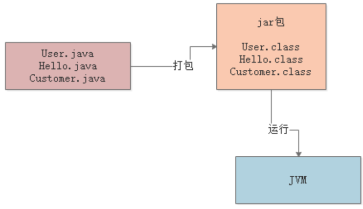

​	接着下一步，JVM要运行这些“.class”字节码文件中的代码，那是不是首先得把这些“.class”文件中包含的各种类给加载进来？这些“.class”文件不就是我们写好的一个一个的类吗？

​	此时就会有一个**“类加载器”**的概念。此时会采用类加载器把编译好的那些“.class”字节码文件给加载到JVM中，然后供后续代码运行来使用。

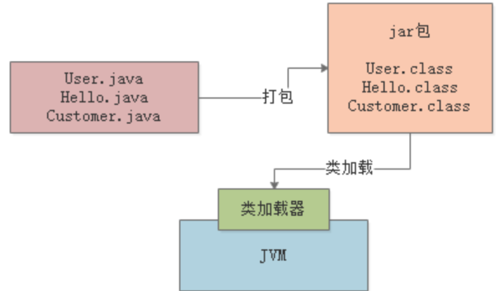

​	最后一步，JVM就会基于自己的**字节码执行引擎**，来执行加载到内存里的我们写好的那些类了。

​	比如你的代码中有一个“main()”方法，那么JVM就会从这个“main()”方法开始执行里面的代码。他需要哪个类的时候，就会使用类加载器来加载对应的类，反正对应的类就在“.class”文件中。  

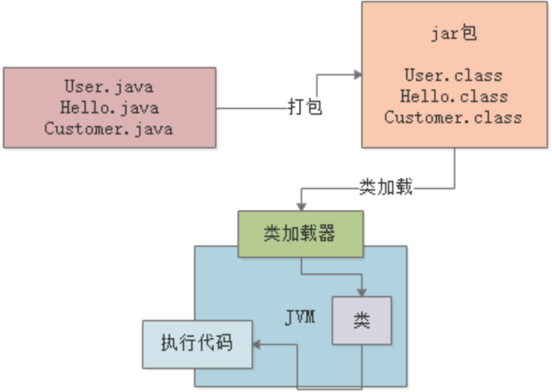


## 二、JVM 类加载机制  

### 2.1 加载过程

​	JVM在什么情况下会加载一个类？  

​	其实类加载过程非常的琐碎复杂，但是对于我们平时从工作中实用的角度来说，主要是把握他的核心工作原理就可以。
一个类从加载到使用，一般会经历下面的这个过程：  

​	**加载 -> 验证 -> 准备 -> 解析 -> 初始化 -> 使用 -> 卸载**  

​	所以首先要搞明白的第一个问题，就是JVM在执行我们写好的代码的过程中，一般在什么情况下会去加载一个类呢？
也就是说，啥时候会从“.class”字节码文件中加载这个类到JVM内存里来。  

​	其实答案非常简单，就是在**你的代码中用到这个类的时候**。  


​	举个简单的例子：
​	比如下面你有一个类（Kafka.class），里面有一个“main()”方法作为主入口。那么一旦你的JVM进程启动之后，它一定会先把你的这个类（Kafka.cass）加载到内存里，然后从“main()”方法的入口代码开始执行。  

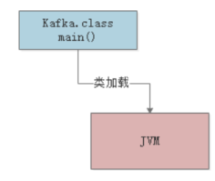

​	接着假设上面的代码中，出现了如下的这么一行代码：  

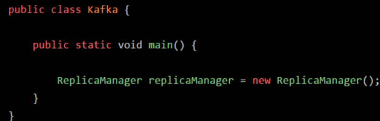

​	这时可能大家就想了，你的代码中明显需要使用“ReplicaManager”这个类去实例化一个对象，此时必须得把“ReplicaManager.class”字节码文件中的这个类加载到内存里来啊！  

​	所以这个时候就会触发JVM通过类加载器，从“ReplicaManager.class”字节码文件中加载对应的类到内存里来使用，这样代码才能跑起来。  

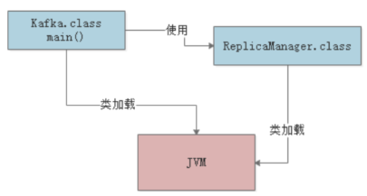

​	简单概括一下：首先你的代码中包含“main()”方法的主类一定会在JVM进程启动之后被加载到内存，开始执行你的“main()”方法中的代码接着遇到你使用了别的类，比如“ReplicaManager”，此时就会从对应的“.class”字节码文件加载对应的类到内存里来。  


### 2.2 验证、准备和初始化的过程  

（1）验证阶段
	简单来说，这一步就是根据Java虚拟机规范，来校验你加载进来的“.class”文件中的内容，是否符合指定的规范。这个相信很好理解，假如说，你的“.class”文件被人篡改了，里面的字节码压根儿不符合规范，那么JVM是没法去执行这个字节码的！所以把“.class”加载到内存里之后，必须先验证一下，校验他必须完全符合JVM规范，后续才能交给JVM来运行。  

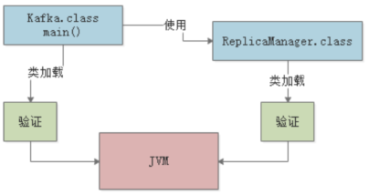

（2）准备阶段
	这个阶段其实也很好理解，咱们都知道，我们写好的那些类，其实都有一些类变量比如下面的这个“ReplicaManager”类：  

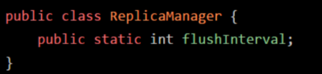

​	假设你有这么一个“ReplicaManager”类，他的“ReplicaManager.class”文件内容刚刚被加载到内存之后，会进行验证，确认这个字节码文件的内容是规范的。
​	接着就会进行准备工作。这个准备工作，其实就是给这个“ReplicaManager”类分配一定的内存空间。然后给他里面的类变量（也就是static修饰的变量）分配内存空间，来一个默认的初始值。

​	比如上面的示例里，就会给“flushInterval”这个类变量分配内容空间，给一个“0”这个初始值。  

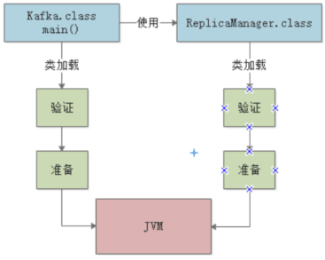

（3）解析阶段
	这个阶段干的事儿，实际上是把**符号引用替换为直接引用**的过程，其实这个部分的内容很复杂，涉及到JVM的底层。

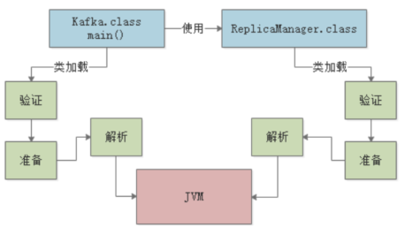

（4）三个阶段的小结
	其实这三个阶段里，最核心的大家务必关注的，就是“准备阶段”。因为这个阶段是给加载进来的类分配好了内存空间，类变量也分配好了内存空间，并且给了默认的初始值，这个概念，大家心里一定要有。  


### 2.3 核心阶段：初始化  

​	之前说过，在准备阶段时，就会把我们的“ReplicaManager”类给分配好内存空间。另外他的一个类变量“flushInterval”也会给一个默认的初始值“0”，那么接下来，在初始化阶段，就会正式执行我们的类初始化的代码了。  

​	那么什么是类初始化的代码呢？我们来看看下面这段代码：  

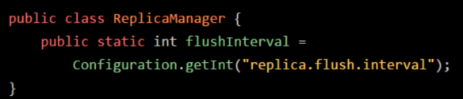

​	大家可以看到，对于“flushInterval”这个类变量，我们是打算通过Configuration.getInt("replica.flush.interval")这段代码
来获取一个值，并且赋值给他的。但是在准备阶段会执行这个赋值逻辑吗？  
​	NO！在准备阶段，仅仅是给“flushInterval”类变量开辟一个内存空间，然后给个初始值“0”罢了。那么这段赋值的代码什么时候执行呢？答案是在**“初始化”**阶段来执行。  

​	在这个阶段，就会执行类的初始化代码，比如上面的 Configuration.getInt("replica.flush.interval") 代码就会在这里执行，完成一个配置项的读取，然后赋值给这个类变量“flushInterval”。  

​	另外比如下图的static静态代码块，也会在这个阶段来执行。  

​	类似下面的代码语义，可以理解为类初始化的时候，调用“loadReplicaFromDish()”方法从磁盘中加载数据副本，并且放在静态变量“replicas”中：  

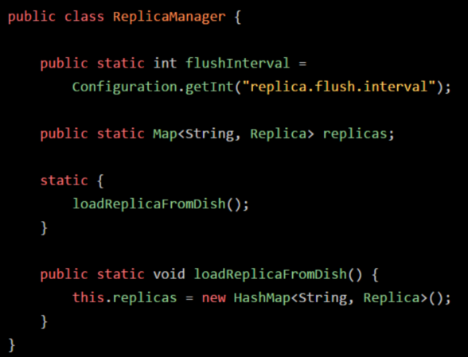

​	那么搞明白了类的初始化是什么，就得来看看类的初始化的规则了。  


**什么时候会初始化一个类？**  

​	一般来说有以下一些时机：比如“new ReplicaManager()”来实例化类的对象了，此时就会触发类的加载到初始化的全过程，把这个类准备好，然后再实例化一个对象出来；或者是包含“main()”方法的主类，必须是立马初始化的。
​	此外，这里还有一个非常重要的规则，就是如果初始化一个类的时候，发现他的父类还没初始化，那么必须先初始化他的父类。比如下面的代码：  

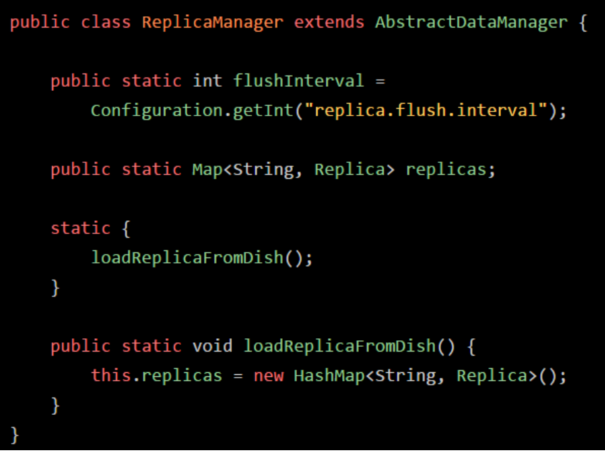

​	如果你要“new ReplicaManager()”初始化这个类的实例，那么会加载这个类，然后初始化这个类。但是初始化这个类之前，发现AbstractDataManager作为父类还没加载和初始化，那么必须先加载这个父类，并且初始化这个父类。  


### 2.4 类加载器和双亲委派机制  

​	现在相信大家都搞明白了整个类加载从触发时机到初始化的过程了，接着给大家说一下类加载器的概念。因为实现上述过程，那必须是依靠类加载器来实现的
那么Java里有哪些类加载器呢？简单来说有下面几种 ：

**（1）启动类加载器**  
	**Bootstrap ClassLoader**，他主要是负责加载我们在机器上安装的Java目录下的核心类的相信大家都知道，如果你要在一个机器上运行自己写好的Java系统，无论是windows笔记本，还是linux服务器，是不是都得装一下JDK？那么在你的Java安装目录下，就有一个“lib”目录，大家可以自己去找找看，这里就有Java最核心的一些类库，支撑你的Java系统的运行。
	所以一旦你的JVM启动，那么首先就会依托启动类加载器，去加载你的Java安装目录下的“lib”目录中的核心类库。  

**（2）扩展类加载器**
	**Extension ClassLoader**，这个类加载器其实也是类似的，就是你的Java安装目录下，有一个**“lib\ext”**目录这里面有一些类，就是需要使用这个类加载器来加载的，支撑你的系统的运行。
	那么你的JVM一旦启动，是不是也得从Java安装目录下，加载这个“lib\ext”目录中的类 。

**（3）应用程序类加载器**
	**Application ClassLoader**，这类加载器就负责去加载“ClassPath”环境变量所指定的路径中的类。其实你大致就理解为去加载你写好的Java代码吧，这个类加载器就负责加载你写好的那些类到内存里。  

**（4）自定义类加载器**
	除了上面那几种之外，还可以自定义类加载器，去根据你自己的需求加载你的类。  

**（5）双亲委派机制**
	JVM的类加载器是有亲子层级结构的，就是说启动类加载器是最上层的，扩展类加载器在第二层，第三层是应用程序类加载器，最后一
层是自定义类加载器。  

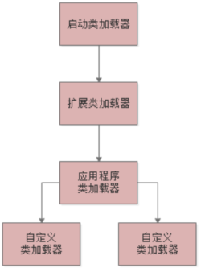

​	然后，基于这个亲子层级结构，就有一个**双亲委派的机制**。

​	就是假设你的应用程序类加载器需要加载一个类，他首先会委派给自己的父类加载器去加载，最终传导到顶层的类加载器去加载。但是如果父类加载器在自己负责加载的范围内，没找到这个类，那么就会下推加载权利给自己的子类加载器。  	

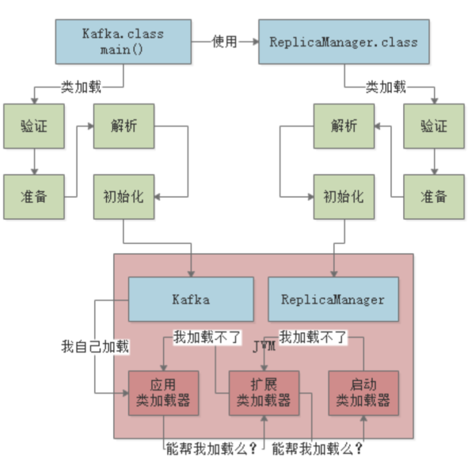


## 三、JVM的内存区域  

### 3.1 是什么

​	JVM在运行我们写好的代码时，他是必须使用多块内存空间的，不同的内存空间用来放不同的数据，然后配合我们写的代码流程，才能让我们的系统运行起来。  

​	举个最简单的例子，比如咱们现在知道了JVM会加载类到内存里来供后续运行，那么我问问大家，这些类加载到内存以后，放到哪儿去了呢？想过这个问题吗？  

​	所以JVM里就必须有一块内存区域，用来存放我们写的那些类。  

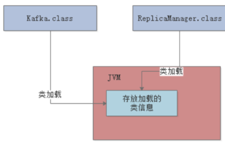

​	继续来看，我们的代码运行起来时，是不是需要执行我们写的一个一个的方法？ 那么运行方法的时候，方法里面有很多变量之类的东西，是不是需要放在某个内存区域里？接着如果我们写的代码里创建一些对象，这些对象是不是也需要内存空间来存放？   

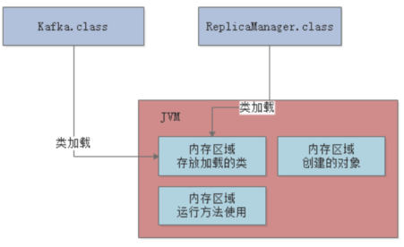

​	这就是为什么JVM中必须划分出来不同的内存区域，它是为了我们写好的代码在运行过程中根据需要来使用的。  


### 3.2 存放类的方法区  

​	这个方法区是在JDK 1.8以前的版本里，代表JVM中的一块区域。主要是放从“.class”文件里加载进来的类，还会有一些类似常量池的东西放在这个区域里。  但是在JDK 1.8以后，这块区域的名字改了，叫做“Metaspace”，可以认为是“元数据空间”这样的意思。当然这里主要还是存放我们自己写的各种类相关的信息。 

​	举个例子，还是跟我们之前说的那样，假设我们有一个“Kafka.class”类和“ReplicaManager.class”类，类似下面的代码。  

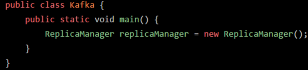

​	这两个类加载到JVM后，就会放在这个方法区中，大家看下图：  

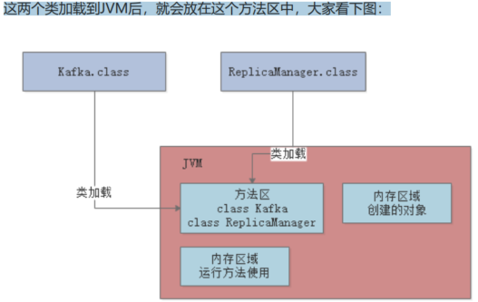


### 3.3 执行代码指令用的程序计数器  

​	继续假设我们的代码是如下所示：  

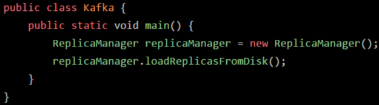

​	之前给大家讲过，实际上上面那段代码首先会存在于“.java”后缀的文件里，这个文件就是**java源代码**文件。但是这个文件是面向我们程序员的，计算机他是看不懂你写的这段代码的。所以此时就得通过编译器，**把“.java”后缀的源代码文件编译为“.class”后缀的字节码文件**。这个**“.class”**后缀的字节码文件里，存放的就是对你写出来的代码编译好的字节码了。字节码才是计算器可以理解的一种语言，而不是我们写出来的那一堆代码。  

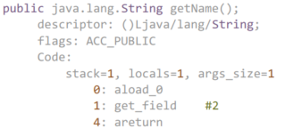

​	这段字节码就是让大家知道“.java”翻译成的“.class”是大概什么样子的。比如“0: aload_0”这样的，就是“字节码指令”，他对应了一条一条的机器指令，计算机只有读到这种机器码指令，才知道具体应该要干什么。比如字节码指令可能会让计算机从内存里读取某个数据，或者把某个数据写入到内存里去，都有可能，各种各样的指令就会指示计算机去干各种各样的事情。  

​	所以现在大家首先明白一点：**我们写好的Java代码会被翻译成字节码，对应各种字节码指令**  

​	现在Java代码通过JVM跑起来的第一件事情就明确了， 首先Java代码被编译成字节码指令，然后字节码指令一定会被一条一条执行，这样才能实现我们写好的代码执行的效果。  

​	所以当JVM加载类信息到内存之后，实际就会使用自己的**字节码执行引擎**，去执行我们写的代码编译出来的代码指令  

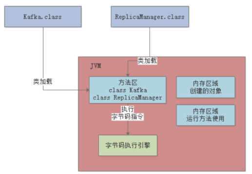

​	那么在执行字节码指令的时候，JVM里就需要一个特殊的内存区域了，那就是“**程序计数器**”。这个程序计数器就是**用来记录当前执行的字节码指令的位置的**，也就是记录目前执行到了哪一条字节码指令。  

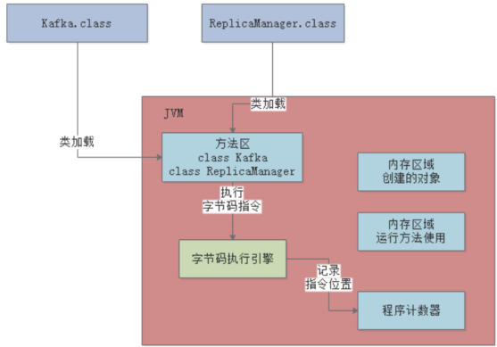

​	大家都知道JVM是支持多个线程的，所以其实你写好的代码可能会开启多个线程并发执行不同的代码，所以就会有多个线程来并发的执行不同的代码指令。 因此每个线程都会有自己的一个程序计数器，专门记录当前这个线程目前执行到了哪一条字节码指令了 。

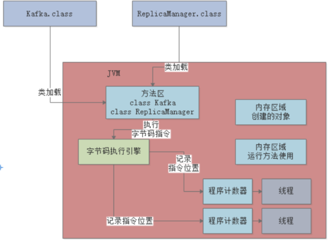


### 3.4 Java虚拟机栈  

​	Java代码在执行的时候，一定是线程来执行某个方法中的代码。 哪怕就是下面的代码，也会有一个main线程来执行main()方法里的代码。在main线程执行main()方法的代码指令的时候，就会通过main线程对应的程序计数器记录自己执行的指令位置。  

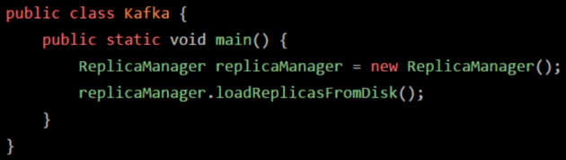

​	但是在方法里，我们经常会定义一些方法内的局部变量。比如在上面的main()方法里，其实就有一个“replicaManager”局部变量，他是引用一个ReplicaManager实例对象的，关于这个对象我们先别去管他，先来看方法和局部变量。

​	因此，JVM必须有一块区域是来保存每个方法内的局部变量等数据的，这个区域就是**Java虚拟机栈**。**每个线程都有自己的Java虚拟机栈**，比如这里的main线程就会有自己的一个Java虚拟机栈，用来存放自己执行的那些方法的局部变量。  
​	如果线程执行了一个方法，就会对这个方法调用创建对应的一个**栈帧。**栈帧里就有这个方法的局部变量表 、操作数栈、动态链接、方法出口等东西。  

​	比如main线程执行了main()方法，那么就会给这个main()方法创建一个栈帧，压入main线程的Java虚拟机栈。同时在main()方法的栈帧里，会存放对应的“replicaManager”局部变量。


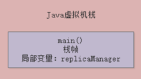

​	然后假设main线程继续执行ReplicaManager对象里的方法，比如下面这样，就在“loadReplicasFromDisk”方法里定义了一个局部变量：“hasFinishedLoad”  

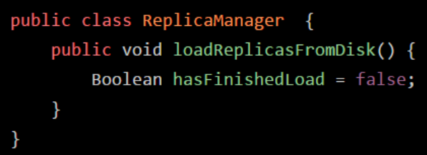

​	那么main线程在执行上面的“loadReplicasFromDisk”方法时，就会为“loadReplicasFromDisk”方法创建一个栈帧压入线程自己的Java虚拟机栈里面去。然后在栈帧的局部变量表里就会有“hasFinishedLoad”这个局部变量。   

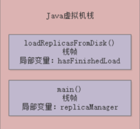

​	接着如果“loadReplicasFromDisk”方法调用了另外一个“isLocalDataCorrupt()”方法 ，这个方法里也有自己的局部变量  

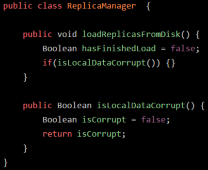

​	那么这个时候会给“isLocalDataCorrupt”方法又创建一个栈帧，压入线程的Java虚拟机栈里。而且“isLocalDataCorrupt”方法的栈帧的局部变量表里会有一个“isCorrupt”变量，这是“isLocalDataCorrupt”方法的局部变量。

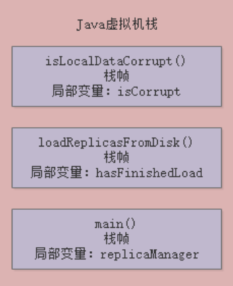

​	接着如果“isLocalDataCorrupt”方法执行完毕了，就会把“isLocalDataCorrupt”方法对应的栈帧从Java虚拟机栈里给出栈。然后如果“loadReplicasFromDisk”方法也执行完毕了，就会把“loadReplicasFromDisk”方法也从Java虚拟机栈里出栈。上述就是JVM中的“Java虚拟机栈”这个组件的作用：调用执行任何方法时，都会给方法创建栈帧然后入栈 。

​	咱们再来看一个图，了解一下每个线程在执行代码时，除了程序计数器以外，还搭配了一个Java虚拟机栈内存区域来存放每个方法中的局部变量表。  

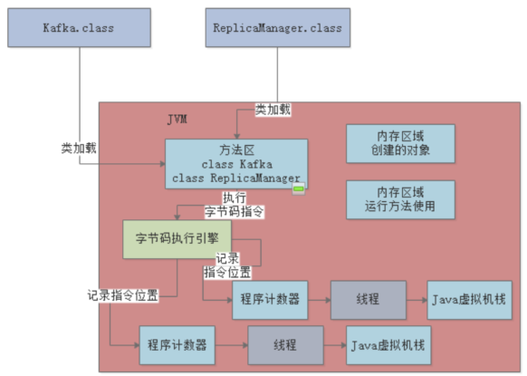


### 3.5 Java堆内存  

​	现在大家都知道了，main线程执行main()方法的时候，会有自己的程序计数器。此外，还会依次把main()方法，loadReplicasFromDisk()方法，isLocalDataCorrupt()方法的栈帧压入Java虚拟机栈，存放每个方法的局部变量。  

​	那么接着我们就得来看JVM中的另外一个非常关键的区域，就是**Java堆内存**，这里就是**存放我们在代码中创建的各种对象的**  

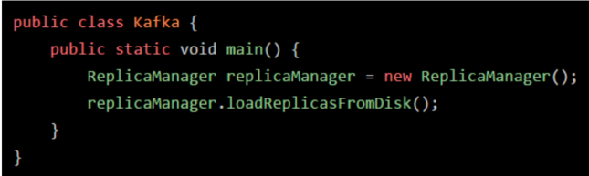

​	上面的“new ReplicaManager()”这个代码就是创建了一个ReplicaManager类的对象实例，这个对象实例里面会包含一些数据，如下面的代码所示。
这个“ReplicaManager”类里的“replicaCount”就是属于这个对象实例的一个数据。类似ReplicaManager这样的对象实例，就会存放在Java堆内存里。  

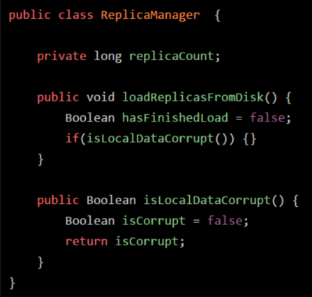

​	Java堆内存区域里会放入类似ReplicaManager的对象，然后我们因为在main方法里创建了ReplicaManager对象的，那么在线程执行main方法代码的时候，就会在main方法对应的栈帧的局部变量表里，让一个引用类型的“replicaManager”局部变量来存放ReplicaManager对象的地址。
​	相当于你可以认为局部变量表里的“replicaManager”指向了Java堆内存里的ReplicaManager对象。

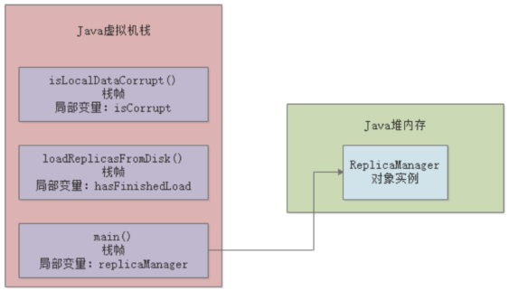

###   3.6 核心内存区域的全流程串讲  

​	其实我们把上面的那个图和下面的这个总的大图一起串起来看看，还有配合整体的代码，我们来捋一下整体的流程，大家就会觉得很清晰。

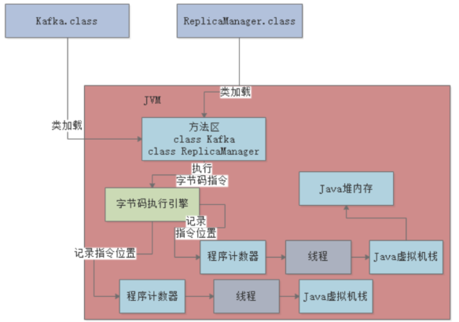

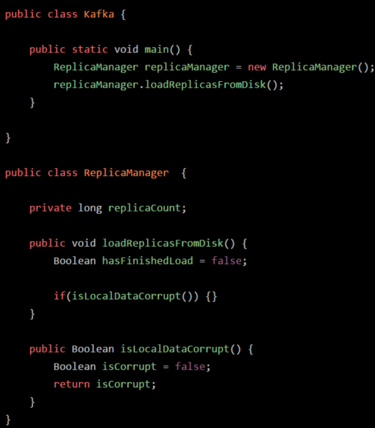


​	首先，你的JVM进程会启动，就会先加载你的Kafka类到内存里。然后有一个main线程，开始执行你的Kafka中的main()方法。main线程是关联了一个程序计数器的，那么他执行到哪一行指令，就会记录在这里。其次，就是main线程在执行main()方法的时候，会在main线程关联的Java虚拟机栈里，压入一个main()方法的栈帧。

​	接着会发现需要创建一个ReplicaManager类的实例对象，此时会加载ReplicaManager类到内存里来。  

​	然后会创建一个ReplicaManager的对象实例分配在Java堆内存里，并且在main()方法的栈帧里的局部变量表引入一个“replicaManager”变量，让他引用ReplicaManager对象在Java堆内存中的地址。

​	接着，main线程开始执行ReplicaManager对象中的方法，会依次把自己执行到的方法对应的栈帧压入自己的Java虚拟机栈执行完方法之后再把方法对应的栈帧从Java虚拟机栈里出栈。  


## 四、垃圾回收

### 4.1 对象的分配与引用

​	现在我们假设有下面一段代码，大概意思你可以理解为通过“loadReplicasFromDisk”方法的执行，去磁盘上加载需要的副本数据。然后通过“ReplicaManager”对象实例完成了这个操作。

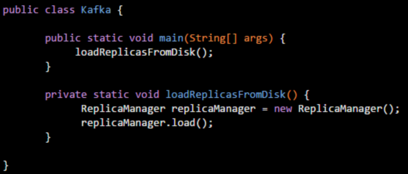

​	结合我们之前理解过的JVM运行原理，一起通过动态的图来拆解一下上述代码的运行流程。首先一个main线程肯定会来执行main()方法里的代码
main线程自己是有一个Java虚拟机栈的，他会把main()方法的栈帧压入Java虚拟机栈。

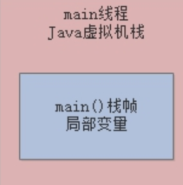

​	接着main()方法里调用了loadReplicasFromDisk()方法。那么就会创建loadReplicasFromDisk()方法的栈帧，压入main线程的Java虚拟机栈里去。 

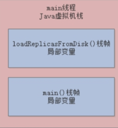

​	此时发现在loadReplicasFromDisk()方法里，有一个“repliaManager”变量，那么就会在loadReplicasFromDisk()。方法对应的栈帧里，放入一个“repliaManager”变量。  

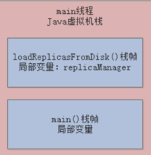

​	接着发现在代码里创建了一个“ReplicaManager”类的实例对象，此时就会在Java堆内存中分配这个实例对象的内存空间。  同时，让loadReplicasFromDisk()方法的栈帧内的“replicaManager”局部变量去指向那个Java堆内存里的ReplicaManager实例对象，  

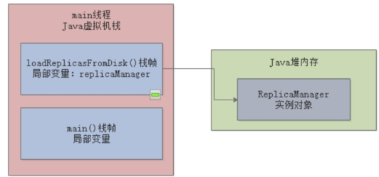

​	接下来，就会执行通过“replicaManager”局部变量引用的“ReplicaManager”实例对象去执行他的load()方法，去完成我们实现的业务逻辑。  


### 4.2 JVM垃圾回收

​	JVM本身是有垃圾回收机制的，他是一个后台自动运行的线程，你只要启动一个JVM进程，他就会自带这么一个垃圾回收的后台线程。这个线程会在后台不断检查JVM堆内存中的各个实例对象还是给大家画一张图，来看看这个过程：  

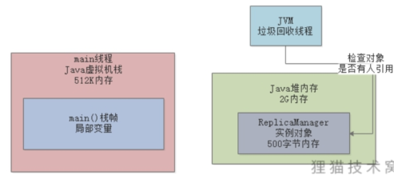

​	如果某个实例对象没有任何一个方法的局部变量指向他，也没有任何一个类的静态变量，包括常量等地方在指向他。那么这个垃圾回收线程，就会把这个没人指向的“ReplicaManager”实例对象给回收掉，从内存里清除掉，让他不再占用任何内存资源。  


# 第二章 JVM垃圾回收原理

## 一、JVM分代模型

如上次的代码

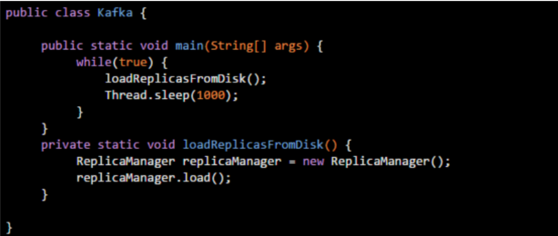

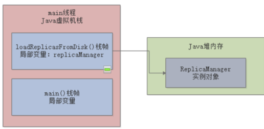

​	在上面代码中，那个ReplicaManager对象，实际上属于短暂存活的这么一个对象 。大家可以观察一下，在loadReplicasFromDisk()方法中创建这个对象，然后执行ReplicaManager对象的load()方法，然后执行完毕之后，loadReplicasFromDisk()方法就会结束。一旦方法结束，那么loadReplicasFromDisk()方法的栈帧就会出栈。此时一旦没人引用这个ReplicaManager对象了，就会被JVM的垃圾回收线程给回收掉，释放内存空间，如下图 

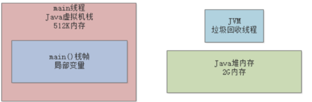

​	可能每次执行loadReplicasFromDisk()方法的时候，被创建出来，然后执行他的load()方法，接着可能1毫秒之后，就被垃圾回收掉 。 

​	但是我们来看另外一段代码，假如说咱们用下面的这种方式来实现同样的功能：  

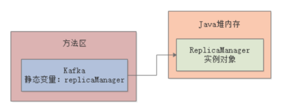

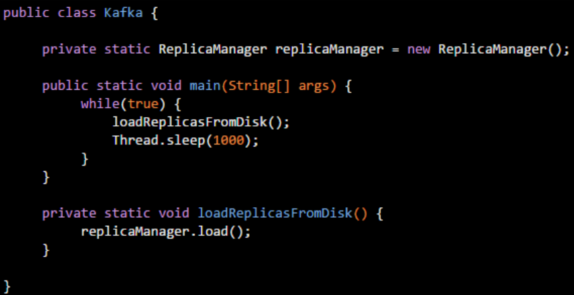

​	接着在main()方法中，就会在一个while循环里，不停的调用ReplicaManager对象的load()方法，做成一个周期性运行的模式。这个时候，我们就要来思考一下，这个ReplicaManager实例对象，他是会一直被Kafka的静态变量引用的，然后会一直驻留在Java堆内存里，是不会被垃圾回收掉的。因为这个实例对象他需要长期被使用，周期新的被调用load()方法，所以他就成为了一个长时间存在的对象。  

​	那么类似这种被类的静态变量长期引用的对象，他需要长期停留在Java堆内存里，这这种对象就是生存周期很长的对象，他是轻易不会被垃圾回收的，他需要长期存在，不停的去使用他。 


## 二、 JVM分代模型：年轻代和老年代  

​	采用不同的方式来创建和使用对象，其实对象的生存周期是不同的。所以JVM将Java堆内存划分为了两个区域，一个是年轻代，一个是老年代。其中年轻代，顾名思义，就是把第一种代码示例中的那种，创建和使用完之后立马就要回收的对象放在里面然后老年代呢，就是把第二种代码示例中的那种，创建之后需要一直长期存在的对象放在里面。

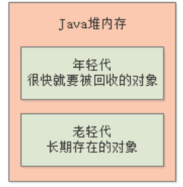

​	比如下面的代码，我们再次来改造一下，再结合图，大家会看的更加的明确一些。


​	Kafka的静态变量“fetcher”引用了ReplicaFetcher对象，这是长期需要驻留在内存里使用的。这个对象会在年轻代里停留一会儿，但是最终会进入老年代。


​	进入main()方法之后，会先调用loadReplicasFromDisk()方法，业务含义是系统启动就从磁盘加载一次副本数据，这个方法的栈帧会入栈然后在这个方法里面创建了一个ReplicaManager对象，这个对象他是用完就会回收，所以是会放在年轻代里的，由栈帧里的局部变量来引用。


​	然后一旦loadReplicasFromDisk()方法执行完毕了，方法的栈帧就会出栈，对应的年轻代里的ReplicaManager对象也会被回收掉。  


​	但是接着会执行一段while循环代码，他会周期性的调用ReplicaFetcher的fetch()方法，去从远程加载副本数据。**所以ReplicaFetcher这个对象因为被Kafka类的静态变量fetcher给引用了**，所以他会长期存在于老年代里的，持续被使用。  


对于年轻代里的对象，他们的特点是创建之后很快就会被回收，所以需要用一种垃圾回收算法
对于老年代里的对象，他们的特点是需要长期存在，所以需要另外一种垃圾回收算法，所以需要分成两个区域来放不同的对象。  
JVM里的永久代其实就是我们之前说的方法区，你可以认为永久代就是放一些类信息的。


## 三、对象分配原则

​	大部分的正常对象，都是优先在新生代分配内存的。  


​	虽然我们看代码知道，类静态变量“fetcher”引用的那个“ReplicaFetcher”对象，是会长期存活在内存里的。但是哪怕是这种对象，其实刚开始你通过“new ReplicaFetcher()”代码来实例化一个对象时，他也是分配在新生代里的。包括在“loadReplicasFromDisk()”方法中创建的“ReplicaManager”实例对象，也都是一样分配在新生代里的。


​	到底什么情况下会触发新生代的垃圾回收？  

​	一旦“loadReplicasFromDisk()”方法执行完毕之后，这个方法的栈帧出栈，会导致没有任何局部变量引用那个“ReplicaManager”实例对象了。  


​	那么此时就一定会立即发生垃圾回收，去回收掉Java堆内存里那个没人使用的“ReplicaManager”实例对象吗？NO！大家别想的那么简单了，实际上垃圾回收他也得有点触发的条件。  

​	其中一个比较常见的场景可能是这样的，假设我们写的代码中创建了N多对象，然后导致Java堆内存里囤积了大量的对象。然后这些对象都是之前有人引用，比如各种各样的方法中的局部变量，但是现在也都没人引用了。  


​	这个时候，如果新生代我们预先分配的内存空间，几乎都被全部对象给占满了！此时假设我们代码继续运行，他需要在新生代里去分配一个对象，怎么办？发现新生代里内存空间都不够了！  

​	这个时候，就会触发一次新生代内存空间的垃圾回收，新生代内存空间的垃圾回收，也称之为**“Minor GC”**，有的时候我们也叫**“Young GC”**，他会尝试把新生代里那些没有人引用的垃圾对象，都给回收掉。  

​	比如上图中，那个“ReplicaManager”实例对象，其实就是没有人引用的垃圾对象此时就会当机立断，把“ReplicaManager”实例对象给回收掉，腾出更多的内存空间，然后放一个新的对象到新生代里去。包括上图中那大量的实例对象，其实也都没人引用，在这个新生代垃圾回收的过程中，就会把这些垃圾对象也都回收掉。  

​	我们在代码中创建的大部分对象，其实都是这种使用之后立马就可以回收掉的生存周期极短的对象，是不是？
​	可能我们会在新生代里分配大量的对象，但是使用完之后立马就没人引用了，此时新生代差不多满了然后要分配新的对象的时候，发现新生代内存空间不足，就会触发一次垃圾回收，然后就把所有垃圾对象给干掉，腾出大量的内存空间。  


​	**长期存活的对象会躲过多次垃圾回收**  

​	接着我们来看下一个问题，上图中大家都注意到了“ReplicaFetcher”实例对象，他是一个长期被“Kafka”类的静态变量“fetcher”引用的长期存活的对象。所以虽然你的新生代可能随着系统的运行，不停的创建对象，然后让新生代变满，接着垃圾回收一次，大量对象被回收掉但是你的这个“ReplicaFetcher”对象，他确是一直会存活在新生代里的。  

​	因为他一直被“Kafka”类的静态变量给引用了，所以他不会被回收。那么此时JVM就有一条规定了。如果一个实例对象在新生代中，成功的在15次垃圾回收之后，还是没被回收掉，就说明他已经15岁了。这是对象的年龄，每垃圾回收一次，如果一个对象没被回收掉，他的年龄就会增加1。 所以如果上图中的那个“ReplicaFetcher”对象在新生代中成功躲过10多次垃圾回收，成为一个“老年人”，那么就会被认为是会长期存活在内存里的对象。然后他会被转移到Java堆内存的老年代中去，顾名思义，老年代就是放这些年龄很大的对象。   


​	因为老年代里的对象也有可能随着代码的运行，不再被任何人引用了，就需要被垃圾回收。大家可以思考一下，如果随着类似上面的情况，越来越多的对象进入老年代，一旦老年代也满了，是不是就要对老年代垃圾回收了？没错，这是肯定的。


**总结：**

先理解对象优先分配在新生代
新生代如果对象满了，会触发Minor GC回收掉没有人引用的垃圾对象
如果有对象躲过了十多次垃圾回收，就会放入老年代里
如果老年代也满了，那么也会触发垃圾回收，把老年代里没人引用的垃圾对象清理掉  


## 四、JVM相关参数

​	在JVM内存分配中，有几个参数是比较核心的，如下所示。 

-Xms：Java堆内存的大小
-Xmx：Java堆内存的最大大小
-Xmn：Java堆内存中的新生代大小，扣除新生代剩下的就是老年代的内存大小了
-XX:PermSize：永久代大小
-XX:MaxPermSize：永久代最大大小
-Xss：每个线程的栈内存大小  


​	-Xms和-Xmx，分别用于设置Java堆内存的刚开始的大小，以及允许扩张到的最大大小。对于这对参数，通常来说，都会设置为完全一样的大小。这两个参数，是用来限定Java堆内存的总大小的。


​	-Xmn，这个参数也是很常见的，他用来设置Java堆内存中的新生代的大小，然后扣除新生代大小之后的剩余内存就是给老年代的内存大小。


​	-XX:PermSize和-XX:MaxPermSize，分别限定了永久代大小和永久代的最大大小。如果是JDK1.8以后的版本，那么这俩参数被替换为了-XX:MetaspaceSize和-XX:MaxMetaspaceSize，但是大家至少得知道，这两个参数限定了永久代的大小。


​	-Xss，这个参数限定了每个线程的栈内存大小  

​	大家都很清楚，每个线程都有一个自己的虚拟机栈，然后每次执行一个方法，就会将方法的栈帧压入线程的栈里，方法执行完毕，那么栈帧就会从线程的栈里出栈 。


 

## 五、JVM垃圾回收时机

### 5.1 垃圾回收时机

​	什么时候会触发垃圾回收？  

​	平时我们系统运行创建的对象都是优先分配在新生代里的。  


​	然后如果新生代里的对象越来越多，都快满了，此时就会触发垃圾回收，把新生代没有人引用的对象给回收掉，释放内存空间。大家务必注意，这就是新生代一个核心的垃圾回收触发时机。


​	被哪些变量引用的对象是不能回收的？  

首先第一个问题，一旦新生代快满了，那么垃圾回收的时候，到底哪些对象是能回收的，哪些对象是不能回收的呢？这个问题非常好解释，JVM中使用了一种**可达性分析算法**来判定哪些对象是可以被回收的，哪些对象是不可以被回收的。这个算法的意思，就是说对每个对象，都分析一下有谁在引用他，然后一层一层往上去判断，看是否有一个**GC Roots**。  


​	上面的代码其实就是在一个方法中创建了一个对象，然后有一个局部变量引用了这个对象，这种情况是最常见的。

​	此时如下图所示。“main()”方法的栈帧入栈，然后调用“loadReplicasFromDisk()”方法，栈帧入栈，接着让局部变量“replicaManager”引用堆内存里的“ReplicaManager”实例对象。


​	假设现在上图中“ReplicaManager”对象被局部变量给引用了，那么此时一旦新生代快满了，发生垃圾回收，会去分析这个“ReplicaManager”对象的可达性。这时，发现他是不能被回收的，因为他被人引用了，而且是被局部变量“replicaManager”引用的。  

​	在JVM规范中，局部变量就是可以作为**GC Roots**的，只要一个对象被局部变量引用了，那么就说明他有一个GC Roots，此时就不能被回收了。另外比较常见的一个情况，其实就是类似下面的代码。 


​	大家可以分析一下上面的代码，如下图所示  


​	大家按照上图思考一下，此时垃圾回收的时候一分析，发现这个“ReplicaManager”对象被Kafka类的一个静态变量“replicaManager”给引用了。此时在JVM的规范里，静态变量也可以看做是一种GC Roots，此时只要一个对象被GC Roots引用了，就不会去回收他。  

​	一句话总结：只要你的对象被**方法的局部变量、类的静态变量**给引用了，就不会回收他们。  


### 5.2 Java中对象不同的引用类型  

​	关于引用和垃圾回收的关系，大家在这里务必有脑子里要引入一个新的概念，那就是Java里有不同的引用类型。分别是强引用、软引用、弱引用和虚引用。下面分别用代码来示范一下。  

​	强引用，就是类似下面的代码：  


​	这个就是最普通的代码，一个变量引用一个对象，**只要是强引用的类型，那么垃圾回收的时候绝对不会去回收这个对象的**。  

​	接着是软引用，类似下面的代码。  


​	就是把“ReplicaManager”实例对象用一个“SoftReference”软引用类型的对象给包裹起来了，此时这个“replicaManager”变量。对“ReplicaManager”对象的引用就是软引用了。  

​	正常情况下垃圾回收是不会回收软引用对象的，但是如果你进行垃圾回收之后，**发现内存空间还是不够存放新的对象，内存都快溢出了。此时就会把这些软引用对象给回收掉，哪怕他被变量引用了**，但是因为他是软引用，所以还是要回收。  

​	接着是弱引用，类似下面的代码。  


​	这个其实非常好解释，**这个弱引用就跟没引用是类似的，如果发生垃圾回收，就会把这个对象回收掉。**  

​	虚引用，这个大家其实暂时忽略他也行，因为很少用。  其实这里比较常用的，**就是强引用和软引用**，强引用就是代表绝对不能回收的对象，软引用就是说有的对象可有可无，如果内存实在不够了，可以回收他 。 


### 5.3 finalize()方法的作用  

​	有GC Roots引用的对象不能回收，没有GC Roots引用的对象可以回收，如果有GC Roots引用，但是如果是软引用或者弱引用的，也有可能被回收掉。接着就是到回收的环节了，假设没有GC Roots引用的对象，是一定立马被回收吗？  

​	其实不是的，这里有一个finalize()方法可以拯救他自己，看下面的代码。  


​	假设有一个ReplicaManager对象要被垃圾回收了，那么假如这个对象重写了Object类中的finialize()方法。此时会先尝试调用一下他的finalize()方法，看是否把自己这个实例对象给了某个GC Roots变量，比如说代码中就给了ReplicaManager类的静态变量。如果重新让某个GC Roots变量引用了自己，那么就不用被垃圾回收了。  


# 第三章 JVM垃圾回收算法

## 一、JVM算法分类

​	针对新生代的垃圾回收算法，他叫做复制算法。简单来说，就是如下图所示，首先把新生代的内存分为两块。  


​	接着假设有如下代码，在“loadReplicasFromDisk()”方法中创建了对象，此时对象就就会分配在新生代其中一块内存空间里 ，而且是由“main线程”的栈内存中的“loadReplicasFromDisk()”方法的栈帧内的局部变量来引用的，如下图所示。   


​	接着大家想象一下，假设与此同时，代码在不停的运行，然后大量的对象都分配在了新生代内存的其中一块内存区域里，也只会分配在那块区域里而且分配过后，很快就失去了局部变量或者类静态变量的引用，成为了垃圾对象。


​	接着这个时候，新生代内存那块被分配对象的内存区域基本都快满了，再次要分配对象的时候，发现里面内存空间不足了。那么此时就会触发Minor GC去回收掉新生代那块被使用的内存空间的垃圾对象。  

​	假设现在采用的垃圾回收思路，就是直接对上图中被使用的那块内存区域中的垃圾对象进行标记。标记出哪些对象是可以被垃圾回收的，然后就直接对那块内存区域中的对象进行垃圾回收，把内存空出来。这种思路去垃圾回收，可能会在回收完毕之后造成那块内存区域看起来跟下图一样。  


​	看上面的图，不知道大家发现什么没有，在那块被使用的内存区域里，回收掉了大量的垃圾对象，但是保留了一些被人引用的存活对象。但是呢，存活对象在内存区域里东一个西一个，非常的凌乱，而且造成了大量的内存碎片。我们再看下面的图我用红线标记出来的区域，那些就是所谓的内存碎片。  


​	看到了吗？在各种凌乱的存活对象的中间，出现了大量的红圈圈出来的内存碎片。**这些内存碎片的大小不一样，有的可能很大，有的可能很小。 会造成内存浪费**。 

​	比如现在打算分配一个新的对象，尝试在上图那块被使用的内存区域里去分配，此时如下图所示，可能因为内存碎片太多的缘故，虽然所有的内存碎片加起来其实有很大的一块内存，但是因为这些内存都是碎片式分散的，所以导致没有一块完整的足够的内存空间来分配新的对象。  


​	所以这种直接对一块内存空间回收掉垃圾对象，保留存活对象的方法，绝对是不可取的，因为内存碎片太多，就是他最大的问题，会造成大量的内存浪费，很多内存碎片压根儿是没法使用的。  

​	**合理的回收算法**

​	首先，并不是按照上述思路直接对已经使用的那块内存把垃圾对象全部回收掉，然后保留全部存活对象。而是先对那块在使用的内存空间**标记出里面哪些对象是不能进行垃圾回收的**，就是要存活的对象。然后先把那些存活的对象**转移到另外一块空白的内存中。**  


​	通过把存活对象先转移到另外一块空白内存区域，我们可以把这些对象都比较紧凑的排列在内存里，这样就可以让被转移的那块内存区域几乎没有什么内存碎片，对象都是按顺序排列在这块内存里的。然后那块被转移的内存区域，是不是多出来一大块连续的可用的内存空间？此时就可以将新对象分配在那块连续内存空间里了。


​	这个时候，再一次性把原来使用的那块内存区域中的垃圾对象全部一扫而空，全部给回收掉，空出来一块内存区域。这就是所谓的**“复制算法“**，把**新生代**内存划分为**两块内存区域**，然后只使用其中一块内存，待那块内存快满的时候，就把里面的存活对象一次性转移到另外一块内存区域，保证没有内存碎片。接着一次性回收原来那块内存区域的垃圾对象，再次空出来一块内存区域。**两块内存区域就这么重复着循环使用**。  

​	缺点：从始至终，就只有一半的内存可以用，这样的算法显然**对内存的使用效率太低**了。  


​	**复制算法的优化：Eden区和Survivor区**  

​	我们之前分析过，其实绝大多数的对象都是存活周期非常短的对象，可能被创建出来1毫秒之后就没人引用了，他就是垃圾对象了。所以大家可以想象一下，可能一次新生代垃圾回收过后，99%的对象其实都被垃圾回收了，就1%的对象存活了下来，**可能就是一些长期存活的对象，或者还没使用完的对象**。 

​	所以实际上真正的复制算法会做出如下优化，把新生代内存区域划分为三块：   

​	1个Eden区，2个Survivor区，其中Eden区占80%内存空间，每一块Survivor区各占10%内存空间，比如说Eden区有800MB内存，每一块Survivor区就100MB内存，如下图。  


​	平时可以使用的，就是Eden区和其中一块Survivor区，那么相当于就是有900MB的内存是可以使用的，如下图所示


​	但是刚开始对象都是分配在Eden区内的，如果Eden区快满了，此时就会触发垃圾回收，此时就会把Eden区中的存活对象都一次性转移到一块空着的Survivor区。接着Eden区就会被清空，然后再次分配新对象到Eden区里，然后就会如上图所示，Eden区和一块Survivor区里是有对象的，其中**Survivor区里放的是上一次Minor GC后存活的对象。**  

​	如果下次再次Eden区满，那么再次触发Minor GC，就会把**Eden区和放着上一次Minor GC后存活对象的Survivor区内的存活对象，转**
**移到另外一块Survivor区去**。  


原因：

​	因为之前分析了，每次垃圾回收可能存活下来的对象就1%，所以在设计的时候就留了一块100MB的内存空间来存放垃圾回收后转移过来的存活对象
。比如Eden区+一块Survivor区有900MB的内存空间都占满了，但是垃圾回收之后，可能就10MB的对象是存活的。此时就把那10MB的存活对象转移到另外一块Survivor区域就可以，然后再一次性把Eden区和之前使用的Survivor区里的垃圾对象全部回收掉。


​	接着新对象继续分配在Eden区和**另外那块开始被使用的Survivor区**，然后**始终保持一块Survivor区是空着的**，就这样一直循环使用这三块内存区域。  

​	这么做最大的好处，就是只有10%的内存空间是被闲置的，90%的内存都被使用上了。无论是垃圾回收的性能，内存碎片的控制，还是说内存使用的效率，都非常的好。  


## 二、年轻代和老年代垃圾回收算法

​	首先我们来看下面的图，我们写好的代码在运行的过程中，就会不断的创建各种各样的对象，这些对象都会优先放到新生代的Eden区和Survivor1区。  


​	接着假如新生代的Eden区和Survivor1区都快满了，此时就会触发Minor GC，把存活对象转移到Survivor2区去。


​	然后接着就会使用Eden区和Survivor2区，来分配新的对象，如下图所示。  


​	**躲过15次GC之后进入老年代**  

​	按照上面的图示的那个过程，其实大家可以理解为我们写的系统刚启动的时候，创建的各种各样的对象，都是分配在新生代里的。然后慢慢系统跑着跑着，新生代就满了，此时就会触发Minor GC，可能就1%的少量存活对象转移到空着的Survivor区中。然后系统继续运行，继续在Eden区里分配各种对象，大概就是这个过程。  

​	那么之前给大家讲过，我们写的系统中有些对象是长期存在的对象，他是不会轻易的被回收掉的，比如下面的代码。  


​	只要这个“Kafka”类还存在，那么他的静态变量“replicaManager”就会长期引用“ReplicaManager”对象，所以你无论新生代怎么垃圾回收，类似这种对象都不会被回收掉的。  

​	此时这类对象每次在新生代里躲过一次GC被转移到一块Survivor区域中，此时他的年龄就会增长一岁。默认的设置下，当对象的年龄达到15岁的时候，也就是躲过15次GC的时候，他就会转移到老年代里去。这个具体是多少岁进入老年代，可以通过JVM参数“-XX:MaxTenuringThreshold”来设置，默认是15岁，大家看下图。  


​	**动态对象年龄判断**  

​	这里跟这个对象年龄有另外一个规则可以让对象进入老年代，不用等待15次GC过后才可以。  

​	他的大致规则就是，假如说当前放对象的Survivor区域里，一批对象的总大小大于了这块Survivor区域的内存大小的50%，那么此时大于等于这批对象年龄的对象，就可以直接进入老年代了。 


​	假设这个图里的Survivor2区有两个对象，这俩对象的年龄一样，都是2岁。 然后俩对象加起来对象超过了50MB，超过了Survivor2区的100MB内存大小的一半了，这个时候，Survivor2区里的大于等于2岁的对象，就要全部进入老年代里去。   

​	这就是所谓的**动态年龄判断**的规则，这条规则也会让一些新生代的对象进入老年代。  

​	另外这里要理清楚一个概念，就是实际这个规则运行的时候是如下的逻辑：年龄1+年龄2+年龄n的多个年龄对象总和超过了Survivor区域的50%，此时就会把年龄n以上的对象都放入老年代。  


​	**大对象直接进入老年代**  

​	有一个JVM参数，就是“-XX:PretenureSizeThreshold”，可以把他的值设置为字节数，比如“1048576”字节，就是1MB。他的意思就是，如果你要创建一个大于这个大小的对象，比如一个超大的数组，或者是别的啥东西，此时就直接把这个大对象放到老年代里去。压根儿不会经过新生代。

​	之所以这么做，就是要避免新生代里出现那种大对象，然后屡次躲过GC，还得把他在两个Survivor区域里来回复制多次之后才能进入老年代。那么大的一个对象在内存里来回复制，不是很耗费时间吗？所以说，这也是一个对象进入老年代的规则。  

 

​	**Minor GC后的对象太多无法放入Survivor区怎么办？**  

​	现在有一个比较大的问题，就是如果在Minor GC之后发现剩余的存活对象太多了，没办法放入另外一块Survivor区怎么办？如下图。


​	比如上面这个图，假设在发生GC的时候，发现Eden区里超过150MB的存活对象，此时没办法放入Survivor区中，此时该怎么办呢？
​	这个时候就必须得把这些对象直接转移到老年代去，如下图所示。  


​	**老年代空间分配担保规则**  

​	这个时候大家又想提一个问题了，如果新生代里有大量对象存活下来，确实是自己的Survivor区放不下了，必须转移到老年代去，那么如果老年代里空间也不够放这些对象呢？这该咋整呢？ 

​	首先，在执行任何一次Minor GC之前，JVM会先检查一下老年代可用的可用内存空间，**是否大于新生代所有对象的总大小**。  为啥检查这个呢？因为最极端的情况下，可能新生代Minor GC过后，所有对象都存活下来了，那岂不是新生代所有对象全部要进入老年代？如下图。 


​	如果说发现老年代的内存大小是大于新生代所有对象的，此时就可以放心大胆的对新生代发起一次Minor GC了，因为即使Minor GC之后所有对象都存活，Survivor区放不下了，也可以转移到老年代去。但是假如执行Minor GC之前，发现老年代的可用内存已经小于了新生代的全部对象大小了那么这个时候是不是有可能在Minor GC之后新生代的对象全部存活下来，然后全部需要转移到老年代去，但是老年代空间又不够？理论上，是有这种可能的。

​	所以假如Minor GC之前，发现老年代的可用内存已经小于了新生代的全部对象大小了，就会看一个“-XX:-HandlePromotionFailure”的参数是否设置了
如果有这个参数，那么就会继续尝试进行下一步判断。下一步判断，就是看看老年代的内存大小，是否大于之前每一次Minor GC后进入老年代的对象的平均大小。  

​	举个例子，之前每次Minor GC后，平均都有10MB左右的对象会进入老年代，那么此时老年代可用内存大于10MB。这就说明，很可能这次Minor GC过后也是差不多10MB左右的对象会进入老年代，此时老年代空间是够的，看下图。


​	如果上面那个步骤判断失败了，或者是“-XX:-HandlePromotionFailure”参数没设置，此时就会直接触发一次“Full GC”，就是对老年代进行垃圾回收，尽量腾出来一些内存空间，然后再执行Minor GC。  

​	如果上面两个步骤都判断成功了，那么就是说可以冒点风险尝试一下Minor GC。此时进行Minor GC有几种可能。 

​	第一种可能，Minor GC过后，剩余的存活对象的大小，是小于Survivor区的大小的，那么此时存活对象进入Survivor区域即可。 

​	第二种可能，Minor GC过后，剩余的存活对象的大小，是大于 Survivor区域的大小，但是是小于老年代可用内存大小的，此时就直接进入老年代即可。  

​	第三种可能，很不幸，Minor GC过后，剩余的存活对象的大小，大于了Survivor区域的大小，也大于了老年代可用内存的大小。此时老年代都放不下这些存活对象了，就会发生“**Handle Promotion Failure**”的情况，这个时候就会触发一次“**Full GC**”。  

​	Full GC就是对老年代进行垃圾回收，同时也一般会对新生代进行垃圾回收。  

​	因为这个时候必须得把老年代里的没人引用的对象给回收掉，然后才可能让Minor GC过后剩余的存活对象进入老年代里面。 

​	如果要是Full GC过后，老年代还是没有足够的空间存放Minor GC过后的剩余存活对象，那么**此时就会导致所谓的“OOM”内存溢出了**。因为内存实在是不够了，你还是要不停的往里面放对象，当然就崩溃了。

​	

​	**老年代垃圾回收算法**  

​	其实把上面的内容都看懂之后，大家现在基本就知道了Minor GC的触发时机，然后就是Minor GC之前要对老年代空间大小做的检查。 包括检查失败的时候要提前触发Full GC给老年代腾一些空间出来，或者是Minor GC过后剩余对象太多放入老年代内存都不够，也要触发Full GC。包括这套规则，还有触发老年代垃圾回收的Full GC时机，都给大家讲清楚了。 

​	简单来说，一句话总结，**对老年代触发垃圾回收的时机，一般就是两个：** 

​	要不然是在Minor GC之前，一通检查发现很可能Minor GC之后要进入老年代的对象太多了，老年代放不下，此时需要提前触发Full GC然后再带着进行Minor GC；  

​	要不然是在Minor GC之后，发现剩余对象太多放入老年代都放不下了。  

​	简单来说，老年代采取的是**标记整理算法**，这个过程说起来比较简单。大家看下图，首先标记出来老年代当前存活的对象，这些对象可能是东一个西一个的。


​	接着会让这些存活对象在内存里进行移动，把存活对象尽量都挪动到一边去，让存活对象紧凑的靠在一起，避免垃圾回收过后出现过多的内存碎片
然后再一次性把垃圾对象都回收掉。


​	大家一定要注意一点，这个老年代的垃圾回收算法的速度至少比新生代的垃圾回收算法的速度慢10倍。如果系统频繁出现老年代的Full GC垃圾回收，会导致系统性能被严重影响，出现频繁卡顿的情况。  

​	所以后面用各种案例给大家展现出来的，就是在各种业务系统的生产故障下，怎么去一步一步分析到底为什么频繁的Full GC，然后怎么来调整JVM的各种参数进行优化。  其实大家如果透彻理解了最近的几篇文章涵盖的JVM的运行原理，就会知道，所谓JVM优化，就是尽可能让对象都在新生代里分配和回收，尽量别让太多对象频繁进入老年代，避免频繁对老年代进行垃圾回收，同时给系统充足的内存大小，避免新生代频繁的进行垃圾回收。  


## 三、常见的垃圾回收器

​	这个系统就是会不停的从MySQL数据库以及其他数据源里提取大量的数据，加载到自己的JVM内存里来进行计算处理，如下图所示。  


​	这个数据计算系统会不停的通过SQL语句和其他方式从各种数据存储中提取数据到内存中来进行计算，**大致当时的生产负载是每分钟大概需要执行500次数据提取和计算的任务。**  但是这是一套分布式运行的系统，所以生产环境部署了多台机器，每台机器大概每分钟负责执行100次数据提取和计算的任务。每次会提取大概1万条左右的数据到内存里来计算，平均每次计算大概需要耗费10秒左右的时间。

​	然后每台机器是4核8G的配置，JVM内存给了4G，其中新生代和老年代分别是1.5G的内存空间。


​	**这个系统到底多快会塞满新生代？**  

​	这个系统每台机器上部署的实例，每分钟会执行100次数据计算任务，每次是1万条数据需要计算10秒的时间。 这里每条数据都是比较大的，大概每条数据包含了平均20个字段，可以认为平均每条数据在1KB左右的大小。那么**每次计算任务的1万条数据就对应了10MB的大小**。如果新生代是按照8:1:1的比例来分配Eden和两块Survivor的区域，那么大体上来说，Eden区就是1.2GB，每块Survivor区域在100MB左右。


​	基本上按照这个内存大小而言，大家会发现，**每次执行一个计算任务，就会在Eden区里分配10MB左右的对象，那么一分钟大概对应100次计算任务。其实基本上一分钟过后，Eden区里就全是对象，基本就全满了。**

​	

​	**触发Minor GC的时候会有多少对象进入老年代？**  

​	此时假设新生代的Eden区在1分钟过后都塞满对象了，然后在接着继续执行计算任务的时候，势必会导致需要进行Minor GC回收一部分的垃圾对象。那么上篇文章给大家讲过这里在执行Minor GC之前会先进行的检查。  

​	首先**第一步**，先看看老年代的可用内存空间是否大于新生代全部对象？
​	看下图，此时老年代是空的，大概有1.5G的可用内存空间，新生代的Eden区大概算他有1.2G的对象好了。


​	此时会发现老年代的可用内存空间有1.5GB，新生代的对象总共有1.2GB，即使一次Minor GC过后，全部对象都存活，老年代也能放的下的，那么此时就会**直接执行Minor GC了**。  

​	那么此时Eden区里有多少对象还是存活的，无法被垃圾回收呢？ 

​	每个计算任务1万条数据需要计算10秒钟，假设此时80个计算任务都执行结束了，但是还有20个计算任务共计200MB的数据还在计算中，此时就是200MB的对象是存活的，不能被垃圾回收掉，然后有1GB的对象是可以垃圾回收的。


​	此时一次Minor GC就会回收掉1GB的对象，然后200MB的对象能放入Survivor区吗？

​	不能！因为任何一块Survivor区实际上就100MB的空间，此时就会通过空间担保机制，让这200MB对象直接进入老年代去，占用里面200MB内存空间，然后Eden区就清空了。   


​	系统运行多久，老年代大概就会填满？ 

​	按照上述计算，每分钟都是一个轮回，大概算下来是每分钟都会把新生代的Eden区填满，然后触发一次Minor GC，然后大概都会有200MB左右的数据进入老年代。  

​	那么大家可以想一下，假设现在2分钟运行过去了，此时老年代已经有400MB内存被占用了，只有1.1GB的内存可用，此时如果第3分钟运行完毕，又要进行Minor GC，会做什么检查呢？  


​	此时老年代可用空间1.1GB，新生代对象有1.2GB，那么此时假设一次Minor GC过后新生代对象全部存活，老年代是放不下的，那么此时就得看看一个参数是否打开了 。 如果“-XX:-HandlePromotionFailure”参数被打开了，当然一般都会打开，此时会进入第二步检查，就是看看老年代可用空间是否大于历次Minor GC过后进入老年代的对象的平均大小。  

​	我们已经计算过了，大概每分钟会执行一次Minor GC，每次大概200MB对象会进入老年代。那么此时发现老年代的1.1GB空间，是大于每次Minor GC后平均200MB对象进入老年代的大小的。所以基本可以推测，本次Minor GC后大概率还是有200MB对象进入老年代，1.1G可用空间是足够的。所以此时就会放心执行一次Minor GC，然后又是200MB对象进入老年代。  

​	转折点大概在运行了7分钟过后，7次Minor GC执行过后，大概1.4G对象进入老年代，老年代剩余空间就不到100MB了，几乎快满了。


​	**这个系统运行多久，老年代会触发1次Full GC？**  

​	大概在第8分钟运行结束的时候，新生代又满了，执行Minor GC之前进行检查，此时发现老年代只有100MB内存空间了，比之前每次Minor GC后进入老年代的200MB对象要小，此时就会直接触发一次Full GC。Full GC会把老年代的垃圾对象都给回收了，假设此时老年代被占据的1.4G空间里，全部都是可以回收的对象，那么此时一次性就会把这些对象都给回收了。


​	然后接着就会执行Minor GC，此时Eden区情况，200MB对象再次进入老年代，之前的Full GC就是为这些新生代本次Minor GC要进入老年代的对象准备的。


​	按照这个运行模型，基本上平均就是七八分钟一次Full GC，这个频率就相当高了。因为每次Full GC速度都是很慢的，性能很差。


​	**该案例应该如何进行JVM优化？**  

​	对这个系统，其实要优化也是很简单的，因为这个系统是数据计算系统，每次Minor GC的时候，必然会有一批数据没计算完毕但是按照现有的内存模型，最大的问题，其实就是每次Survivor区域放不下存活对象。所以当时我们就是对生产系统进行了调整，增加了新生代的内存比例，3GB左右的堆内存，其中2GB分配给新生代，1GB留给老年代这样Survivor区大概就是200MB，每次刚好能放得下Minor GC过后存活的对象了。


​	只要每次Minor GC过后200MB存活对象可以放Survivor区域，那么等下一次Minor GC的时候，这个Survivor区的对象对应的计算任务早就结束了，都是可以回收的了，此时比如Eden区里1.6GB空间被占满了，然后Survivor1区里有200MB上一轮 Minor GC后存活的对象。


​	然后此时执行Minor GC，就会把Eden区里1.6GB对象回收掉，Survivor1区里的200MB对象也会回收掉，然后Eden区里剩余的200MB存活对象会放入Survivor2区里。


​	以此类推，基本上就很少对象会进入老年代中，老年代里的对象也不会太多的。

```
	但是大家在这里肯定注意到一点，就是之前说过一个动态年龄判定升入老年代的规则，就是如果Survivor区中的同龄对象大小超过Survivor区内存的一半，就要直接升入老年代。所以这里优化的方式仅仅是做一个示例说明，意思是要增加Survivor区的大小，让Minor GC后的对象进入Survivor区中，避免进入老年代。
	实际上为了避免动态年龄判定规则把Survivor区中的对象直接升入老年代，在这里如果新生代内存有限，那么可以调整"-XX:SurvivorRatio=8"这个参数，默认是说Eden区比例为80%，也可以降低Eden区的比例，给两块Survivor区更多的内存空间，然后让每次Minor GC后的对象进入Survivor区中，还可以避免动态年龄判定规则直接把他们升入老年代。
```


​	**垃圾回收器简介**

​	在新生代和老年代进行垃圾回收的时候，都是要用垃圾回收器进行回收的，不同的区域用不同的垃圾回收器。

​	**Serial和Serial Old垃圾回收器**：分别用来回收新生代和老年代的垃圾对象，工作原理就是单线程运行，垃圾回收的时候会停止我们自己写的系统的其他工作线程，让我们系统直接卡死不动，然后让他们垃圾回收，这个现在一般写后台Java系统几乎不用。  

​	**ParNew和CMS垃圾回收器**：ParNew现在一般都是用在新生代的垃圾回收器，CMS是用在老年代的垃圾回收器，他们都是多线程并发的机制，性能更好，现在一般是线上生产系统的标配组合。  

​	**G1垃圾回收器**：统一收集新生代 和老年代，采用了更加优秀的算法和设计机制  


## 四、Stop the World  

​	回顾一个新生代GC场景

​	新生代的内存大家都知道是分为Eden和两个Survivor的。  


​	那么此时如果系统不停的运行，然后把Eden给塞满了呢？


​	这个时候势必就会触发Minor GC了，好，那么之前给大家说过，进行垃圾回收是有专门的垃圾回收线程的，而且对不同的内存区域会有不同的垃圾回收器。相当于垃圾回收线程和垃圾回收器配合起来，使用自己的垃圾回收算法，对指定的内存区域进行垃圾回收。


​	比如针对新生代我们会用**ParNew**垃圾回收器来进行回收，然后ParNew垃圾回收器针对新生代采用的就是**复制算法**来垃圾回收。这个时候垃圾回收器，就会把Eden区中的存活对象都标记出来，然后全部转移到Survivor1去，接着一次性清空掉Eden中的垃圾对象。


  	接着系统继续运行，新的对象继续分配在Eden中 


​	当Eden再次塞满的时候，就又要触发Minor GC了，此时已然是垃圾回收线程运行垃圾回收器中的算法逻辑，也就是采用复制算法逻辑，去标记出来Eden和Survivor1中的存活对象，然后一次性把存活对象转移到Survivor2中去，接着把Eden和Survivor1中的垃圾对象都回收掉。


​	

​	**GC的时候还能继续创建新的对象吗？**  

​	之前我们一直都是说GC的原理和JVM整体运行的机制，但是从来没说过在GC的时候，到底我们写好的Java系统在运行期间还能不能继续在新生代里创建新的对象了？假设允许在GC期间，然后还可以继续让系统在新生代的Eden区里创建新的对象，会是一个什么样的场景？ 


​	根据上图所示，如果一边垃圾回收器在想办法把Eden和Survivor2里的存活对象标记出来转移到Survivor1去，然后还在想办法把Eden和Survivor2里的垃圾对象都清理掉，结果这个时候系统程序还在不停的在Eden里创建新的对象。这些新的对象有的很快就成了垃圾对象，有的还有人引用是存活对象，那现在咋办？全部乱套了，对于程序新创建的这些对象，你怎么让垃圾回收器去持续追踪这些新对象的状态？怎么想办法在这次垃圾回收的过程中把新对象中的那些存活对象转移到Survivor2中去？怎么想办法把新创建的对象中的垃圾都给回收了？


​	**JVM的痛点：Stop the World**    

​	所以现在大家就好理解了，我们平时使用JVM最大的痛点，其实就是在垃圾回收的这个过程，因为在垃圾回收的时候，尽可能要让垃圾回收器专心致志的干工作，不能随便让我们写的Java系统继续对象了，所以此时JVM会在后台直接进入“**Stop the World**”状态。也就是说，他会直接停止我们写的Java系统的所有工作线程，让我们写的代码不再运行！然后让垃圾回收线程可以专心致志的进行垃圾回收的工作。


​	这样的话，就可以让我们的系统暂停运行，然后不再创建新的对象，同时让垃圾回收线程尽快完成垃圾回收的工作，就是标记和转移Eden以及Survivor2的存活对象到Survivor1中去，然后尽快一次性回收掉Eden和Survivor2中的垃圾对象。


​	接着一旦垃圾回收完毕，就可以继续恢复我们写的Java系统的工作线程的运行了，然后我们的那些代码就可以继续运行，继续在Eden中创建新的对象。


​	**Stop the World造成的系统停顿**  

​	现在大家就很清晰“Stop the World”会对系统造成的影响了， 假设我们的Minor GC要运行100ms，那么可能就会导致我们的系统直接停顿100ms不能处理任何请求。在这100ms期间用户发起的所有请求都会出现短暂的卡顿，因为系统的工作线程不在运行，不能处理请求。

​	假设你开发的是一个Web系统，那么可能导致你的用户从网页或者APP上点击一个按钮，然后平时只要几十ms就可以返回响应了现在因为你的Web系统的JVM正在执行Minor GC，暂停了所有的工作线程，导致你的请求过来到响应返回，这次需要等待几百毫秒。

​	因为内存分配不合理，导致对象频繁进入老年代，平均七八分钟一次Full GC，而Full GC是最慢的，有的时候弄不好一次回收要进行几秒钟，甚至几十秒，有的极端场景几分钟都是有可能的。那么此时一旦你频繁的Full GC，难道你希望你的系统每隔七八分钟就卡死个30秒吗？

​	所以说，无论是新生代GC还是老年代GC，都尽量不要让频率过高，也避免持续时间过长，避免影响系统正常运行，这也是使用JVM过程中一个最需要优化的地方，也是最大的一个痛点。 


​	**不同的垃圾回收器的不同的影响**  

​	比如对新生代的回收，Serial垃圾回收器就是用一个线程进行垃圾回收，然后此时暂停系统工作线程，所以一般我们在服务器程序中很少用这种方式。但是我们平时常用的新生代垃圾回收器是**ParNew**，他针对服务器一般都是多核CPU做了优化，他是支持多线程个垃圾回收的，可以大幅度提升回收的性能，缩短回收的时间。


​	大家可以看到，不同的垃圾回收器他会有不同的机制和原理，使用多线程或者单线程，都是有区别的。  

​    


# 第四章 JVM垃圾回收器深入

## 一、最常用的新生代垃圾回收器：ParNew  

​	一般来说，在之前多年里，假设没有最新的G1垃圾回收器的话，通常大家线上系统都是ParNew垃圾回收器作为新生代的垃圾回收器。当然现在即使有了G1，其实很多线上系统还是用的ParNew。  

​	通常运行在服务器上的Java系统，都可以充分利用服务器的多核CPU的优势，所以大家可以想一下，假设你的服务器是4核CPU，如果对新生代垃圾回收的时候，仅仅使用单线程进行垃圾回收，是不是会导致没法充分利用CPU资源？  


​	比如上图，现在你在垃圾回收的时候，都把系统程序所有的工作线程全部停掉了，就一个垃圾回收线程在运行，那么此时4核CPU的资源根本没法充分利用，理论上4核CPU就可以支持4个垃圾回收线程并行执行，可以提升4倍的性能！所以说，新生代的ParNew垃圾回收器主打的就是多线程垃圾回收机制，另外一种Serial垃圾回收器主打的是单线程垃圾回收，他们俩都是回收新生代的，唯一的区别就是单线程和多线程的区别，但是垃圾回收算法是完全一样的。  

​	ParNew垃圾回收器如果一旦在合适的时机执行Minor GC的时候，就会把系统程序的工作线程全部停掉，禁止程序继续运行创建新的对象，然后自己就用多个垃圾回收线程去进行垃圾回收，回收的机制和算法就跟之前说的是一样的。  


 

​	**如何为线上系统指定使用ParNew垃圾回收器？**  

一般来说，对于线上系统部署启动的时候，我们之前都看过多种方式来设置JVM参数了，在Eclipse/IntelliJ IDEA中可以设置Debug JVM Arguments，使用“java -jar”命令启动时直接在后面跟上JVM参数即可部署到Tomcat时可以在Tomcat的catalina.sh中设置Tomcat的JVM参数，使用Spring Boot也可以在启动时指定JVM参数。  

​	**那么在启动系统的时候如果要指定使用ParNew垃圾回收器，是用什么参数呢？**  

​	很简单，使用“-XX:+UseParNewGC”选项，只要加入这个选项，JVM启动之后对新生代进行垃圾回收的，就是ParNew垃圾回收器了。那么Minor GC的时机，检查机制，包括垃圾回收的具体过程，以及对象升入老年代的机制，都是我们之前说过的那套原理了，只不过大家要知道，ParNew会使用多个线程来进行垃圾回收。  

​	

​	**ParNew垃圾回收器默认情况下的线程数量** 

​	因为现在一般我们部署系统的服务器都是多核CPU的，所以为了在垃圾回收的时候充分利用多核CPU的资源，一旦我们指定了使用ParNew垃圾回收器之后，他默认给自己设置的垃圾回收线程的数量就是跟CPU的核数是一样的。  
​	比如我们线上机器假设用的是4核CPU，或者8核CPU，或者16核CPU，那么此时ParNew的垃圾回收线程数就会分别是4个线程、8个线程、16个线程,这个东西一般不用我们手动去调节，因为跟CPU核数一样的线程数量，是可以充分进行并行处理的。 但是如果你一定要自己调节ParNew的垃圾回收线程数量，也是可以的，使用“-XX:ParallelGCThreads”参数即可，通过他可以设置线程的数量。

  

## 二、老年代垃圾回收器

​	**CMS垃圾回收的基本原理**  

​	一般老年代我们选择的垃圾回收器是**CMS**，他采用的是**标记清理**算法，其实非常简单，就是先用之前文章里讲过的标记方法去标记出哪些对象是垃圾对象，然后就把这些垃圾对象清理掉


​	上面图里是一个老年代内存区域的对象分布情况，现在假设因为老年代内存空间小于了历次Minor GC后升入老年代对象的平均大小，判断Minor GC有风险，可能就会提前触发Full GC回收老年代的垃圾对象。或者是一次Minor GC后的对象太多了，都要升入老年代，发现空间不足，出发了一次老年代的Full GC。
​	总之就是要进行Full GC了，此时所谓的标记-清理算法，其实就是我们之前给大家讲过的一个算法，先通过追踪GC Roots的方法，看看各个对象是否被GC Roots给引用了，如果是的话，那就是存活对象，否则就是垃圾对象。先将垃圾对象都标记出来，然后一次性把垃圾对象都回收掉。


​	这种方法其实最大的问题，就是会造成很多内存碎片，大家看下图的红圈处就是所谓的内存碎片，这种碎片不大不小的，可能放不小 任何一个对象，那么这个内存就被浪费了，之前我们聊过这个问题。  


​	这就是CMS采取的“**标记-清理**”算法。  


​	**如果Stop the World然后垃圾回收会如何？**  

​	假设要先“Stop the World”，然后再采用“标记-清理”算法去回收垃圾，那么会有什么问题？之前文章也说过了，如果停止一切工作线程，然后慢慢的去执行“标记-清理”算法，会导致系统卡死时间过长，很多响应无法处理。所以CMS垃圾回收器采取的是**垃圾回收线程和系统工作线程尽量同时执行的模式**来处理的。  


​	**CMS如何实现系统一边工作的同时进行垃圾回收？**  

​	CMS在执行一次垃圾回收的过程一共分为4个阶段：
​		初始标记
​		并发标记
​		重新标记
​		并发清理  

​	首先，CMS要进行垃圾回收时，**会先执行初始标记阶段**，这个阶段会让系统的工作线程全部停止，进入**“Stop the World”状态**，如下图。


  	所谓的“初始标记”，他是说标记出来所有GC Roots直接引用的对象，这是啥意思呢？  比如下面的代码。  


​	在初始标记阶段，仅仅会通过“replicaManager”这个**类的静态变量代表的GC Roots**，去标记出来他直接引用的ReplicaManager对象，这就是初始标记的过程。  

​	他不会去管ReplicaFetcher这种对象，因为ReplicaFetcher对象是被ReplicaManager类的“replicaFetcher”实例变量引用的之前说过，**方法的局部变量和类的静态变量是GC Roots**。但是**类的实例变量不是GC Roots**。 如下图


​	所以第一个阶段，初始标记，虽然说要造成“Stop the World”暂停一切工作线程，但是其实影响不大，因为他的速度很快，仅仅标记GC Roots直接引用的那些对象罢了。  

​	接着第二个阶段，是**并发标记**，这个阶段会让系统线程可以随意创建各种新对象，继续运行。

​	在运行期间可能会创建新的存活对象，也可能会让部分存活对象失去引用，变成垃圾对象。在这个过程中，垃圾回收线程，会尽可能的对已有的对象进行**GC Roots追踪**。 所谓进行GC Roots追踪，意思就是对类似“ReplicaFetcher”之类的全部老年代里的对象，他会去看他被谁引用了？

​	比如这里是被“ReplicaManager”对象的实例变量引用了，接着会看，“ReplicaManager”对象被谁引用了？会发现被“Kafka”类的静态变量引用了。那么此时可以认定“ReplicaFetcher”对象是被GC Roots间接引用的，所以此时就不需要回收他。


​	但是这个过程中，在进行并发标记的时候，系统程序会不停的工作，他可能会各种创建出来新的对象，部分对象可能成为垃圾，如下图所示。


​	第二个阶段，就是对老年代所有对象进行GC Roots追踪，**其实是最耗时的**  他需要追踪所有对象是否从根源上被GC Roots引用了，但是这个最耗时的阶段，是跟系统程序并发运行的，所以其实这个阶段不会对系统运行造成影响的。  

​	接着会进入第三个阶段，**重新标记阶段**。因为第二阶段里，你一边标记存活对象和垃圾对象，一边系统在不停运行创建新对象，让老对象变成垃圾所以第二阶段结束之后，绝对会有很多存活对象和垃圾对象，是之前第二阶段没标记出来的，如下图。


​	所以此时进入第三阶段，要继续让系统程序停下来，**再次进入“Stop the World”阶段**。然后重新标记下在第二阶段里新创建的一些对象，还有一些已有对象可能失去引用变成垃圾的情况。


​	这个重新标记的阶段，是速度很快的，他其实就是对在第二阶段中被系统程序运行变动过的少数对象进行标记，所以运行速度很快。

​	接着重新恢复系统程序的运行，进入第四阶段：**并发清理**  

​	这个阶段就是让系统程序随意运行，然后他来清理掉之前标记为垃圾的对象即可。这个阶段其实是很耗时的，因为需要进行对象的清理，但是他也是跟系统程序并发运行的，所以其实也不影响系统程序的执行，如下图  


​	**对CMS的垃圾回收机制进行性能分析**  

​	其实大家看完CMS的垃圾回收机制之后，就会发现，他已经尽可能的进行了性能优化了。因为最耗时的，其实就是对老年代全部对相关进行GC Roots追踪，标记出来到底哪些可以回收，然后就是对各种垃圾对象从内存里清理掉，这是最耗时的。但是他的第二阶段和第四阶段，都是和系统程序并发执行的，所以基本这两个最耗时的阶段对性能影响不大。只有第一个阶段和第三个阶段是需要“Stop the World”的，但是这两个阶段都是简单的标记而已，速度非常的快，所以基本上对系统运行响应也不大。


## 三、CMS原理分析

​	**并发回收垃圾导致CPU资源紧张**  


​	CMS垃圾回收器有一个最大的问题，虽然能在垃圾回收的同时让系统同时工作，但是大家发现没有，在并发标记和并发清理两个最耗时的阶段，垃圾回收线程和系统工作线程同时工作，会导致有限的CPU资源被垃圾回收线程占用了一部分。并发标记的时候，需要对GC Roots进行深度追踪，看所有对象里面到底有多少人是存活的。但是因为老年代里存活对象是比较多的，这个过程会追踪大量的对象，所以耗时较高。并发清理，又需要把垃圾对象从各种随机的内存位置清理掉，也是比较耗时的。  

​	所以在这两个阶段，CMS的垃圾回收线程是比较耗费CPU资源的。**CMS默认启动的垃圾回收线程的数量是（CPU核数 + 3）/ 4**。  

​	所以其实CMS这个并发垃圾回收的机制，**第一个问题就是会消耗CPU资源**  


​	**Concurrent Mode Failure问题**  

​	第二个问题，在并发清理阶段，CMS只不过是回收之前标记好的垃圾对象。但是这个阶段系统一直在运行，可能会随着系统运行让一些对象进入老年代，同时还变成垃圾对象，这种垃圾对象是**“浮动垃圾”**。  


​	大家看上图那个红圈画的地方，那个对象就是在并发清理期间，系统程序可能先把某些对象分配在新生代，然后可能触发了一次Minor GC，一些对象进入了老年代，然后短时间内又没人引用这些对象了。这种对象，就是老年代的**“浮动垃圾”**。  

​	因为他虽然成为了垃圾，但是CMS只能回收之前标记出来的垃圾对象，不会回收他们，需要等到下一次GC的时候才会回收他们。所以为了保证在CMS垃圾回收期间，还有一定的内存空间让一些对象可以进入老年代，一般会预留一些空间。 **CMS垃圾回收的触发时机**，其中有一个就是**当老年代内存占用达到一定比例了**，就自动执行GC。   

​	“-XX:CMSInitiatingOccupancyFaction”参数可以用来设置老年代占用多少比例的时候触发CMS垃圾回收，JDK 1.6里面默认的值是92%。也就是说，老年代占用了92%空间了，就自动进行CMS垃圾回收，预留8%的空间给并发回收期间，系统程序把一些新对象放入老年代中。
​	那么如果CMS垃圾回收期间，系统程序要放入老年代的对象大于了可用内存空间，此时会如何？
​	这个时候，会发生**Concurrent Mode Failure**，就是说并发垃圾回收失败了，我一边回收，你一边把对象放入老年代，内存都不够了。此时就会**自用“Serial Old”垃圾回收器替代CMS**，就是直接**强行把系统程序“Stop the World”**，**重新进行长时间的GC Roots追踪**，标记出来全部垃圾对象，不允许新的对象产生，然后一次性把垃圾对象都回收掉，完事儿了再恢复系统线程。所以在生产实践中，这个自动触发CMS垃圾回收的比例需要合理优化一下，避免“Concurrent Mode Failure”问题。


​	**内存碎片问题**

​	老年代的CMS采用“标记-清理”算法，每次都是标记出来垃圾对象，然后一次性回收掉，这样会导致大量的内存碎片产生。  

​	如果内存碎片太多，会导致后续对象进入老年代找不到可用的连续内存空间了，然后触发Full GC。所以CMS不是完全就仅仅用**“标记-清理”**算法的，因为太多的内存碎片实际上会导致更加频繁的Full GC。CMS有一个参数是**“-XX:+UseCMSCompactAtFullCollection”**，默认就打开了。他意思是在Full GC之后要再次进行“Stop the World”，停止工作线程，然后进行碎片整理，就是把存活对象挪到一起，空出来大片连续内存空间，避免内存碎片。  

​	还有一个参数是**“-XX:CMSFullGCsBeforeCompaction”**，这个意思是执行多少次Full GC之后再执行一次内存碎片整理的工作，默认是0，意思就是每次Full GC之后都会进行一次内存整理。  


​	上图有一个画红圈的地方，就是说在垃圾回收之后，有一些内存碎片，接着会停止工作线程进行碎片整理，如下图：  


## 四、年轻代垃圾回收优化

​	**特殊的电商大促场景**  

​	因为很多中小型的电商平台，确实平时系统压力其实没那么大，也没太大的高并发，每秒几千并发压力就算是高峰压力了。但是如果遇到一些大促场景，比如双11什么的，情况就不同了。假设在类似双11的节日里，零点的时候，很多人等着大促开始就要剁手购物，这个时候，可能在大促开始的短短10分钟内，瞬间就会有50万订单。那么此时每秒就会有接近1000的下单请求，我们就针对这种大促场景来对订单系统的内存使用模型分析一下。  

​	**抗住大促的瞬时压力需要几台机器？**  

​	那么要抗住大促期间的瞬时下单压力，订单系统需要部署几台机器呢？基本上可以按3台来算，就是每台机器每秒需要抗300个下单请求。这个也是非常合理的，而且需要假设订单系统部署的就是最普通的标配4核8G机器。从机器本身的CPU资源和内存资源角度，抗住每秒300个下单请求是没问题的。但是问题就在于需要对JVM有限的内存资源进行合理的分配和优化，包括对垃圾回收进行合理的优化，让JVM的GC次数尽可能最少，而且尽量避免Full GC，这样可以尽可能减少JVM的GC对高峰期的系统新更难的影响。  

​	**大促高峰期订单系统的内存使用模型估算**  

​	基本上可以按照每秒钟处理300个下单请求来估算，其实无论是订单处理性能还是并发情况，都跟生产很接近，因为处理下单请求是比较耗时的，涉及很多接口的调用，基本上每秒处理100~300个下单请求是差不多的。那么每个订单咱们就按1kb的大小来估算，单单是300个订单就会有300kb的内存开销。然后算上订单对象连带的订单条目对象、库存、促销、优惠券等等一系列的其他业务对象，一般需要对单个对象开销放大10倍~20倍。此外，除了下单之外，这个订单系统还会有很多订单相关的其他操作，比如订单查询之类的，所以连带算起来，可以往大了估算，再扩大10倍的量。 

​	那么每秒钟会有大概300kb * 20 * 10 = 60mb的内存开销。但是一秒过后，可以认为这60mb的对象就是垃圾了，因为300个订单处理完了，所有相关对象都失去了引用，可以回收的状态。   


​	**内存到底该如何分配？**  

​	假设我们有4核8G的机器，那么给JVM的内存一般会到4G，剩下几个G会留点空余给操作系统之类的来使用，不要想着把机器内存一下子都耗尽，其中堆内存我们可以给3G，新生代我们可以给到1.5G，老年代也是1.5G。然后每个线程的Java虚拟机栈有1M，那么JVM里如果有几百个线程大概会有几百M，然后再给永久代256M内存，基本上这4G内存就差不多了。  

​	同时还要记得设置一些必要的参数，比如说打开“-XX:HandlePromotionFailure”选项，JVM参数如下所示： 

```
“-Xms3072M -Xmx3072M -Xmn1536M -Xss1M -XX:PermSize=256M -XX:MaxPermSize=256M -XX:HandlePromotionFailure”

	但是“-XX:HandlePromotionFailure”参数在JDK 1.6以后就被废弃了，所以现在一般都不会在生产环境里设置这个参数了。在JDK1.6以后，只要判断“老年代可用空间”> “新生代对象总和”，或者“老年代可用空间”> “历次Minor GC升入老年代对象的平均大小”，两个条件满足一个，就可以直接进行Minor GC，不需要提前触发Full GC了。
	
	所以实际上，如果大家用的是JDK 1.7或者JDK 1.8，那么JVM参数就保持如下即可，后面也都不再加入这个参数了：
	“-Xms3072M -Xmx3072M -Xmn1536M -Xss1M -XX:PermSize=256M -XX:MaxPermSize=256M”
```

 	此时JVM内存入下图所示  


​	接着就很明确了，订单系统的系统程序在大促期间不停的运行，每秒处理300个订单，都会占据新生代60MB的内存空间，但是1秒过后这60MB对象都会变成垃圾，那么新生代1.5G的内存空间大概需要25秒就会占满。


​	25秒过后就会要进行Minor GC了，此时因为有“-XX:HandlePromotionFailure”选项，所以你可以认为需要进行的检查，主要就是比较 “老年代可用空间大小”和“历次Minor GC后进入老年代对象的平均大小”，刚开始肯定这个检查是可以通过的。所以Minor GC直接运行，一下子可以回收掉99%的新生代对象，因为除了最近一秒的订单请求还在处理，大部分订单早就处理完了，所以此时可能存活对象就100MB左右。 

​	但是这里问题来了，如果“-XX:SurvivorRatio”参数默认值为8，那么此时新生代里Eden区大概占据了1.2GB内存，每个Survivor区是150MB的内存，如下图。   


​	所以Eden区1.2GB满了就要进行Minor GC了，因此大概只需要20秒，就会把Eden区塞满，就要进行Minor GC了。然后GC后存活对象在100MB左右，会放入S1区域内。如下图。 


​	然后再次运行20秒，把Eden区占满，再次垃圾回收Eden和S1中的对象，存活对象可能还是在100MB左右会进入S2区，如下图。


​	此时JVM参数如下：
​	“-Xms3072M -Xmx3072M -Xmn1536M -Xss1M -XX:PermSize=256M -XX:MaxPermSize=256M -XX:SurvivorRatio=8”


​	**新生代垃圾回收优化之一：Survivor空间够不够**  

​	首先在进行JVM优化的时候，第一个要考虑的问题，就是你通过估算，你的新生代的Survivor区到底够不够，按照上述逻辑，首先每次新生代垃圾回收在100MB左右，有可能会突破150MB，那么岂不是经常会出现Minor GC过后的对象无法放入Survivor中？然后岂不是频繁会让对象进入老年代？还有，即使Minor GC后的对象少于150MB，但是即使是100MB的对象进入Survivor区，因为这是一批同龄对象，直接超过了Survivor区空间的50%，此时也可能会导致对象进入老年代。 

​	所以其实按照我们这个模型来说，Survivor区域是明显不足的。这里其实建议的是**调整新生代和老年代的大小**，因为这种普通业务系统，明显大部分对象都是短生存周期的，根本不应该频繁进入老年代，也没必要给老年代维持过大的内存空间，首先得先让对象尽量留在新生代里。所以此时可以考虑把新生代调整为2G，老年代为1G，那么此时Eden为1.6G，每个Survivor为200MB，如下图。   


​	这个时候，Survivor区域变大，就大大降低了新生代GC过后存活对象在Survivor里放不下的问题，或者是同龄对象超过Survivor 50%的问题。这样就大大降低了新生代对象进入老年代的概率。
​	此时JVM的参数如下：

```java
“-Xms3072M -Xmx3072M -Xmn2048M -Xss1M -XX:PermSize=256M -XX:MaxPermSize=256M -XX:SurvivorRatio=8”
```

​	其实对任何系统，首先类似上文的内存使用模型预估以及合理的分配内存，尽量让每次Minor GC后的对象都留在Survivor里，不要进入老年代，这是你首先要进行优化的一个地方。


​	**新生代对象躲过多少次垃圾回收后进入老年代？**  

​	大家都知道，除了Minor GC后对象无法放入Survivor会导致一批对象进入老年代之外，还有就是有些对象连续躲过15次垃圾回收后会自动升入老年代。其实按照上述内存运行模型，基本上20多秒触发一次Minor GC，那么如果按照“-XX:MaxTenuringThreshold”参数的默认值15次来说，你要是连续躲过15次GC，就是一个对象在新生代停留超过了几分钟了，此时他进入老年代也是应该的。  

​	有些博客会说，应该提高这个参数，比如增加到20次，或者30次，其实那种说法根本是不对的。因为你对这个参数考虑必须结合系统的运行模型来说，如果躲过15次GC都几分钟了，一个对象几分钟都不能被回收，说明肯定是系统里类似用**@Service、@Controller之类的注解标注**的那种需要长期存活的核心业务逻辑组件。那么他就应该进入老年代，何况这种对象一般很少，一个系统累计起来最多也就几十MB而已。

​	此时JVM参数如下：   

```
“-Xms3072M -Xmx3072M -Xmn2048M -Xss1M -XX:PermSize=256M -XX:MaxPermSize=256M -XX:SurvivorRatio=8 
-XX:MaxTenuringThreshold=5”
```


​	**多大的对象直接进入老年代？**  

​	另外有一个逻辑是说，大对象可以直接进入老年代 ，因为大对象说明是要长期存活和使用的，比如在JVM里可能会缓存一些数据，这个一般可以结合自己系统中到底有没有创建大对象来决定。但是一般来说，给他设置个1MB足以，因为一般很少有超过1MB的大对象。如果有，可能是你提前分配了**一个大数组**、**大List**之类的东西用来放缓存的数据。  

​	此时JVM参数如下：  

```
“-Xms3072M -Xmx3072M -Xmn2048M -Xss1M -XX:PermSize=256M -XX:MaxPermSize=256M 
-XX:SurvivorRatio=8 -XX:MaxTenuringThreshold=5 -XX:PretenureSizeThreshold=1M”
```


​	**别忘了指定垃圾回收器**  

​	同时大家别忘了要指定垃圾回收器，新生代使用ParNew，老年代使用CMS，如下JVM参数 ：

```
“-Xms3072M -Xmx3072M -Xmn2048M -Xss1M -XX:PermSize=256M -XX:MaxPermSize=256M -XX:SurvivorRatio=8 
-XX:MaxTenuringThreshold=5 -XX:PretenureSizeThreshold=1M -XX:+UseParNewGC -XX:+UseConcMarkSweepGC”
```

​	ParNew垃圾回收器的核心参数，其实就是配套的新生代内存大小、Eden和Survivor的比例，只要你设置合理，避免Minor GC后对象放不下Survivor进入老年代，或者是动态年龄判定之后进入老年代，给新生代里的Survivor充足的空间，那么Minor GC一般就没什么问题。

​	然后根据你的系统运行模型，合理设置“-XX:MaxTenuringThreshold”，让那些长期存活的对象，抓紧尽快进入老年代，别在新生代里一直待着。 


## 五、老年代垃圾回收优化

​	在目前优化好的背景下，一般什么情况下会让一些对象进入老年代呢？

​	首先第一种情况，那绝对就是“-XX:MaxTenuringThreshold=5”这个参数会让在**一两分钟内连续躲过5次Minor GC的对象迅速进入老年代中**。**这种对象一般就是一些@Service、@Controller之类的注解标注的那种系统业务逻辑组件**，这种对象实例一般全局就有一个实例就可以了，要一直使用的所以一般会长期被GC Roots引用，这种对象一般不会太多，大概最多一个系统就几十MB这种对象。所以此时类似这样的长期存活的对象就会进入老年代中，如下图所示。  


​	此外，按照我们的JVM参数，如果分配一个超过1MB的大对象，比如说你**创建一个大数组或者是大List之类的**，就会直接进入老年代。但是这种大对象我们假设在这个案例里是没有的，所以可以忽略不计。  

​	此外就是Minor GC过后可能存活的对象超过200MB放不下Survivor了，或者是一下子占到超过Surviovr的50%，此时会有一些对象进入老年代中。

​	但是我们之前对新生代的JVM参数进行优化，就是为了避免这种情况，经过我们的测算，这种概率应该是很低的。但是虽说是很低，也不能完全是是没有这种情况，比如某一次GC过后可能刚好机缘巧合有超过200MB对象，就会进入老年代里。

​	我们可以做一个假设，大概就是这个订单系统在大促期间，每隔5分钟会在Minor GC之后有一小批对象进入老年代，大概200MB左右的大小，如下图所示。


​	**大促期间多久会触发一次Full GC？**  

​	接着我们来研究一下，那么按照Full GC的触发条件，多久会触发一次Full GC？首先来看看，Full GC的触发条件目前我们学习到的有以下4种：

（1）没有打开“**-XX:HandlePromotionFailure**”选项，结果老年代可用内存最多也就1G，新生代对象总大小最多可以有1.8G。那么会导致每次Minor GC前一检查，都发现“老年代可用内存” < “新生代总对象大小”，这会导致每次Minor GC前都触发Full GC。  

（2）每次Minor GC之前，都检查一下“老年代可用内存空间” < “历次Minor GC后升入老年代的平均对象大小”，其实按照我们目前设定的背景，要很多次Minor GC之后才可能有一两次碰巧会有200MB对象升入老年代，所以这个“历次Minor GC后升入老年代的平均对象大小”，基本是很小的。 

（3）可能某次Minor GC后要升入老年代的对象有几百MB，但是老年代可用空间不足了。

（4）设置了“**-XX:CMSInitiatingOccupancyFaction**”参数，比如设定值为92%，那么此时可能前面几个条件都没满足，但是刚好发现这个条件满足了，比如就是老年代空间使用超过92%了，此时就会自行触发Full GC。


## 六、G1

​	ParNew + CMS的组合让我们有哪些痛点？  

​	Stop the World，这个是大家最痛的一个点！
​	无论是新生代垃圾回收，还是老年代垃圾回收，都会或多或少产生“Stop the World”现象，对系统的运行是有一定影响的。所以其实之后对垃圾回收器的优化，都是朝着减少“Stop the World”的目标去做的。在这个基础之上，G1垃圾回收器就应运而生了，他可以提供比“ParNew + CMS”组合更好的垃圾回收的性能。 


​	G1垃圾回收器  

​	G1垃圾回收器是可以同时回收新生代和老年代的对象的，不需要两个垃圾回收器配合起来运作，他一个人就可以搞定所有的垃圾回收。他最大的一个特点，**就是把Java堆内存拆分为多个大小相等的Region。**


​	然后G1也会有新生代和老年代的概念，但是只不过是**逻辑上的概念**。也就是说，新生代可能包含了某些Region，老年代可能包含了某些Reigon，如下图。  


​	而且G1最大的一个特点，就是可以让我们设置一个垃圾回收的**预期停顿时间**  

​	也就是说比如我们可以指定：希望G1同志在垃圾回收的时候，可以保证，在1小时内由G1垃圾回收导致的“Stop the World”时间，
也就是系统停顿的时间，不能超过1分钟。这个就很厉害了，大家如果看明白了之前我们的很多JVM优化的思路，都明白一点，其实我们对内存合理分配，优化一些参数，就是为了尽可能减少Minor GC和Full GC，尽量减少GC带来的系统停顿，避免影响系统处理请求。但是现在我们直接可以给G1指定，在一个时间内，垃圾回收导致的系统停顿时间不能超过多久，G1全权给你负责，保证达到这个目标。这样相当于我们就可以直接控制垃圾回收对系统性能的影响了  。

​	

​	**G1是如何做到对垃圾回收导致的系统停顿可控的？**  

​	其实G1如果要做到这一点，他就必须要追踪每个Region里的回收价值，啥叫做回收价值呢？他必须搞清楚每个Region里的对象有多少是垃圾，如果对这个Region进行垃圾回收，需要耗费多长时间，可以回收掉多少垃圾？大家看下图，G1通过追踪发现，1个Region中的垃圾对象有10MB，回收他们需要耗费1秒钟，另外一个Region中的垃圾对象有20MB，回收他们需要耗费200毫秒。


​	然后在垃圾回收的时候，G1会发现在最近一个时间段内，比如1小时内，垃圾回收已经导致了几百毫秒的系统停顿了，现在又要执行一次垃圾回收，那么必须是回收上图中那个只需要200ms就能回收掉20MB垃圾的Region啊！于是G1触发一次垃圾回收，虽然可能导致系统停顿了200ms，但是一下子回收了更多的垃圾，就是20MB的垃圾，如下图。  


​	所以简单来说，G1可以做到让你来设定垃圾回收对系统的影响，他自己通过把内存拆分为大量小Region，以及追踪每个Region中可以回收的对象大小和预估时间，最后在垃圾回收的时候，尽量把垃圾回收对系统造成的影响控制在你指定的时间范围内，同时在有限的时间内尽量回收尽可能多的垃圾对象。这就是G1的核心设计思路。  


​	Region可能属于新生代也可能属于老年代 

​	另外在G1中，每一个Region时可能属于新生代，但是也可能属于老年代的。刚开始Region可能谁都不属于，然后接着就分配给了新生代，然后放了很多属于新生代的对象，接着就触发了垃圾回收这个Region，然后下一次同一个Region可能又被分配了老年代了，用来放老年代的长生存周期的对象  


​	如何设定G1对应的内存大小  

​	我们都知道G1对应的是一大堆的Region内存区域，每个Region的大小是一致的，那么首先思考两个问题：到底有多少个Region呢？每个Region的大小是多大呢？  
​	其实这个默认情况下自动计算和设置的，我们可以给整个堆内存设置一个大小，比如说用“-Xms”和“-Xmx”来设置堆内存的大小。然后JVM启动的时候一旦发现你使用的是G1垃圾回收器，可以使用“-XX:+UseG1GC”来指定使用G1垃圾回收器，此时会自动用堆大小除以2048因为JVM最多可以有2048个Region，然后Region的大小必须是2的倍数，比如说1MB、2MB、4MB之类的。比如说堆大小是4G，那么就是4096MB，此时除以2048个Region，每个Region的大小就是2MB。大概就是这样子来决定Region的数量和大小的，如果通过手动方式来指定，则是“-XX:G1HeapRegionSize” 。

​	刚开始的时候，默认新生代对堆内存的占比是5%，也就是占据200MB左右的内存，对应大概是100个Region，这个是可以通过“-XX:G1NewSizePercent”来设置新生代初始占比的，其实维持这个默认值即可。因为在系统运行中，JVM其实会不停的给新生代增加更多的Region，但是最多新生代的占比不会超过60%，可以通过“-XX:G1MaxNewSizePercent”。而且一旦Region进行了垃圾回收，此时新生代的Region数量还会减少，这些其实都是动态的。  


​	新生代还有Eden和Survivor的概念吗？ 

​	其实在G1中虽然把内存划分为了很多的 Region，但是其实还是有新生代、老年代的区分而且新生代里还是有Eden和Survivor的划分的。比如新生代之前说刚开始初始的时候，有100个Region，那么可能80个Region就是Eden，两个Survivor各自占10个Region，如下图。  


​	G1的新生代垃圾回收  

​	既然G1的新生代也有Eden和Survivor的区分，那么触发垃圾回收的机制都是类似的，随着不停的在新生代的Eden对应的Region中放对象，JVM就会不停的给新生代加入更多的Region，直到新生代占据堆大小的最大比例60%。一旦新生代达到了设定的占据堆内存的最大大小60%，比如都有1200个Region了，里面的Eden可能占据了1000个Region，每个Survivor是100个Region，而且Eden区还占满了对象。


​	这个时候还是会触发新生代的GC，G1就会用之前说过的复制算法来进行垃圾回收，进入一个“Stop the World”状态，然后把Eden对应的Region中的存活对象放入S1对应的Region中，接着回收掉Eden对应的Region中的垃圾对象。

​	但是这个过程跟之前是有区别的，因为G1是可以设定目标GC停顿时间的，也就是G1执行GC的时候最多可以让系统停顿多长时间，可以通过“-XX:MaxGCPauseMills”参数来设定，默认值是200ms。那么G1就会通过之前说的，对每个Region追踪回收他需要多少时间，可以回收多少对象来选择回收一部分的Region，保证GC停顿时间控制在指定范围内，尽可能多的回收掉一些对象。  


​	对象什么时候进入老年代？  

​	大家都知道，在G1的内存模型下，新生代和老年代各自都会占据一定的Region，老年代也会有自己的Region，按照默认新生代最多只能占据堆内存60%的Region来推算，老年代最多可以占据40%的Region，大概就是800个左右的Region。那么对象什么时候从新生代进入老年代呢？可以说跟之前几乎是一样的，还是这么几个条件：
（1）对象在新生代躲过了很多次的垃圾回收，达到了一定的年龄了，“-XX:MaxTenuringThreshold”参数可以设置这个年龄，他就会进入老年代
（2）动态年龄判定规则，如果一旦发现某次新生代GC过后，存活对象超过了Survivor的50%，此时就会判断一下，比如年龄为1岁，2岁，3岁，4岁的对象的大小总和超过了Survivor的50%，此时4岁以上的对象全部会进入老年代，这就是动态年龄判定规则。


​	大对象Region  

​	大家此时可能会疑惑了，唉？以前说是那种大对象也是可以直接进入老年代的，那么现在在G1的这套内存模型下呢？实际上这里会有所改变，G1提供了专门的Region来存放大对象，而不是让大对象进入老年代的Region中。在G1中，大对象的判定规则就是一个大对象超过了一个Region大小的50%，比如按照上面算的，每个Region是2MB，只要一个大对象超过了1MB，就会被放入大对象专门的Region中而且一个大对象如果太大，可能会横跨多个Region来存放。


​	那堆内存里哪些Region用来存放大对象啊？  

​	在G1里，新生代和老年代的Region是不停的变化的，比如新生代现在占据了1200个Region，但是一次垃圾回收之后，就让里面1000个Region都空了，此时那1000个Region就可以不属于新生代了，里面很多Region可以用来存放大对象。  

​	大对象既然不属于新生代和老年代，那么什么时候会触发垃圾回收呢？
​	其实新生代、老年代在回收的时候，会顺带带着大对象Region一起回收，所以这就是在G1内存模型下对大对象的分配和回收的策略。  


​	什么时候触发新生代+老年代的混合垃圾回收？  

​	G1有一个参数，是“-XX:InitiatingHeapOccupancyPercent”，他的默认值是45%，意思就是说，如果老年代占据了堆内存的45%的Region的时候，此时就会尝试触发一个新生代+老年代一起回收的混合回收阶段。比如按照我们之前说的，堆内存有2048个Region，如果老年代占据了其中45%的Region，也就是接近1000个Region的时候，就会开始触发一个混合回收。

 

​	G1垃圾回收的过程  

​	首先会触发一个“初始标记”的操作，这个过程是需要进入“Stop the World”的，仅仅只是标记一下GC Roots直接能引用的对象，这个过程速度是很快的。


​	接着会进入“并发标记”的阶段，这个阶段会允许系统程序的运行，同时进行GC Roots追踪，从GC Roots开始追踪所有的存活对象  


​	接着是下一个阶段，最终标记阶段，这个阶段会进入“Stop the World”，系统程序是禁止运行的，但是会根据并发标记 阶段记录的那些对象修改，最终标记一下有哪些存活对象，有哪些是垃圾对象。

​	最后一个阶段，就是“混合回收“阶段，这个阶段会计算老年代中每个Region中的存活对象数量，存活对象的占比，还有执行垃圾回收的预期性能和效率。接着会停止系统程序，然后全力以赴尽快进行垃圾回收，此时会选择部分Region进行回收，因为必须让垃圾回收的停顿时间控制在我们指定的范围内。
​	比如说老年代此时有1000个Region都满了，但是因为根据预定目标，本次垃圾回收可能只能停顿200毫秒，那么通过之前的计算得知，可能回收其中800个Region刚好需要200ms，那么就只会回收800个Region，把GC导致的停顿时间控制在我们指定的范围内。
而且大家需要在这里有一点认识，其实老年代对堆内存占比达到45%的时候，触发的是“混合回收”。也就是说，此时垃圾回收不仅仅是回收老年代，还会回收新生代，还会回收大对象。

​	到底是回收这些区域的哪些Region呢？

​	那就要看情况了，因为我们设定了对GC停顿时间的目标，所以说他会从新生代、老年代、大对象里各自挑选一些Region，保证用指定
的时间（比如200ms）回收尽可能多的垃圾，这就是所谓的混合回收 。

​	回收失败时的Full GC  

​	如果在进行Mixed回收的时候，无论是年轻代还是老年代都基于复制算法进行回收，都要把各个Region的存活对象拷贝到别的Region里去，此时万一出现拷贝的过程中发现没有空闲Region可以承载自己的存活对象了，就会触发 一次失败。一旦失败，立马就会切换为停止系统程序，然后采用单线程进行标记、清理和压缩整理，空闲出来一批Region，这个过程是极慢极慢的。  


## 七、Minor GC、Young GC、Full GC、Old GC、Major GC、Mixed GC。  

​	（1）Minor GC / Young GC

​	首先我们先来看最简单的名词，Minor GC / Young GC，这个非常好理解，大家都知道，“新生代”也可以称之为“年轻代”，这两个名词是等价的。那么在年轻代中的Eden内存区域被占满之后，实际上就需要触发年轻代的gc，或者是新生代的gc。
​	此时这个新生代gc，其实就是所谓的“Minor GC”，也可以称之为“Young GC”，这两个名词，相信大家就理解了，说白了，就专门针对新生代的gc。  


​	（2）Full GC、Old GC

​	之前给大家分析的时候，一直是说老年代一旦被占满之后，就会触发老年代的gc，之前称呼这种GC为Full GC。  

​	其实所谓的老年代gc，称之为“Old GC”更加合适一些，因为从字面意义上就可以理解，这就是所谓的老年代gc。但是在这里之所以我们把老年代GC称之为Full GC，其实也是可以的，只不过是一个字面意思的多种不同的说法。为了更加精准的表述这个老年代gc的含义，我们从现在开始，一律把老年代gc称之为Old GC，后续也如此定义。

​	所以在这里，大家务必捋清这个概念，在跟面试官聊的时候，如果说到所谓的老年代gc，为了避免歧义，建议大家用Old GC来指代。 


​	（3）Full GC  

​	对于Full GC，其实这里有一个更加合适的说法，就是说Full GC指的是针对新生代、老年代、永久代的全体内存空间的垃圾回收，所以称之为Full GC。
​	从字面意思上也可以理解，“Full”就是整体的意思，所以就是对JVM进行一次整体的垃圾回收，把各个内存区域的垃圾都回收掉。
​	但是说实话，不同的名词如何定义每个人都有自己的看法，有些人，包括我自己，平时有一定的习惯是把Full GC直接等价为Old GC的，也就是仅仅针对老年代的垃圾回收。但是如果从字面意义上来理解，建议大家日后在外面跟别人交谈的时候，把Full GC理解为针对JVM内所有内存区域的一次整体垃圾回收。

​	

​	（4）Major GC  

​	还有一个名词是所谓的Major GC，这个其实一般用的比较少，他也是一个非常容易混淆的概念。
​	有些人把Major GC跟Old GC等价起来，认为他就是针对老年代的GC，也有人把Major GC和Full GC等价起来，认为他是针对JVM全体内存区域的GC。
​	所以针对这个容易混淆的概念，建议大家以后少提。如果听到有人说这个Major GC的概念，大家可以问清楚，他到底是想说Old GC呢？还是Full GC呢？  


​	（5）Mixed GC  

​	Mixed GC是G1中特有的概念，其实说白了，主要就是说在G1中，一旦老年代占据堆内存的45%了，就要触发Mixed GC，此时对年轻代和老年代都会进行回收。  


# 第五章 GC日志及运行排查

## 一、GC日志的查看

​	**一次GC的概要说明**  

​	接着我们看GC日志中的如下一行：
​	0.268: [GC (Allocation Failure) 0.269: [ParNew: 4030K->512K(4608K), 0.0015734 secs] 4030K->574K(9728K), 0.0017518 secs]
[Times: user=0.00 sys=0.00, real=0.00 secs]
​	这个就是概要说明了本次GC的执行情况 。


​	GC (Allocation Failure)，这个看字面意思就知道，为啥会发生一次GC呢？
​	很简单，因为看上图，要分配一个2MB的数组，结果Eden区内存不够了，所以就出现了“Allocation Failure”，也就是对象分配失败。所以此时就要触发一次Young GC。那这次GC是什么时候发生的呢？
​	很简单，看一个数字，“0.268”，这个意思就是你的系统运行以后过了多少秒发生了本次GC，比如这里就是大概系统运行之后过了大概200多毫秒，发生了本次GC。  


​	ParNew: 4030K->512K(4608K), 0.0015734 secs
​	这个“ParNew”的意思，大家很明确了吧，我们触发的是年轻代的Young GC，所以是用我们指定的ParNew垃圾回收器执行GC的。4030K->512K(4608K)
这个代表的意思是，年轻代可用空间是4608KB，也就是4.5MB，为啥是4.5MB呢？  	
​	大家看上图，Eden区是4MB，两个Survivor中只有一个是可以放存活对象的，另外一个是必须一致保持空闲的，所以他考虑年轻代的可用空间，就是Eden+1个Survivor的大小，也就是4.5MB。 

​	然后4030K->512K，意思就是对年轻代执行了一次GC，GC之前都使用了4030KB了，但是GC之后只有512KB的对象是存活下来的。   

​	0.0015734 secs，这个就是本次gc耗费的时间，看这里来说大概耗费了1.5ms，仅仅是回收3MB的对象而已。  

​	4030K->574K(9728K), 0.0017518 secs，这段话指的是整个Java堆内存的情况
​	意思是整个Java堆内存是总可用空间9728KB（9.5MB），其实就是年轻代4.5MB+老年代5M，然后GC前整个Java堆内存里使用了4030KB，GC之后Java堆内存使用了574KB。  


​	[Times: user=0.00 sys=0.00, real=0.00 secs]
​	这个意思就是本次gc消耗的时间，大家可以看，这里最小单位是小数点之后两位，但是这里全部是0.00 secs，也就是说本次gc就耗费了几毫秒，所以从秒为单位来看，几乎是0。

​	接下来我们给大家图解一下这个GC发生的过程。  


​	**图解GC执行过程**  

​	第一个问题，看这行日志，ParNew: 4030K->512K(4608K), 0.0015734 secs
​	大家很奇怪，我们在GC之前，明明在Eden区里就放了3个1MB的数组，一共是3MB，也就是3072KB的对象，那么GC之前年轻代应该是使用了3072KB的内存啊，为啥是使用了4030KB的内存呢？
​	其实这个问题，大家先不要纠结，你只要明白两点：
​	其实你创建的数组本身虽然是1MB，但是为了存储这个数组，JVM内置还会附带一些其他信息，所以每个数组实际占用的内存是大于1MB的；
​	除了你自己创建的对象以外，可能还有一些你看不见的对象在Eden区里，至于这些看不见的未知对象是什么，后面我们有专门的工具可以分析堆内存快照，以后会带你看到这些对象是什么。
​	所以如下图所示，GC之前，三个数组和其他一些未知对象加起来，就是占据了4030KB的内存。  


​	接着你想要在Eden分配一个2MB的数组，此时肯定触发了“Allocation Failure“，对象分配失败，就触发了Young GC
​	然后ParNew执行垃圾回收，回收掉之前我们创建的三个数组，此时因为他们都没人引用了，一定是垃圾对象，如下图


​	然后我们继续看gc日志，ParNew: 4030K->512K(4608K), 0.0015734 secs。
​	gc回收之后，从4030KB内存使用降低到了512KB的内存使用。

​	也就是说这次gc日志有512KB的对象存活了下来，从Eden区转移到了Survivor1区，其实我们可以把称呼改改，叫做Survivor From区，另外一个Survivor叫做Survivor To区，如下图。  


​	**GC过后的堆内存使用情况**  

​	接着我们看下面的GC日志：
Heap
par new generation total 4608K, used 2601K [0x00000000ff600000, 0x00000000ffb00000, 0x00000000ffb00000)
eden space 4096K, 51% used [0x00000000ff600000, 0x00000000ff80a558, 0x00000000ffa00000)
from space 512K, 100% used [0x00000000ffa80000, 0x00000000ffb00000, 0x00000000ffb00000)
to space 512K, 0% used [0x00000000ffa00000, 0x00000000ffa00000, 0x00000000ffa80000)
concurrent mark-sweep generation total 5120K, used 62K [0x00000000ffb00000, 0x0000000100000000,
0x0000000100000000)
Metaspace used 2782K, capacity 4486K, committed 4864K, reserved 1056768K
class space used 300K, capacity 386K, committed 512K, reserved 1048576K
​	

​	这段日志是在JVM退出的时候打印出来的当前堆内存的使用情况，其实也很简单，一点点看一下，先看下面这段。  

par new generation total 4608K, used 2601K [0x00000000ff600000, 0x00000000ffb00000, 0x00000000ffb00000)
eden space 4096K, 51% used [0x00000000ff600000, 0x00000000ff80a558, 0x00000000ffa00000)
from space 512K, 100% used [0x00000000ffa80000, 0x00000000ffb00000, 0x00000000ffb00000)
to space 512K, 0% used [0x00000000ffa00000, 0x00000000ffa00000, 0x00000000ffa80000)  

​	par new generation total 4608K, used 2601K，这就是说“ParNew”垃圾回收器负责的年轻代总共有4608KB（4.5MB）可用内存，目前是使用了2601KB（2.5MB）。  


​	那么大家思考一下，此时在JVM退出之前，**为什么年轻代占用了2.5MB的内存**？
​	很简单，在gc之后，我们这不是通过如下代码又分配了一个2MB的数组吗：byte[] array2 = new byte[2 * 1024 * 1024];
​	所以此时在Eden区中一定会有一个2MB的数组，也就是2048KB，然后上次gc之后在From Survivor区中存活了一个512KB的对象，大家也不知道是啥，先不用管他。但是此时你疑惑了，2048KB + 512KB = 2560KB。
​	那为什么说年轻代使用了2601KB呢？
​	因为之前说过了每个数组他会额外占据一些内存来存放一些自己这个对象的元数据，所以你可以认为多出来的41KB可以是数组对象额外使用的内存空间。  


​	接着我们继续看GC日志：
eden space 4096K, 51% used [0x00000000ff600000, 0x00000000ff80a558, 0x00000000ffa00000)
from space 512K, 100% used [0x00000000ffa80000, 0x00000000ffb00000, 0x00000000ffb00000)
to space 512K, 0% used [0x00000000ffa00000, 0x00000000ffa00000, 0x00000000ffa80000)
​	通过GC日志就能验证我们的推测是完全准确的，这里说的很清晰了，Eden区此时4MB的内存被使用了51%，就是因为有一个2MB的数组在里面。
​	然后From Survivor区，512KB是100%的使用率，此时被之前gc后存活下来的512KB的未知对象给占据了。  


​	接着看GC日志：
concurrent mark-sweep generation total 5120K, used 62K [0x00000000ffb00000, 0x0000000100000000,
0x0000000100000000)
Metaspace used 2782K, capacity 4486K, committed 4864K, reserved 1056768K
class space used 300K, capacity 386K, committed 512K, reserved 1048576K  

​	

​	concurrent mark-sweep generation total 5120K, used 62K，这个很简单，就是说Concurrent Mark-Sweep垃圾回收器，也就是
CMS垃圾回收器，管理的老年代内存空间一共是5MB，此时使用了62KB的空间，这个是啥你也先不用管了，可以先忽略不计，以后我们有内存分析工具了，你都能看到。 

 

Metaspace used 2782K, capacity 4486K, committed 4864K, reserved 1056768K
class space used 300K, capacity 386K, committed 512K, reserved 1048576K
	上述两段日志也很简单，意思就是Metaspace元数据空间和Class空间，存放一些类信息、常量池之类的东西，此时他们的总容量，使用内存，等等。  


## 二、jstat、jmap 

**jstat -gc PID**  

S0C：这是From Survivor区的大小
S1C：这是To Survivor区的大小
S0U：这是From Survivor区当前使用的内存大小
S1U：这是To Survivor区当前使用的内存大小
EC：这是Eden区的大小
EU：这是Eden区当前使用的内存大小
OC：这是老年代的大小
OU：这是老年代当前使用的内存大小
MC：这是方法区（永久代、元数据区）的大小
MU：这是方法区（永久代、元数据区）的当前使用的内存大小
**YGC：这是系统运行迄今为止的Young GC次数**
**YGCT：这是Young GC的耗时**
FGC：这是系统运行迄今为止的Full GC次数
FGCT：这是Full GC的耗时
GCT：这是所有GC的总耗时  


其他常见的jstat命令

jstat -gccapacity PID：堆内存分析
jstat -gcnew PID：年轻代GC分析，这里的TT和MTT可以看到对象在年轻代存活的年龄和存活的最大年龄
jstat -gcnewcapacity PID：年轻代内存分析
jstat -gcold PID：老年代GC分析
jstat -gcoldcapacity PID：老年代内存分析
jstat -gcmetacapacity PID：元数据区内存分析  


**使用案例：**


**新生代对象增长的速率**  

​	我们平时对jvm第一个要了解的事儿，就是随着系统运行，每秒钟会在年轻代的Eden区分配多少对象。要分析这东西，你只要在线上linux机器上运行如下命令**jstat -gc PID 1000 10**，这行命令，他的意思就是每隔**1秒钟更新出来最新的一行jstat统计信息，一共执行10次jstat统计。**

​	举个例子，执行这个命令之后，第一秒先显示出来Eden区使用了200MB内存，第二秒显示出来的那行统计信息里，发信Eden区使用了205MB内存，第三秒显示出来的那行统计信息里，发现Eden区使用了209MB内存，以此类推。此时你可以轻易的推断出来，这个系统大概每秒钟会新增5MB左右的对象。

​	而且这里大家可以根据自己系统的情况灵活多变的使用，比如你们系统负载很低，不一定每秒都有请求，那么可以把上面的1秒钟调整为1分钟，甚至10分钟，去看你们系统每隔1分钟或者10分钟大概增长多少对象。  


**Young GC的触发频率和每次耗时**  

​	接着下一步我们就想知道大概多久会触发一次Young GC，以及每次Young GC的耗时了。其实多久触发一次Young GC就很容易推测出来了，因为系统高峰和日常时候的对象增长速率你都知道了，那么非常简单就可以推测出来高峰期多久发生一次Young GC，日常期多久发生一次Young GC。 

​	比如你Eden区有800MB内存，那么发现高峰期每秒新增5MB对象，大概高峰期就是3分钟会触发一次Young GC。日常期每秒新增0.5MB对象，那么日常期大概需要半个小时才会触发一次Young GC。  


**那么每次Young GC的平均耗时呢？**  

​	jstat会告诉你迄今为止系统已经发生了多少次Young GC以及这些Young GC的总耗时。比如系统运行24小时后共发生了260次Young GC，总耗时为20s。那么平均下来每次Young GC大概就耗时几十毫秒的时间。你大概就知道每次Young GC的时候会导致系统停顿几十毫秒。   

  

**每次Young GC后有多少对象是存活和进入老年代**？  

​	接着我们想要知道，每次Young GC后有多少对象会存活下来，以及有多少对象会进入老年代。
​	其实每次Young GC过后有多少对象会存活下来，这个没法直接看出来，但是有办法可以大致推测出来。
​	之前我们已经推算出来高峰期的时候多久发生一次Young GC，比如3分钟会有一次Young GC。那么此时我们可以执行下述jstat命令：jstat -gc PID 180000 10。这就相当于是让他每隔三分钟执行一次统计，连续执行10次。
​	此时大家可以观察一下，每隔三分钟之后发生了一次Young GC，此时Eden、Survivor、老年代的对象变化。  

​	正常来说，Eden区肯定会在几乎放满之后重新变得里面对象很少，比如800MB的空间就使用了几十MB。Survivor区。肯定会放入一些存活对象，老年代可能会增长一些对象占用。所以这里的关键，就是观察老年代的对象增长速率。  

​	从一个正常的角度来看，老年代的对象是不太可能不停的快速增长的，因为普通的系统其实没那么多长期存活的对象。如果你发现比如每次Young GC过后，老年代对象都要增长几十MB，那很有可能就是你一次Young GC过后存活对象太多了。存活对象太多，可能导致放入Survivor区域之后触发了动态年龄判定规则进入老年代，也可能是Survivor区域放不下了，所以大部分存活对象进入老年代。

​	最常见的就是这种情况。如果你的老年代每次在Young GC过后就新增几百KB，或者几MB的对象，这个还算情有可缘，但是如果老年代对象快速增长，那一定是不正常的。所以通过上述观察策略，你就可以知道每次Young GC过后多少对象是存活的，实际上Survivor区域里的和进入老年代的对象，都是存活的。你也可以知道老年代对象的增长速率，比如每隔3分钟一次Young GC，每次会有50MB对象进入老年代，这就是年代对象的增长速率，每隔3分钟增长50MB。  


**Full GC的触发时机和耗时**  

​	只要知道了老年代对象的增长速率，那么Full GC的触发时机就很清晰了，比如老年代总共有800MB的内存，每隔3分钟新增50MB对象，那么大概每小时就会触发一次Full GC。
​	然后可以看到jstat打印出来的系统运行起劲为止的Full GC次数以及总耗时，比如一共执行了10次Full GC，共耗时30s，每次Full GC大概就是需要耗费3s左右。  


**jmap -histo PID**  

​	这个命令会打印出来类似下面的信息：  


​	这个就很有意思了，各位同学看上述打印出来的东西，他会按照各种对象占用内存空间的大小降序排列，把占用内存最多的对象放在最上面。所以如果你只是想要简单的了解一下当前jvm中的对象对内存占用的情况，只要直接用jmap -histo命令即可，非常好用。你可以快速了解到当前内存里到底是哪个对象占用了大量的内存空间。  


**jmap生成堆内存转储快照**  

​	但是如果你仅仅只是看一个大概，感觉就只是看看上述那些对象占用内存的情况，感觉还不够，想要来点深入而且仔细点的，那就可以用jmap命令生成一个堆内存快照放到一个文件里去，用如下的命令即可：
​	**jmap -dump:live,format=b,file=dump.hprof PID**
​	这个命令会在当前目录下生成一个dump.hrpof文件，这里是二进制的格式，你不能直接打开看的，他把这一时刻JVM堆内存里所有对象的快照放到文件里去了，供你后续去分析。   


**使用jhat在浏览器中分析堆转出快照**  

​	接着就可以使用jhat去分析堆快照了，jhat内置了web服务器，他会支持你通过浏览器来以图形化的方式分析堆转储快照，使用如下命令即可启动jhat服务器，还可以指定自己想要的http端口号，默认是7000端口号： 

​	**jhat dump.hprof -port 7000**  

​	接着你就在浏览器上访问当前这台机器的7000端口号，就可以通过图形化的方式去分析堆内存里的对象分布情况了。  


## 三、OOM相关问题

**运行一个Java系统就是运行一个JVM进程**  

​	首先的话呢，大家得先搞明白一个事情，就是我们平时说启动一个Java系统，其实本质就是启动一个JVM进程。咱们就用最最基本的情况来给大家演示一下好了，比如说下面的一段代码，是每个Java初学者都会写的一段代码： 


​	那么大家知道，当你在Eclipse或者Intellij IDEA中写好这个代码，然后通过IDE来运行这个代码的时候，会发生哪些事情吗？
​	首先，我们专栏最早的几篇文章就给大家说过，我们写好的代码他都是后缀为“.java”的源代码，这个代码是不能运行的。所以第一步就是这份“.java”源代码文件必须先编译成一个“.class”字节码文件，这个字节码文件才是可以运行的。


​	好的字节码文件，比如HelloWorld.class，如果里面包含了main方法，接下来我们就可以用“java命令”来在命令行执行这个字节码文件了，实际上一旦你执行“java命令”，相当于就会启动一个JVM进程。这个JVM进程就会负责去执行你写好的那些代码。


​	所以首先要清楚第一点，运行一个Java系统，本质上就是启动一个JVM进程，这个JVM进程负责来执行你写好的一大堆代码。只要你的Java系统中包含一个main方法，接着JVM进程就会从你指定的这个main方法入手，开始执行你写的代码。


**到底执行哪些代码：JVM得加载你写的类**  

​	大家都知道，Java是一个面向对象的语言，所以最最基本的代码组成单元就是一个一个的类，平时我们说写Java代码，不就是写一个一个的类吗？是不是。
​	然后在一个一个的类里我们会定义各种变量，方法，数据结构，通过if else之类的语法，写出来各种各样的系统业务逻辑，这就是所谓的编程了。  

​	所以JVM既然要执行你写的代码，首先当然得把你写好的类加载到内存里来啊！
​	所以JVM的内存区域里大家都知道，有一块区域叫做永久代，当然JDK 1.8以后都叫做Metaspace了，我们也用最新的说法好了。这块内存区域就是用来存放你系统里的各种类的信息的，包括JDK自身内置的一些类的信息，都在这块区域里。JVM有类加载器和一套类加载的机制，我们在专栏最开始的时候都说过了，这里不再赘述，他会负责把我们写好的类从编译好的“.class”字节码文件里加载到内存里来，如下图。  


​	好，那么既然有这么一块Metaspace区域是用来存放类信息的，**那是不是有可能在这个Metaspace区域里就会发生OOM**？没错，是有这种可能的。  


**Java虚拟机栈：让线程执行各种方法**  

​	大家都知道，我们写好的那些Java代码虽然是一个一个的类，但是其实核心的代码逻辑一般都是封装在类里面的各种方法中的
​	比如JVM已经加载了我们写好的HelloWorld类到内存里了，接着怎么执行他里面的代码呢？
​	Java语言中的一个通用的规则，就是一个JVM进程总是从main方法开始执行的，所以我们既然在HelloWorld中写了一个main()方法，那么当然得执行这个方法中的代码了。
​	但是等一等，JVM进程里的谁去执行main()方法的代码？
​	其实我们所有的方法执行，都必须依赖JVM进程中的某个线程去执行，你可以理解为**线程才是执行我们写的代码的核心主体**。**JVM进程启动之后默认就会有一个main线程，这个main线程就是专门负责执行main()方法的**。  


​	现在又有一个问题了，在main()方法里定义了一个局部变量，“message”，那么大家回忆一下，这些方法里的局部变量可能会有很多，那么这些局部变
量是放在哪里的呢？
​	很简单，每个线程都有一个自己的虚拟机栈，就是所谓的栈内存。
​	然后这个线程只要执行一个方法，就会为方法创建一个栈桢，将栈桢放入自己的虚拟机栈里去，然后在这个栈桢里放入方法中定义的各种局部变量，如下图所示。

  

所以第二块可能发生OOM的区域，就是每个线程的虚拟机栈内存。  


**堆内存：放我们创建的各种对象**  

​	最后我们知道，我们写好的代码里，特别在一些方法中，可能会频繁的创建各种各样的对象，这些对象都是放在堆内存里的，如下图所示。


​	而且我们通过之前的学习，也都知道了一点，通常我们在JVM中分配给堆内存的空间其实一般是固定的。既然如此，我们还不停在堆内存里创建对象，是不是说明，堆内存也有可能会发生内存溢出？没错，第三块可能发生内存溢出的区域，就是堆内存空间！  


