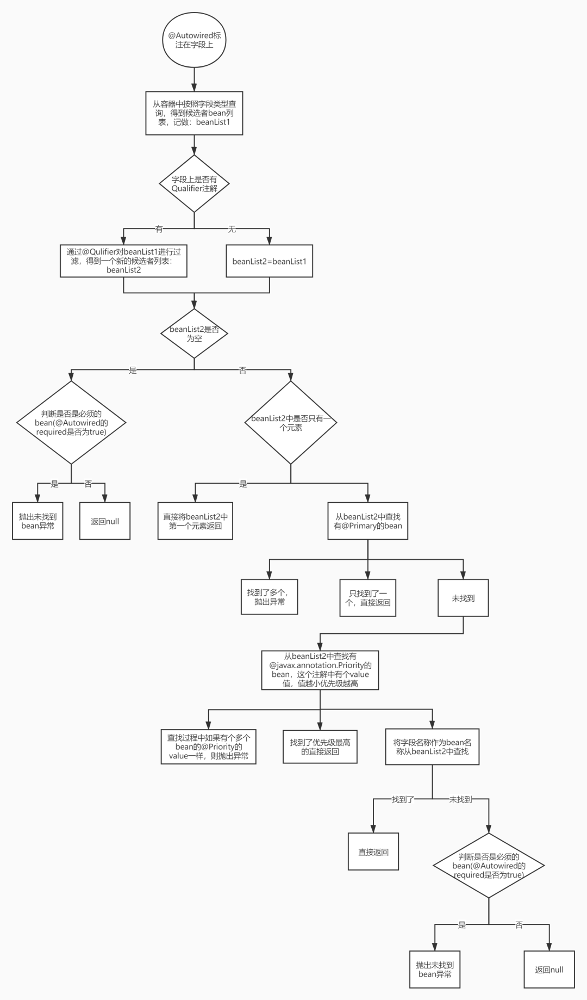
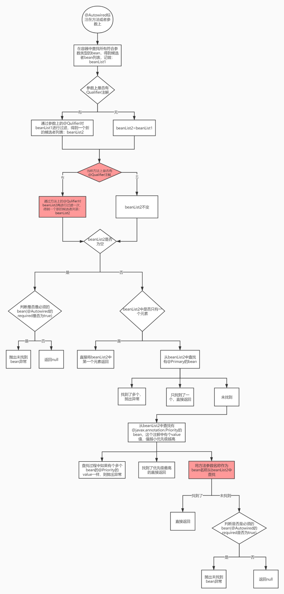
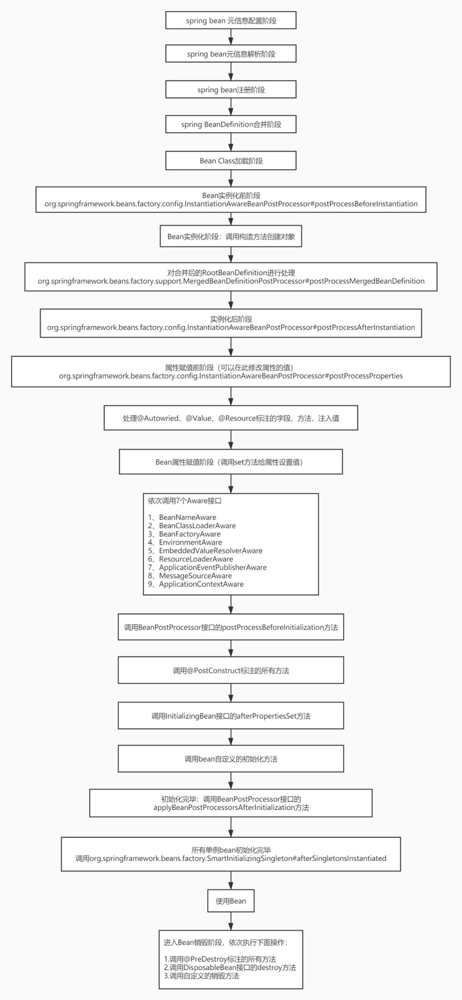

# 二十一、@Autowired、@Resource、@Primary、@Qulifier相关注解

## 1、@Autowired：注入依赖对象的方式

1、@Autowired标注在构造器上，通过构造器注入依赖对象

​	在构造器方法上加入注解：

```java
@Autowired
public Service2(Service1 service1) {
    System.out.println(this.getClass() + "有参构造器");
    this.service1 = service1;
}
```

2、@Autowired标注在方法上，通过方法注入依赖的对象

​	@1：方法上标注了@Autowired，spring容器会调用这个方法，从容器中查找Service1类型的bean，然后注入。

```java
@Autowired
public void injectService1(Service1 service1) { //@1
    System.out.println(this.getClass().getName() + ".injectService1()");
    this.service1 = service1;
}
```
3、@Autowired标注在setter方法上，通过setter方法注入

```java
private Service1 service1;
 
@Autowired
public void setService1(Service1 service1) { //@1
    System.out.println(this.getClass().getName() + ".setService1方法");
    this.service1 = service1;
}
```
4、@Autowired标注在方法参数上

```java
@Autowired
public void injectService1(Service1 service1, @Autowired(required = false) String name) { //@1
    System.out.println(String.format("%s.injectService1(),{service1=%s,name=%s}", this.getClass().getName(), service1, name));
    this.service1 = service1;
}
```
​	多个参数的时候，方法上面的@Autowire默认对方法中所有参数起效，如果我们想对某个参数进行特定的配置，可以在参数上加上@Autowired，这个配置会覆盖方法上面的@Autowired配置。

​	在第二个参数上面加上@Autowired，设置required为false。

5、@Autowired用在字段上

```java
@Autowired
private Service1 service1;//@1
 
@Autowired
private Service2 service2;//@2
```
​	@1和@2：定义了2个字段，上面都标注了@Autowired，spring会去容器中按照类型查找这2种类型的bean，然后设置给这2个属性。

6、@Autowire标注字段，多个候选者的时候，按字段名称注入

```java
@Component
public class Service2 {
    @Autowired
    private IService service1; //@1
```
​	@1：标注了@Autowired注解，需要注入类型为IService类型的bean，满足这种类型的有2个：service0和service1

​	**按照上面介绍的候选者查找过程，最后会注入和字段名称一样的bean，即：service1。**

7、将指定类型的所有bean，注入到Collection、Map中

​	**被注入的类型为Collection类型或者Collection子接口类型，注意必须是接口类型**


## 2、@Resource注入使用案例

@Resource查找候选者可以简化为：

```java
先按Resource的name值作为bean名称找 -> 按名称（字段名称、方法名称、set属性名称）找 -> 按类型找 -> 通过限定符@Qualifier过滤 -> @Primary -> @Priority -> 根据名称找（字段名称或者方法参数名称）
```

1.1、@Resource标注在字段上

```java
@Component
public class Service2 {
    @Resource
    private IService service1;
}
```

@1：字段名称为service1，按照字段名称查找bean，会找到Service1

1.2 如果将Service2中的代码调整一下

```java
@Resource
private IService service0;
```

此时会注入service0这个bean


2、源码：

```java
org.springframework.context.annotation.CommonAnnotationBeanPostProcessor
```


## 3、@Qualifier：限定符

​	**可以在依赖注入查找候选者的过程中对候选者进行过滤。**

1、用在类上

用在类上，你可以理解为给通过@Qulifier给这个bean打了一个标签。

```java
@Component
@Qualifier("tag1")
public class Service1 implements IService {
}
```

```java
@Component
@Qualifier("tag1")
public class Service2 implements IService {
}
```

```java
@Component
@Qualifier("tag2")
public class Service3 implements IService {
}
```

```java
@Component
public class InjectService {
    @Autowired
    @Qualifier("tag1") //@1
    private Map<String, IService> serviceMap1;

    @Autowired
    @Qualifier("tag2") //@2
    private Map<String, IService> serviceMap2;

    @Override
    public String toString() {
        return "InjectService{" +
                "serviceMap1=" + serviceMap1 +
                ", serviceMap2=" + serviceMap2 +
                '}';
    }
}
```

结果：

```java
injectService->InjectService{serviceMap1={service1=com.javacode2018.lesson001.demo26.test8.Service1@9597028, service2=com.javacode2018.lesson001.demo26.test8.Service2@6069db50}, serviceMap2={service3=com.javacode2018.lesson001.demo26.test8.Service3@4efbca5a}}
service1->com.javacode2018.lesson001.demo26.test8.Service1@9597028
service2->com.javacode2018.lesson001.demo26.test8.Service2@6069db50
service3->com.javacode2018.lesson001.demo26.test8.Service3@4efbca5a
```

​	注意第一行的输出，看一下serviceMap1和serviceMap2的值。
​	serviceMap1注入了@Qulifier的value为tag1的所有IService类型的bean
​	serviceMap1注入了@Qulifier的value为tag2的所有IService类型的bean
​	实现了bean分组的效果。


2、@Autowired结合@Qulifier指定注入的bean

​	被注入的类型有多个的时候，可以使用@Qulifier来指定需要注入那个bean，将@Qulifier的value设置为需要注入bean的名称

```java
@Component
public class InjectService {
    @Autowired
    @Qualifier("service2") //@1
    private IService service;

    @Override
    public String toString() {
        return "InjectService{" +
                "service=" + service +
                '}';
    }
}
```

​	**@1：这里限定符的值为service2，容器中IService类型的bean有2个[service1和service2]，当类上没有标注@Qualifier注解的时候，可以理解为：bean的名称就是限定符的值，所以@1这里会匹配到service2**


3、用在方法参数上

```java
@Component
public class InjectService {

    private IService s1;
    private IService s2;

    @Autowired
    public void injectBean(@Qualifier("service2") IService s1, @Qualifier("service1") IService s2) {
        this.s1 = s1;
        this.s2 = s2;
    }
}
```

​	@1：方法上标注了@Autowired注解，说明会被注入依赖，2个参数上分别使用了限定符来指定具体需要注入哪个bean


4、用在setter方法上

```JAVA
@Component
public class InjectService {

    private IService s1;
    private IService s2;

    @Autowired
    @Qualifier("service2")
    public void setS1(IService s1) {
        this.s1 = s1;
    }

    @Autowired
    @Qualifier("service2")
    public void setS2(IService s2) {
        this.s2 = s2;
    }
}
```

​	上面2个setter方法上都有@Autowired注解，并且结合了@Qulifier注解来限定需要注入哪个bean。


## 4、@Primary：设置为主要候选者

注入依赖的过程中，当有多个候选者的时候，可以指定哪个候选者为主要的候选者。
可以用在类上或者方法上面。
通常定义bean常见的有2种方式：
	方式1：在类上标注@Component注解，此时可以配合@Primary，标注这个bean为主要候选者
	方式2：在配置文件中使用@Bean注解标注方法，来注册bean，可以在@Bean标注的方法上加上@Primary，标注这个bean为主要候选bean。


1、用在类上

```java
@Component
@Primary
public class Service2 implements IService {
}
```

```java
@Component
public class InjectService {

    @Autowired
    private IService service1;
}
```

​	@1：容器中IService类型的bean有2个，但是service2为主要的候选者，所以此处会注入service2


2、用在方法上，结合@Bean使用

```java
public class InjectService {

    @Autowired
    private IService service1;

    @Override
    public String toString() {
        return "InjectService{" +
                "service1=" + service1 +
                '}';
    }
}
```

```java
@Configuration
public class MainConfig13 {

    @Bean
    public IService service1() {
        return new Service1();
    }

    @Bean
    @Primary //@1
    public IService service2() {
        return new Service2();
    }

    @Bean
    public InjectService injectService() {
        return new InjectService();
    }
}
```

service1->com.javacode2018.lesson001.demo26.test13.Service1@6913c1fb
service2->com.javacode2018.lesson001.demo26.test13.Service2@66d18979
injectService->InjectService{service1=com.javacode2018.lesson001.demo26.test13.Service2@66d18979}

注意最后一行，service1注入的是service2这个bean


## 5、@Bean定义bean时注入依赖的几种方式

常见3种方式

1. 硬编码方式
2. @Autowired、@Resource的方式
3. @Bean标注的方法参数的方式


1、硬编码方式

```java
public class Service3 {
    private Service1 service1;
    private Service2 service2;

    public Service1 getService1() {
        return service1;
    }

    public void setService1(Service1 service1) {
        this.service1 = service1;
    }

    public Service2 getService2() {
        return service2;
    }

    public void setService2(Service2 service2) {
        this.service2 = service2;
    }

    @Override
    public String toString() {
        return "Service3{" +
                "service1=" + service1 +
                ", service2=" + service2 +
                '}';
    }
}
```

​	上面类中会用到service1和service2，提供了对应的setter方法，一会我们通过setter方法注入依赖对象。

```java
@Configuration
public class MainConfig14 {
    @Bean
    public Service1 service1() {
        return new Service1();
    }

    @Bean
    public Service2 service2() {
        return new Service2();
    }

    @Bean
    public Service3 service3() {
        Service3 service3 = new Service3();
        service3.setService1(this.service1()); //@1
        service3.setService2(this.service2()); //@2
        return service3;
    }
}
```

​	上面代码中通过@Bean定义了3个bean

​	Service3中需要用到Service1和Service2，注意@1和@2直接调用当前方法获取另外2个bean，注入到service3中。


2、@Autowired、@Resource的方式

​	这种方式就不讲了直接在需要注入的对象上面加上这2个注解的任意一个就行了，可以参考文章前面的部分。


3、@Bean标注的方法使用参数来进行注入

```java
@Configuration
public class MainConfig15 {
    @Bean
    public Service1 service1() {
        return new Service1();
    }

    @Bean
    public Service2 service2() {
        return new Service2();
    }

    @Bean
    public Service3 service3(Service1 s1, Service2 s2) { //@0
        Service3 service3 = new Service3();
        service3.setService1(s1); //@1
        service3.setService2(s2); //@2
        return service3;
    }
}
```

​	@0：这个地方是关键，方法上标注了@Bean，并且方法中是有参数的，spring调用这个方法创建bean的时候，会将参数中的两个参数注入进来。

​	注入对象的查找逻辑可以参考上面@Autowired标注方法时查找候选者的逻辑。


4、其他

4.1 @Bean标注的方法参数上使用@Autowired注解

```java
@Configuration
public class MainConfig16 {
    @Bean
    public Service3 service3_0(@Autowired(required = false) Service1 s1, @Autowired(required = false) Service2 s2) { //@0
        Service3 service3 = new Service3();
        service3.setService1(s1); //@1
        service3.setService2(s2); //@2
        return service3;
    }
}
```

​	@0：方法由2个参数，第二个参数上标注了@Autowired(required = false)，说明第二个参数候选者不是必须的，找不到会注入一个null对象；第一个参数候选者是必须的，找不到会抛出异常。


4.2 @Bean结合@Qualifier

```java
public class Service1 implements IService {
}
```

```java
@Component
@Qualifier("tag1")
public class Service2 implements IService {
}
```

```java
@Component
@Qualifier("tag2")
public class Service3 implements IService {
}
```

```java
public class InjectService {
    private Map<String, IService> serviceMap1;
    private Map<String, IService> serviceMap2;

    public Map<String, IService> getServiceMap1() {
        return serviceMap1;
    }

    public void setServiceMap1(Map<String, IService> serviceMap1) {
        this.serviceMap1 = serviceMap1;
    }

    public Map<String, IService> getServiceMap2() {
        return serviceMap2;
    }

    public void setServiceMap2(Map<String, IService> serviceMap2) {
        this.serviceMap2 = serviceMap2;
    }

    @Override
    public String toString() {
        return "InjectService{" +
                "serviceMap1=" + serviceMap1 +
                ", serviceMap2=" + serviceMap2 +
                '}';
    }
}
```

```java
@Configuration
public class MainConfig17 {
 
    @Bean
    @Qualifier("tag1") //@1
    public Service1 service1() {
        return new Service1();
    }
 
    @Bean
    @Qualifier("tag1") //@2
    public Service2 service2() {
        return new Service2();
    }
 
    @Bean
    @Qualifier("tag2") //@3
    public Service3 service3() {
        return new Service3();
    }
 
    @Bean
    public InjectService injectService(@Qualifier("tag1") Map<String, IService> map1) { //@4
        InjectService injectService = new InjectService();
        injectService.setServiceMap1(map1);
        return injectService;
    }
}
```

​	Service1,Service2,Service3都实现了IService接口

​	@1,@2,@3这3个方法上面使用了@Bean注解，用来定义3个bean，这3个方法上还是用了@Qualifier注解，用来给这些bean定义标签，service1()方法类似于下面的写法：

```java
@Compontent
@Qualifier("tag1")
public class Service1 implements IService{
}
```

​	再回到MainConfig17中的@4：参数中需要注入Map，会查找IService类型的bean，容器中有3个，但是这个参数前面加上了@Qualifier限定符，值为tag1，所以会通过这个过滤，最后满足的候选者为：[service1,service2]。


## 6、泛型注入的使用


## 7、@Autowired注解的源码分析

### 7.1 总述

@Autowired查找候选者可以简化为下面这样：

```java
按类型找->通过限定符@Qualifier过滤->@Primary->@Priority->根据名称找（字段名称或者方法名称）
```

@Autowired标注在**字段**上面：假定字段类型为一个自定义的普通的类型，候选者查找过程如下：



@Autowired标注在**方法上**或者**方法参数**上面：假定参数类型为为一个自定义的普通的类型，候选者查找过程如下：




### 7.2 触发方式

1、Spring容器在每个Bean实例化之后，调用AutowiredAnnotationBeanPostProcessor的`postProcessMergedBeanDefinition`方法，查找该Bean是否有@Autowired注解。

2、Spring在每个Bean实例化的时候，调用`populateBean`进行属性注入的时候，即调用`postProcessPropertyValues`方法，查找该Bean是否有@Autowired注解。


### 7.3 构造方法

```java
public AutowiredAnnotationBeanPostProcessor() {
	//后置处理器将处理@Autowire注解
	this.autowiredAnnotationTypes.add(Autowired.class);
	//后置处理器将处理@Value注解
	this.autowiredAnnotationTypes.add(Value.class);
	try {
		//后置处理器将处理javax.inject.Inject JSR-330注解
		this.autowiredAnnotationTypes.add((Class<? extends Annotation>)
				ClassUtils.forName("javax.inject.Inject", AutowiredAnnotationBeanPostProcessor.class.getClassLoader()));
		logger.info("JSR-330 'javax.inject.Inject' annotation found and supported for autowiring");
	}
	catch (ClassNotFoundException ex) {
		// JSR-330 API not available - simply skip.
	}
}
```


### 7.4 注入的方法

```java
        //处理类中的属性,属性注入
	@Override
	public PropertyValues postProcessPropertyValues(
		PropertyValues pvs, PropertyDescriptor[] pds, Object bean, String beanName) throws BeanCreationException {

	//获取指定类中autowire相关注解的元信息
<1>	InjectionMetadata metadata = findAutowiringMetadata(beanName, bean.getClass(), pvs);
	try {
		//对Bean的属性进行自动注入
<2>		metadata.inject(bean, beanName, pvs);
	}
	catch (BeanCreationException ex) {
		throw ex;
	}
	catch (Throwable ex) {
		throw new BeanCreationException(beanName, "Injection of autowired dependencies failed", ex);
	}
	return pvs;
	}

```

​	该方法就是在属性注入populateBean中调用的`pvs = ibp.postProcessPropertyValues(pvs, filteredPds, bw.getWrappedInstance(), beanName);`的具体实现之一。

​	<1> 处的代码是从该bean中获取对应的注解信息，在`AutowiredAnnotationBeanPostProcessor`这里就是寻找有加@Value、@Autowired注解的字段，然后把相关信息封装在`InjectionMetadata`，具体实现如下：

```java
//获取给定类的autowire相关注解元信息
	private InjectionMetadata findAutowiringMetadata(String beanName, Class<?> clazz, @Nullable PropertyValues pvs) {
	// Fall back to class name as cache key, for backwards compatibility with custom callers.
	String cacheKey = (StringUtils.hasLength(beanName) ? beanName : clazz.getName());
	// Quick check on the concurrent map first, with minimal locking.
	//首先从容器中查找是否有给定类的autowire相关注解元信息
	InjectionMetadata metadata = this.injectionMetadataCache.get(cacheKey);
	if (InjectionMetadata.needsRefresh(metadata, clazz)) {
		synchronized (this.injectionMetadataCache) {
			metadata = this.injectionMetadataCache.get(cacheKey);
			if (InjectionMetadata.needsRefresh(metadata, clazz)) {
				if (metadata != null) {
					//解析给定类autowire相关注解元信息
					metadata.clear(pvs);
				}
				//解析给定类autowire相关注解元信息
				metadata = buildAutowiringMetadata(clazz);
				//将得到的给定类autowire相关注解元信息存储在容器缓存中
				this.injectionMetadataCache.put(cacheKey, metadata);
			}
		}
	}
	return metadata;
}
```

​	下面来看`buildAutowiringMetadata`的详细代码：

```java
//解析给定类autowire相关注解元信息
	private InjectionMetadata buildAutowiringMetadata(final Class<?> clazz) {
	//创建一个存放注解元信息的集合
	LinkedList<InjectionMetadata.InjectedElement> elements = new LinkedList<>();
	Class<?> targetClass = clazz;

	//递归遍历当前类及其所有基类，解析全部注解元信息
	do {
		//创建一个存储当前正在处理类注解元信息的集合
		final LinkedList<InjectionMetadata.InjectedElement> currElements = new LinkedList<>();

		//利用JDK反射机制获取给定类中所有的声明字段，获取字段上的注解信息
		ReflectionUtils.doWithLocalFields(targetClass, field -> {
			//获取给定字段上的注解
			AnnotationAttributes ann = findAutowiredAnnotation(field);
			if (ann != null) {
				//如果给定字段是静态的(static)，则直接遍历下一个字段
				if (Modifier.isStatic(field.getModifiers())) {
					if (logger.isWarnEnabled()) {
						logger.warn("Autowired annotation is not supported on static fields: " + field);
					}
					return;
				}
				//判断注解的required属性值是否有效
				boolean required = determineRequiredStatus(ann);
				//将当前字段元信息封装，添加在返回的集合中
				currElements.add(new AutowiredFieldElement(field, required));
			}
		});

		//利用JDK反射机制获取给定类中所有的声明方法，获取方法上的注解信息
		ReflectionUtils.doWithLocalMethods(targetClass, method -> {
			Method bridgedMethod = BridgeMethodResolver.findBridgedMethod(method);
			if (!BridgeMethodResolver.isVisibilityBridgeMethodPair(method, bridgedMethod)) {
				return;
			}
			//获取给定方法上的所有注解
			AnnotationAttributes ann = findAutowiredAnnotation(bridgedMethod);
			if (ann != null && method.equals(ClassUtils.getMostSpecificMethod(method, clazz))) {
				//如果方法是静态的，则直接遍历下一个方法
				if (Modifier.isStatic(method.getModifiers())) {
					if (logger.isWarnEnabled()) {
						logger.warn("Autowired annotation is not supported on static methods: " + method);
					}
					return;
				}
				//如果方法的参数列表为空
				if (method.getParameterCount() == 0) {
					if (logger.isWarnEnabled()) {
						logger.warn("Autowired annotation should only be used on methods with parameters: " +
								method);
					}
				}
				//判断注解的required属性值是否有效
				boolean required = determineRequiredStatus(ann);
				//获取当前方法的属性描述符，即方法是可读的(readable)getter方法，还是可写的(writeable)setter方法
				PropertyDescriptor pd = BeanUtils.findPropertyForMethod(bridgedMethod, clazz);
				//将方法元信息封装添加到返回的元信息集合中
				currElements.add(new AutowiredMethodElement(method, required, pd));
			}
		});

		//将当前类的注解元信息存放到注解元信息集合中
		elements.addAll(0, currElements);
		//获取给定类的父类
		targetClass = targetClass.getSuperclass();
	}
	//如果给定类有基类，并且基类不是Object，则递归获取其基类的元信息
	while (targetClass != null && targetClass != Object.class);

	return new InjectionMetadata(clazz, elements);
}
```

​	到这一步就拿到了指定类中autowire相关注解的元信息。这里可以看到@Autowired注解是不支持static修饰的

接着看`postProcessPropertyValues`方法的<2>处具体的注入逻辑：

```java
//InjectionMetadata.java

public void inject(Object target, @Nullable String beanName, @Nullable PropertyValues pvs) throws Throwable {
	Collection<InjectedElement> checkedElements = this.checkedElements;
	//要注入的字段集合
	Collection<InjectedElement> elementsToIterate =
			(checkedElements != null ? checkedElements : this.injectedElements);
	if (!elementsToIterate.isEmpty()) {
		boolean debug = logger.isDebugEnabled();
		//遍历每个字段 注入
		for (InjectedElement element : elementsToIterate) {
			if (debug) {
				logger.debug("Processing injected element of bean '" + beanName + "': " + element);
			}
			element.inject(target, beanName, pvs);
		}
	}
}
```

​	继续追踪`element.inject(target, beanName, pvs);`

```java
//InjectionMetadata.java

protected void inject(Object target, @Nullable String requestingBeanName, @Nullable PropertyValues pvs)
		throws Throwable {

	if (this.isField) {
		Field field = (Field) this.member;
		ReflectionUtils.makeAccessible(field);
		field.set(target, getResourceToInject(target, requestingBeanName));
	}
	else {
		if (checkPropertySkipping(pvs)) {
			return;
		}
		try {
			Method method = (Method) this.member;
			ReflectionUtils.makeAccessible(method);
			method.invoke(target, getResourceToInject(target, requestingBeanName));
		}
		catch (InvocationTargetException ex) {
			throw ex.getTargetException();
		}
	}
}

```

​	这是`element.inject()`的原始方法，它还有两个子类自己实现的方法

​	从方法名称可以看出，一个是对字段进行注入，一个是对方法进行注入。并且这两个方法都是`AutowiredAnnotationBeanPostProcessor`具体的实现。


**7.4.1 字段注入**

```java
//AutowiredAnnotationBeanPostProcessor.java

	@Override
	protected void inject(Object bean, @Nullable String beanName, @Nullable PropertyValues pvs) throws Throwable {
		//获取要注入的字段
		Field field = (Field) this.member;
		Object value;
		//如果字段的值有缓存
		if (this.cached) {
			//从缓存中获取字段值value
			value = resolvedCachedArgument(beanName, this.cachedFieldValue);
		}
		//没有缓存
		else {
			//创建一个字段依赖描述符
			DependencyDescriptor desc = new DependencyDescriptor(field, this.required);
			desc.setContainingClass(bean.getClass());
			Set<String> autowiredBeanNames = new LinkedHashSet<>(1);
			Assert.state(beanFactory != null, "No BeanFactory available");
			//获取容器中的类型转换器
			TypeConverter typeConverter = beanFactory.getTypeConverter();
			try {
				//核心！获取注入的值
				value = beanFactory.resolveDependency(desc, beanName, autowiredBeanNames, typeConverter);
			}
			catch (BeansException ex) {
				throw new UnsatisfiedDependencyException(null, beanName, new InjectionPoint(field), ex);
			}
			//线程同步，确保容器中数据一致性
			synchronized (this) {
				//如果字段的值没有缓存
				if (!this.cached) {
					//字段值不为null，并且required属性为true
					if (value != null || this.required) {
						this.cachedFieldValue = desc;
						//为指定Bean注册依赖Bean
						registerDependentBeans(beanName, autowiredBeanNames);
						if (autowiredBeanNames.size() == 1) {
							String autowiredBeanName = autowiredBeanNames.iterator().next();
							//如果容器中有指定名称的Bean对象
							if (beanFactory.containsBean(autowiredBeanName)) {
								//依赖对象类型和字段类型匹配，默认按类型注入
								if (beanFactory.isTypeMatch(autowiredBeanName, field.getType())) {
									//创建一个依赖对象的引用，同时缓存
									this.cachedFieldValue = new ShortcutDependencyDescriptor(
											desc, autowiredBeanName, field.getType());
								}
							}
						}
					}
					//如果获取的依赖关系为null，且获取required属性为false
					else {
						//将字段值的缓存设置为null
						this.cachedFieldValue = null;
					}
					//容器已经对当前字段的值缓存
					this.cached = true;
				}
			}
		}
		//如果字段值不为null
		if (value != null) {
			//显式使用JDK的反射机制，设置自动的访问控制权限为允许访问
			ReflectionUtils.makeAccessible(field);
			//为字段赋值
			field.set(bean, value);
		}
}
```

​	这段代码很好理解，从注解@Value/@Autowired中获取要注入的值，之后利用反射set到字段中。
​	重点就是怎么从注解中获取要注入的值，我们来看核心代码`value = beanFactory.resolveDependency(desc, beanName, autowiredBeanNames, typeConverter);`

```java
//DefaultListableBeanFactory.java

public Object resolveDependency(DependencyDescriptor descriptor, @Nullable String requestingBeanName,
	@Nullable Set<String> autowiredBeanNames, @Nullable TypeConverter typeConverter) throws BeansException {

	descriptor.initParameterNameDiscovery(getParameterNameDiscoverer());
	if (Optional.class == descriptor.getDependencyType()) {
		return createOptionalDependency(descriptor, requestingBeanName);
	}
	else if (ObjectFactory.class == descriptor.getDependencyType() ||
			ObjectProvider.class == descriptor.getDependencyType()) {
		return new DependencyObjectProvider(descriptor, requestingBeanName);
	}
	else if (javaxInjectProviderClass == descriptor.getDependencyType()) {
		return new Jsr330ProviderFactory().createDependencyProvider(descriptor, requestingBeanName);
	}
	else {
		Object result = getAutowireCandidateResolver().getLazyResolutionProxyIfNecessary(
				descriptor, requestingBeanName);
		if (result == null) {
			//真正获取值的代码
			result = doResolveDependency(descriptor, requestingBeanName, autowiredBeanNames, typeConverter);
		}
		return result;
	}
}
```

​	进行跟踪：

```java
//DefaultListableBeanFactory.java

public Object doResolveDependency(DependencyDescriptor descriptor, @Nullable String beanName,
	@Nullable Set<String> autowiredBeanNames, @Nullable TypeConverter typeConverter) throws BeansException {
        //注入点
	InjectionPoint previousInjectionPoint = ConstructorResolver.setCurrentInjectionPoint(descriptor);
	try {
		// 针对给定的工厂给定一个快捷实现的方式，例如考虑一些预先解析的信息
		// 在进入所有bean的常规类型匹配算法之前，解析算法将首先尝试通过此方法解析快捷方式。
		// 子类可以覆盖此方法
		Object shortcut = descriptor.resolveShortcut(this);
		if (shortcut != null) {
			return shortcut;
		}

		//获取字段属性的类型
		Class<?> type = descriptor.getDependencyType();

		//拿到@Value里的值
		Object value = getAutowireCandidateResolver().getSuggestedValue(descriptor);
		if (value != null) {
			if (value instanceof String) {
				String strVal = resolveEmbeddedValue((String) value);
				BeanDefinition bd = (beanName != null && containsBean(beanName) ? getMergedBeanDefinition(beanName) : null);
				value = evaluateBeanDefinitionString(strVal, bd);
			}
			TypeConverter converter = (typeConverter != null ? typeConverter : getTypeConverter());
			return (descriptor.getField() != null ?
					converter.convertIfNecessary(value, type, descriptor.getField()) :
					converter.convertIfNecessary(value, type, descriptor.getMethodParameter()));
		}

		//如果标识@Autowired注解的属性是复合类型，如Array,Collection,Map,
		// 从这个方法获取@Autowired里的值
<1>		Object multipleBeans = resolveMultipleBeans(descriptor, beanName, autowiredBeanNames, typeConverter);
		if (multipleBeans != null) {
			return multipleBeans;
		}

		// 如果标识@Autowired注解的属性是非复合类型，
		// 从这个方法获取@Autowired里的值
<2>		Map<String, Object> matchingBeans = findAutowireCandidates(beanName, type, descriptor);
		//如果没有符合该类型的Bean
		if (matchingBeans.isEmpty()) {
			// 没有找到，检验 @autowire  的 require 是否为 true
			if (isRequired(descriptor)) {
				//抛出异常
				raiseNoMatchingBeanFound(type, descriptor.getResolvableType(), descriptor);
			}
			return null;
		}

		String autowiredBeanName;
		Object instanceCandidate;

		//如果符合该类型的Bean有多个
		if (matchingBeans.size() > 1) {
			//挑选出最优解
<3>			autowiredBeanName = determineAutowireCandidate(matchingBeans, descriptor);
			if (autowiredBeanName == null) {
				if (isRequired(descriptor) || !indicatesMultipleBeans(type)) {
					//抛出异常
					return descriptor.resolveNotUnique(type, matchingBeans);
				}
				else {
					// In case of an optional Collection/Map, silently ignore a non-unique case:
					// possibly it was meant to be an empty collection of multiple regular beans
					// (before 4.3 in particular when we didn't even look for collection beans).
					return null;
				}
			}
			instanceCandidate = matchingBeans.get(autowiredBeanName);
		}
		else {
			// We have exactly one match.
			Map.Entry<String, Object> entry = matchingBeans.entrySet().iterator().next();
			autowiredBeanName = entry.getKey();
			instanceCandidate = entry.getValue();
		}

		if (autowiredBeanNames != null) {
			autowiredBeanNames.add(autowiredBeanName);
		}
		if (instanceCandidate instanceof Class) {
			instanceCandidate = descriptor.resolveCandidate(autowiredBeanName, type, this);
		}
		Object result = instanceCandidate;
		if (result instanceof NullBean) {
			if (isRequired(descriptor)) {
				raiseNoMatchingBeanFound(type, descriptor.getResolvableType(), descriptor);
			}
			result = null;
		}
		if (!ClassUtils.isAssignableValue(type, result)) {
			throw new BeanNotOfRequiredTypeException(autowiredBeanName, type, instanceCandidate.getClass());
		}
		return result;
	}
	finally {
		ConstructorResolver.setCurrentInjectionPoint(previousInjectionPoint);
	}
}
```

​	这段代码看着很长，但其实很容易理解。大致流程就是：
​	根据字段类型从IOC容器中获取符合的Bean，如果有多个，则挑选出最优的那一个。


**<1>处：@Autowired注入集合数组，如Map.List，获取@Autowired里的值**

```java
//DefaultListableBeanFactory.java

private Object resolveMultipleBeans(DependencyDescriptor descriptor, @Nullable String beanName,
		@Nullable Set<String> autowiredBeanNames, @Nullable TypeConverter typeConverter) {

	Class<?> type = descriptor.getDependencyType();
	//如果@Autowired标识的是数组类型的属性
	if (type.isArray()) {
		//获取数组的内容类型
		Class<?> componentType = type.getComponentType();
		ResolvableType resolvableType = descriptor.getResolvableType();
		Class<?> resolvedArrayType = resolvableType.resolve();
		if (resolvedArrayType != null && resolvedArrayType != type) {
			type = resolvedArrayType;
			componentType = resolvableType.getComponentType().resolve();
		}
		if (componentType == null) {
			return null;
		}
		//通过类型去IOC容器内择取符合的Bean都是使用这个方法
		Map<String, Object> matchingBeans = findAutowireCandidates(beanName, componentType,
				new MultiElementDescriptor(descriptor));
		if (matchingBeans.isEmpty()) {
			return null;
		}
		if (autowiredBeanNames != null) {
			autowiredBeanNames.addAll(matchingBeans.keySet());
		}
		TypeConverter converter = (typeConverter != null ? typeConverter : getTypeConverter());
		//将得到的Bean的候选者们转换为属性类型，如从set转换为Array,List等
		Object result = converter.convertIfNecessary(matchingBeans.values(), type);
		if (getDependencyComparator() != null && result instanceof Object[]) {
			Arrays.sort((Object[]) result, adaptDependencyComparator(matchingBeans));
		}
		return result;
	}
	else if (Collection.class.isAssignableFrom(type) && type.isInterface()) {
		//获取Collection的泛型
		Class<?> elementType = descriptor.getResolvableType().asCollection().resolveGeneric();
		if (elementType == null) {
			return null;
		}
		Map<String, Object> matchingBeans = findAutowireCandidates(beanName, elementType,
				new MultiElementDescriptor(descriptor));
		if (matchingBeans.isEmpty()) {
			return null;
		}
		if (autowiredBeanNames != null) {
			autowiredBeanNames.addAll(matchingBeans.keySet());
		}
		TypeConverter converter = (typeConverter != null ? typeConverter : getTypeConverter());
		Object result = converter.convertIfNecessary(matchingBeans.values(), type);
		if (getDependencyComparator() != null && result instanceof List) {
			Collections.sort((List<?>) result, adaptDependencyComparator(matchingBeans));
		}
		return result;
	}
	else if (Map.class == type) {
		ResolvableType mapType = descriptor.getResolvableType().asMap();
		Class<?> keyType = mapType.resolveGeneric(0);
		if (String.class != keyType) {
			return null;
		}
		Class<?> valueType = mapType.resolveGeneric(1);
		if (valueType == null) {
			return null;
		}
		Map<String, Object> matchingBeans = findAutowireCandidates(beanName, valueType,
				new MultiElementDescriptor(descriptor));
		if (matchingBeans.isEmpty()) {
			return null;
		}
		if (autowiredBeanNames != null) {
			autowiredBeanNames.addAll(matchingBeans.keySet());
		}
		return matchingBeans;
	}
	else {
		return null;
	}
}
```

**<2>处：@Autowired注入非集合数组,即普通的类如Service**

```java
//DefaultListableBeanFactory.java

protected Map<String, Object> findAutowireCandidates(
		@Nullable String beanName, Class<?> requiredType, DependencyDescriptor descriptor) {

	//从IOC容器中获取所有的符合类型的BeanName，存入候选数组
	String[] candidateNames = BeanFactoryUtils.beanNamesForTypeIncludingAncestors(
			this, requiredType, true, descriptor.isEager());
	Map<String, Object> result = new LinkedHashMap<>(candidateNames.length);
	//首先从容器自身注册的依赖解析来匹配，Spring容器自身注册了很多Bean的依赖，
	//当使用者想要注入指定类型的Bean时，会优先从已注册的依赖内寻找匹配
	for (Class<?> autowiringType : this.resolvableDependencies.keySet()) {
		if (autowiringType.isAssignableFrom(requiredType)) {
			Object autowiringValue = this.resolvableDependencies.get(autowiringType);
			autowiringValue = AutowireUtils.resolveAutowiringValue(autowiringValue, requiredType);
			//如果注册的依赖Bean类型是指定类型的实例或是其父类，接口，则将其作为候选者，注册依赖的类型不会重复
			if (requiredType.isInstance(autowiringValue)) {
				result.put(ObjectUtils.identityToString(autowiringValue), autowiringValue);
				break;
			}
		}
	}
	//遍历候选数组
	for (String candidate : candidateNames) {
		//候选Bean不是自引用（即要注入的类不能是类本身，会触发无限递归注入）
		if (!isSelfReference(beanName, candidate) && isAutowireCandidate(candidate, descriptor)) {
			addCandidateEntry(result, candidate, descriptor, requiredType);
		}
	}
	if (result.isEmpty() && !indicatesMultipleBeans(requiredType)) {
		// Consider fallback matches if the first pass failed to find anything...
		DependencyDescriptor fallbackDescriptor = descriptor.forFallbackMatch();
		for (String candidate : candidateNames) {
			if (!isSelfReference(beanName, candidate) && isAutowireCandidate(candidate, fallbackDescriptor)) {
				addCandidateEntry(result, candidate, descriptor, requiredType);
			}
		}
		if (result.isEmpty()) {
			// Consider self references as a final pass...
			// but in the case of a dependency collection, not the very same bean itself.
			for (String candidate : candidateNames) {
				if (isSelfReference(beanName, candidate) &&
						(!(descriptor instanceof MultiElementDescriptor) || !beanName.equals(candidate)) &&
						isAutowireCandidate(candidate, fallbackDescriptor)) {
					addCandidateEntry(result, candidate, descriptor, requiredType);
				}
			}
		}
	}
	return result;
}
```

​	这段代码注释已经写的很清楚了，我们来继续看下`addCandidateEntry`方法，该方法是把Bean实例放入到候选者集合中。

```java
//DefaultListableBeanFactory.java

private void addCandidateEntry(Map<String, Object> candidates, String candidateName,
		DependencyDescriptor descriptor, Class<?> requiredType) {

	//当@Autowired标识的是容器类型的属性，生成的依赖描述类型是MultiElementDescriptor ，
	//因此所有的候选者均是合格的，所以会当场实例化他们。而如果属性的类型非容器，那么可能是多个候选者中挑一个，
	//此时实例化他们所有就不合适了，最终会把合格的那个实例化，如果没有合格的则不实例化，
	//提前实例化对Bean的很多方面有影响，比如AOP，EarlyReference等 */
	if (descriptor instanceof MultiElementDescriptor || containsSingleton(candidateName)) {
		Object beanInstance = descriptor.resolveCandidate(candidateName, requiredType, this);
		candidates.put(candidateName, (beanInstance instanceof NullBean ? null : beanInstance));
	}
	else {
		candidates.put(candidateName, getType(candidateName));
	}
}
```

​	这里会调用doGetBean()方法进行实例化Bean

**<3>处：多个候选者中挑选出最优解**

​	如果根据类型从IOC容器中获得的Bean有多个，那么就需要调用`determineAutowireCandidate(matchingBeans, descriptor)`方法，去挑选出最优解。

```java
//DefaultListableBeanFactory.java

protected String determineAutowireCandidate(Map<String, Object> candidates, DependencyDescriptor descriptor) {
	Class<?> requiredType = descriptor.getDependencyType();
	//根据@Primary注解来择取最优解
	String primaryCandidate = determinePrimaryCandidate(candidates, requiredType);
	if (primaryCandidate != null) {
		return primaryCandidate;
	}
	//根据@Order,@PriorityOrder，及实现Order接口的序号来择取最优解
	String priorityCandidate = determineHighestPriorityCandidate(candidates, requiredType);
	if (priorityCandidate != null) {
		return priorityCandidate;
	}
	// Fallback
	for (Map.Entry<String, Object> entry : candidates.entrySet()) {
		String candidateName = entry.getKey();
		Object beanInstance = entry.getValue();
		//如果通过以上两步都不能选择出最优解，则使用最基本的策略
		//首先如果这个类型已经由Spring注册过依赖关系对，则直接使用注册的对象，
		//候选者集合是LinkedHashMap,有序Map集合，容器注册的依赖对象位于LinkedHashMap的起始位置
		//如果没有注册过此类型的依赖关系，则根据属性的名称来匹配
		//如果属性名称和某个候选者的Bean名称或别名一致，那么直接将此Bean作为最优解
		if ((beanInstance != null && this.resolvableDependencies.containsValue(beanInstance)) ||
				matchesBeanName(candidateName, descriptor.getDependencyName())) {
			return candidateName;
		}
	}
	return null;
}
```

​	这部分逻辑比较简单，总结就是3个步骤：

​		1.根据@Primary注解来择取最优解

​		2.根据@Order,@PriorityOrder，及实现Order接口的序号来择取最优解

​		3.根据Spring默认规则

逐一分析这几个步骤，先看第一个：**根据@Primary注解来择取最优解**

```java
//DefaultListableBeanFactory.java

protected String determinePrimaryCandidate(Map<String, Object> candidates, Class<?> requiredType) {
	String primaryBeanName = null;
	for (Map.Entry<String, Object> entry : candidates.entrySet()) {
		String candidateBeanName = entry.getKey();
		Object beanInstance = entry.getValue();
		//候选者可以是父容器内的标识了@Primary的Bean，也可以是当前容器的。SpringMVC容器将Spring容器作为父容器
		if (isPrimary(candidateBeanName, beanInstance)) {
			if (primaryBeanName != null) {
				boolean candidateLocal = containsBeanDefinition(candidateBeanName);
				boolean primaryLocal = containsBeanDefinition(primaryBeanName);
				//此处确保同一个容器中同一个类型的多个Bean最多只有一个Bean标识了@Primary
				if (candidateLocal && primaryLocal) {
					throw new NoUniqueBeanDefinitionException(requiredType, candidates.size(),
							"more than one 'primary' bean found among candidates: " + candidates.keySet());
				}
				//如果上一个@Primary的Bean是父容器的，则用当前容器的候选者覆盖之前的@Primary的Bean
				else if (candidateLocal) {
					primaryBeanName = candidateBeanName;
				}
			}
			else {
				primaryBeanName = candidateBeanName;
			}
		}
	}
	return primaryBeanName;
}
```

接着看第二个：**根据@Order,@PriorityOrder**

```java
//DefaultListableBeanFactory.java

protected String determineHighestPriorityCandidate(Map<String, Object> candidates, Class<?> requiredType) {
	String highestPriorityBeanName = null;
	Integer highestPriority = null;
	for (Map.Entry<String, Object> entry : candidates.entrySet()) {
		String candidateBeanName = entry.getKey();
		Object beanInstance = entry.getValue();
		Integer candidatePriority = getPriority(beanInstance);
		if (candidatePriority != null) {
			//不能同时存在两个最高优先级的序号
			if (highestPriorityBeanName != null) {
				if (candidatePriority.equals(highestPriority)) {
					throw new NoUniqueBeanDefinitionException(requiredType, candidates.size(),
							"Multiple beans found with the same priority ('" + highestPriority +
							"') among candidates: " + candidates.keySet());
				}
				//使用优先级序号最小的Bean作为最优解
				else if (candidatePriority < highestPriority) {
					highestPriorityBeanName = candidateBeanName;
					highestPriority = candidatePriority;
				}
			}
			else {
				highestPriorityBeanName = candidateBeanName;
				highestPriority = candidatePriority;
			}
		}
	}
	return highestPriorityBeanName;
	}

```

**小结**：
到这里，@Autowired字段注入的源码就分析完毕了。


7.4.2 方法注入

```java
//DefaultListableBeanFactory.java

protected void inject(Object bean, @Nullable String beanName, @Nullable PropertyValues pvs) throws Throwable {
	//如果属性被显式设置为skip，则不进行注入
	if (checkPropertySkipping(pvs)) {
		return;
	}
	//获取注入元素对象
	Method method = (Method) this.member;
	Object[] arguments;
	//如果容器对当前方法缓存
	if (this.cached) {
		// Shortcut for avoiding synchronization...
		//获取缓存中指定Bean名称的方法参数
		arguments = resolveCachedArguments(beanName);
	}
	//如果没有缓存
	else {
		//获取方法的参数列表
		Class<?>[] paramTypes = method.getParameterTypes();
		//创建一个存放方法参数的数组
		arguments = new Object[paramTypes.length];
		DependencyDescriptor[] descriptors = new DependencyDescriptor[paramTypes.length];
		Set<String> autowiredBeans = new LinkedHashSet<>(paramTypes.length);
		Assert.state(beanFactory != null, "No BeanFactory available");
		//获取容器的类型转换器
		TypeConverter typeConverter = beanFactory.getTypeConverter();
		for (int i = 0; i < arguments.length; i++) {
			//创建方法参数对象
			MethodParameter methodParam = new MethodParameter(method, i);
			DependencyDescriptor currDesc = new DependencyDescriptor(methodParam, this.required);
			currDesc.setContainingClass(bean.getClass());
			//解析方法的输入参数，为方法参数创建依赖描述符
			descriptors[i] = currDesc;
			try {
				Object arg = beanFactory.resolveDependency(currDesc, beanName, autowiredBeans, typeConverter);
				if (arg == null && !this.required) {
					arguments = null;
					break;
				}
				//根据容器中Bean定义解析依赖关系，获取方法参数依赖对象
				arguments[i] = arg;
			}
			catch (BeansException ex) {
				throw new UnsatisfiedDependencyException(null, beanName, new InjectionPoint(methodParam), ex);
			}
		}
		//线程同步，以确保容器中数据一致性
		synchronized (this) {
			//如果当前方法没有被容器缓存
			if (!this.cached) {
				//如果方法的参数列表不为空
				if (arguments != null) {
					//为容器中缓存方法参数的对象赋值
					Object[] cachedMethodArguments = new Object[paramTypes.length];
					for (int i = 0; i < arguments.length; i++) {
						cachedMethodArguments[i] = descriptors[i];
					}
					//为指定Bean注册依赖Bean
					registerDependentBeans(beanName, autowiredBeans);
					//如果依赖对象集合大小等于方法参数个数
					if (autowiredBeans.size() == paramTypes.length) {
						Iterator<String> it = autowiredBeans.iterator();
						//为方法参数设置依赖对象
						for (int i = 0; i < paramTypes.length; i++) {
							String autowiredBeanName = it.next();
							//如果容器中存在指定名称的Bean对象
							if (beanFactory.containsBean(autowiredBeanName)) {
								//如果参数类型和依赖对象类型匹配
								if (beanFactory.isTypeMatch(autowiredBeanName, paramTypes[i])) {
									//创建一个依赖对象的引用，复制给方法相应的参
									cachedMethodArguments[i] = new ShortcutDependencyDescriptor(
											descriptors[i], autowiredBeanName, paramTypes[i]);
								}
							}
						}
					}
					this.cachedMethodArguments = cachedMethodArguments;
				}
				//如果方法参数列表为null，则设置容器对该方法参数的缓存为null
				else {
					this.cachedMethodArguments = null;
				}
				//设置容器已经对该方法缓存
				this.cached = true;
			}
		}
	}
	//如果方法参数依赖对象不为null
	if (arguments != null) {
		try {
			//使用JDK的反射机制，显式设置方法的访问控制权限为允许访问
			ReflectionUtils.makeAccessible(method);
			//调用Bean的指定方法
			method.invoke(bean, arguments);
		}
		catch (InvocationTargetException ex){
			throw ex.getTargetException();
		}
	}
}
```

​	@Autowired注解的原理用一句话讲明：
​	就是先从IOC容器中根据类型找到所有符合的Bean,然后再根据@Primary、@Order、@PriorityOrder或Spring默认规则挑选出最符合的Bean,利用反射注入到字段中。


# 二十二、@Scope、@DependsOn、@ImportResource、@Lazy相关注解

## 1、@Scope：指定bean的作用域

​	@Scope用来配置bean的作用域，等效于bean xml中的bean元素中的scope属性。@Scope可以用在类上和方法上。参数：value和scopeName效果一样，用来指定bean作用域名称，如：singleton、prototype。

- ​	常见2种用法
  - 和@Compontent一起使用在类上
  - 和@Bean一起标注在方法上


案例一：和@Compontent一起使用在类上

```java
@Component
@Scope(ConfigurableBeanFactory.SCOPE_PROTOTYPE)
public class ServiceA {
}
```

上面定义了一个bean，作用域为单例的。

@1：ConfigurableBeanFactory接口中定义了几个作用域相关的常量，可以直接拿来使用，如：
String SCOPE_SINGLETON = "singleton";
String SCOPE_PROTOTYPE = "prototype";


案例2：和@Bean一起标注在方法上

```java
@Configurable
public class MainConfig2 {
    @Bean
    @Scope(ConfigurableBeanFactory.SCOPE_PROTOTYPE)
    public ServiceA serviceA() {
        return new ServiceA();
    }
}
```


## 2、@DependsOn：指定当前bean依赖的bean

​	@DependsOn等效于bean xml中的bean元素中的depend-on属性。
​	spring在创建bean的时候，如果bean之间没有依赖关系，那么spring容器很难保证bean实例创建的顺序，如果想确保容器在创建某些bean之前，需要先创建好一些其他的bean，可以通过@DependsOn来实现，@DependsOn可以指定当前bean依赖的bean，通过这个可以确保@DependsOn指定的bean在当前bean创建之前先创建好

​	常见2种用法：

1. 和@Compontent一起使用在类上
2. 和@Bean一起标注在方法上


案例1：和@Compontent一起使用在类上

```java
@DependsOn({"service2", "service3"})
@Component
public class Service1 {
    public Service1() {
        System.out.println("create Service1");
    }
}
```

​	@1：使用了@DependsOn，指定了2个bean：service2和service3，那么spring容器在创建上面这个service1的时候会先将@DependsOn中指定的2个bean先创建好。


案例2：和@Bean一起标注在方法上

```java
@Configurable
public class MainConfig4 {

    @Bean
    @DependsOn({"service2", "service3"})//@1
    public Service1 service1() {
        return new Service1();
    }

    @Bean
    public Service2 service2() {
        return new Service2();
    }

    @Bean
    public Service3 service3() {
        return new Service3();
    }

}
```

​	上面是一个spring的配置类，类中3个方法定义了3个bean

​	@1：这个地方使用了@DependsOn，表示service1这个bean创建之前，会先创建好service2和service3。


## 3、@ImportResource：配置类中导入bean定义的配置文件

用法：

​	有些项目，前期可能采用xml的方式配置bean，后期可能想采用spring注解的方式来重构项目，但是有些老的模块可能还是xml的方式，spring为了方便在注解方式中兼容老的xml的方式，提供了@ImportResource注解来引入bean定义的配置文件。
​	bean定义配置文件：目前我们主要介绍了xml的方式，还有一种properties文件的方式，以后我们会介绍，此时我们还是以引入bean xml来做说明。

通常将其用在配置类上。

有3个参数：

- value和locations效果一样，只能配置其中一个，是一个string类型的数组，用来指定需要导入的配置文件的路径。


- reader：用来指定bean定义的读取器，目前我们知道的配置bean的方式有xml文件的方式，注解的方式，其实还有其他的方式，比如properties文件的方式，如果用其他的方式，你得告诉spring具体要用那种解析器去解析这个bean配置文件，这个解析器就是BeanDefinitionReader，以后我们讲BeanDefinition的时候再细说。


## 4、@Lazy：延迟初始化

用法：

​	@Lazy等效于bean xml中bean元素的lazy-init属性，可以实现bean的延迟初始化。**所谓延迟初始化：就是使用到的时候才会去进行初始化。**

常用3种方式：

1. 和@Compontent一起标注在类上，可以是这个类延迟初始化
2. 和@Configuration一起标注在配置类中，可以让当前配置类中通过@Bean注册的bean延迟初始化
3. 和@Bean一起使用，可以使当前bean延迟初始化


案例一：和@Compontent一起使用

```java
@Component
@Lazy
public class Service1 {
    public Service1() {
        System.out.println("创建Service1");
    }
}
```

​	@1：使用到了@Lazy，默认值为true，表示会被延迟初始化，在容器启动过程中不会被初始化，当从容器中查找这个bean的时候才会被初始化。


案例二：和@Configuration一起使用加在配置类上

​	@Lazy和@Configuration一起使用，此时配置类中所有通过@Bean方式注册的bean都会被延迟初始化，不过也可以在@Bean标注的方法上使用@Lazy来覆盖配置类上的@Lazy配置，看下面代码：

```java
@Lazy
@Configurable
public class MainConfig7 {

    @Bean
    public String name() {
        System.out.println("create bean:name");
        return "路人甲Java";
    }

    @Bean
    public String address() {
        System.out.println("create bean:address");
        return "上海市";
    }

    @Bean
    @Lazy(false)
    public Integer age() {
        System.out.println("create bean:age");
        return 30;
    }
}
```

@1：配置类上使用了@Lazy，此时会对当前类中所有@Bean标注的方法生效

@2：这个方法上面使用到了@Lazy(false)，此时age这个bean不会被延迟初始化。其他2个bean会被延迟初始化。


# 二十三、Bean生命周期详解

## 0、总述

Spring bean生命周期13个环节：

阶段1：Bean元信息配置阶段

阶段2：Bean元信息解析阶段

阶段3：将Bean注册到容器中

阶段4：BeanDefinition合并阶段

阶段5：Bean Class加载阶段

阶段6：Bean实例化阶段（2个小阶段）

​	Bean实例化前阶段

​	Bean实例化阶段

阶段7：合并后的BeanDefinition处理

阶段8：属性赋值阶段（3个小阶段）

​	Bean实例化后阶段

​	Bean属性赋值前阶段

​	Bean属性赋值阶段

阶段9：Bean初始化阶段（5个小阶段）

​	Bean Aware接口回调阶段

​	Bean初始化前阶段

​	Bean初始化阶段

​	Bean初始化后阶段

阶段10：所有单例bean初始化完成后阶段

阶段11：Bean的使用阶段

阶段12：Bean销毁前阶段

阶段13：Bean销毁阶段


## 1、阶段一：Bean元信息配置阶段

这个阶段主要是bean信息的定义阶段。

Bean信息定义4种方式：

- API的方式
- Xml文件方式
- properties文件的方式
- 注解的方式


### 1.1 API的方式

​	先来说这种方式，因为其他几种方式最终都会采用这种方式来定义bean配置信息。

​	Spring容器启动的过程中，会将Bean解析成Spring内部的BeanDefinition结构。
不管是是通过xml配置文件的标签，还是通过注解配置的@Bean，还是@Compontent标注的类，还是扫描得到的类，它最终都会被解析成一个BeanDefinition对象，最后我们的Bean工厂就会根据这份Bean的定义信息，对bean进行实例化、初始化等等操作。
​	你可以把BeanDefinition丢给Bean工厂，然后Bean工厂就会根据这个信息帮你生产一个Bean实例，拿去使用。
​	BeanDefinition里面里面包含了bean定义的各种信息，如：bean对应的class、scope、lazy信息、dependOn信息、autowireCandidate（是否是候选对象）、primary（是否是主要的候选者）等信息。
​	BeanDefinition是个接口，有几个实现类，看一下类图：


​	

​	BeanDefinition接口：bean定义信息接口

​	表示bean定义信息的接口，里面定义了一些获取bean定义配置信息的各种方法，来看一下源码：

```java
public interface BeanDefinition extends AttributeAccessor, BeanMetadataElement {
 
    /**
     * 设置此bean的父bean名称（对应xml中bean元素的parent属性）
     */
    void setParentName(@Nullable String parentName);
 
    /**
     * 返回此bean定义时指定的父bean的名称
     */
    @Nullable
    String getParentName();
 
    /**
     * 指定此bean定义的bean类名(对应xml中bean元素的class属性)
     */
    void setBeanClassName(@Nullable String beanClassName);
 
    /**
     * 返回此bean定义的当前bean类名
     * 注意，如果子定义重写/继承其父类的类名，则这不一定是运行时使用的实际类名。此外，这可能只是调用工厂方法的类，或者在调用方法的工厂bean引用的情况下，它甚至可能是空的。因此，不要认为这是运行时的最终bean类型，而只将其用于单个bean定义级别的解析目的。
     */
    @Nullable
    String getBeanClassName();
 
    /**
     * 设置此bean的生命周期，如：singleton、prototype（对应xml中bean元素的scope属性）
     */
    void setScope(@Nullable String scope);
 
    /**
     * 返回此bean的生命周期，如：singleton、prototype
     */
    @Nullable
    String getScope();
 
    /**
     * 设置是否应延迟初始化此bean（对应xml中bean元素的lazy属性）
     */
    void setLazyInit(boolean lazyInit);
 
    /**
     * 返回是否应延迟初始化此bean，只对单例bean有效
     */
    boolean isLazyInit();
 
    /**
     * 设置此bean依赖于初始化的bean的名称,bean工厂将保证dependsOn指定的bean会在当前bean初始化之前先初始化好
     */
    void setDependsOn(@Nullable String... dependsOn);
 
    /**
     * 返回此bean所依赖的bean名称
     */
    @Nullable
    String[] getDependsOn();
 
    /**
     * 设置此bean是否作为其他bean自动注入时的候选者
     * autowireCandidate
     */
    void setAutowireCandidate(boolean autowireCandidate);
 
    /**
     * 返回此bean是否作为其他bean自动注入时的候选者
     */
    boolean isAutowireCandidate();
 
    /**
     * 设置此bean是否为自动注入的主要候选者
     * primary：是否为主要候选者
     */
    void setPrimary(boolean primary);
 
    /**
     * 返回此bean是否作为自动注入的主要候选者
     */
    boolean isPrimary();
 
    /**
     * 指定要使用的工厂bean（如果有）。这是要对其调用指定工厂方法的bean的名称。
     * factoryBeanName：工厂bean名称
     */
    void setFactoryBeanName(@Nullable String factoryBeanName);
 
    /**
     * 返回工厂bean名称（如果有）（对应xml中bean元素的factory-bean属性）
     */
    @Nullable
    String getFactoryBeanName();
 
    /**
     * 指定工厂方法（如果有）。此方法将使用构造函数参数调用，如果未指定任何参数，则不使用任何参数调用。该方法将在指定的工厂bean（如果有的话）上调用，或者作为本地bean类上的静态方法调用。
     * factoryMethodName：工厂方法名称
     */
    void setFactoryMethodName(@Nullable String factoryMethodName);
 
    /**
     * 返回工厂方法名称（对应xml中bean的factory-method属性）
     */
    @Nullable
    String getFactoryMethodName();
 
    /**
     * 返回此bean的构造函数参数值
     */
    ConstructorArgumentValues getConstructorArgumentValues();
 
    /**
     * 是否有构造器参数值设置信息（对应xml中bean元素的<constructor-arg />子元素）
     */
    default boolean hasConstructorArgumentValues() {
        return !getConstructorArgumentValues().isEmpty();
    }
 
    /**
     * 获取bean定义是配置的属性值设置信息
     */
    MutablePropertyValues getPropertyValues();
 
    /**
     * 这个bean定义中是否有属性设置信息（对应xml中bean元素的<property />子元素）
     */
    default boolean hasPropertyValues() {
        return !getPropertyValues().isEmpty();
    }
 
    /**
     * 设置bean初始化方法名称
     */
    void setInitMethodName(@Nullable String initMethodName);
 
    /**
     * bean初始化方法名称
     */
    @Nullable
    String getInitMethodName();
 
    /**
     * 设置bean销毁方法的名称
     */
    void setDestroyMethodName(@Nullable String destroyMethodName);
 
    /**
     * bean销毁的方法名称
     */
    @Nullable
    String getDestroyMethodName();
 
    /**
     * 设置bean的role信息
     */
    void setRole(int role);
 
    /**
     * bean定义的role信息
     */
    int getRole();
 
    /**
     * 设置bean描述信息
     */
    void setDescription(@Nullable String description);
 
    /**
     * bean描述信息
     */
    @Nullable
    String getDescription();
 
    /**
     * bean类型解析器
     */
    ResolvableType getResolvableType();
 
    /**
     * 是否是单例的bean
     */
    boolean isSingleton();
 
    /**
     * 是否是多列的bean
     */
    boolean isPrototype();
 
    /**
     * 对应xml中bean元素的abstract属性，用来指定是否是抽象的
     */
    boolean isAbstract();
 
    /**
     * 返回此bean定义来自的资源的描述（以便在出现错误时显示上下文）
     */
    @Nullable
    String getResourceDescription();
 
    @Nullable
    BeanDefinition getOriginatingBeanDefinition();
 
}
```

BeanDefinition接口上面还继承了2个接口：

- AttributeAccessor
- BeanMetadataElement


AttributeAccessor接口：属性访问接口

```java
public interface AttributeAccessor {
 
    /**
     * 设置属性->值
     */
    void setAttribute(String name, @Nullable Object value);
 
    /**
     * 获取某个属性对应的值
     */
    @Nullable
    Object getAttribute(String name);
 
    /**
     * 移除某个属性
     */
    @Nullable
    Object removeAttribute(String name);
 
    /**
     * 是否包含某个属性
     */
    boolean hasAttribute(String name);
 
    /**
     * 返回所有的属性名称
     */
    String[] attributeNames();
 
}
```

​	这个接口相当于key->value数据结构的一种操作，BeanDefinition继承这个，内部实际上是使用了LinkedHashMap来实现这个接口中的所有方法，通常我们通过这些方法来保存BeanDefinition定义过程中产生的一些附加信息。


BeanMetadataElement接口

```java
public interface BeanMetadataElement {
 
    @Nullable
    default Object getSource() {
        return null;
    }
}
```

​	BeanDefinition继承这个接口，getSource返回BeanDefinition定义的来源，比如我们通过xml定义BeanDefinition的，此时getSource就表示定义bean的xml资源；若我们通过api的方式定义BeanDefinition，我们可以将source设置为定义BeanDefinition时所在的类，出错时，可以根据这个来源方便排错。


**实现类和继承的接口：**	

**RootBeanDefinition类**：

​	表示根bean定义信息。通常bean中没有父bean的就使用这种表示。

**ChildBeanDefinition类：**

​	表示子bean定义信息。如果需要指定父bean的，可以使用ChildBeanDefinition来定义子bean的配置信息，里面有个parentName属性，用来指定父bean的名称。

**GenericBeanDefinition类：**

​	通用的bean定义信息。既可以表示没有父bean的bean配置信息，也可以表示有父bean的子bean配置信息，这个类里面也有parentName属性，用来指定父bean的名称。

**ConfigurationClassBeanDefinition类**：

​	表示通过配置类中@Bean方法定义bean信息。可以通过配置类中使用@Bean来标注一些方法，通过这些方法来定义bean，这些方法配置的bean信息最后会转换为ConfigurationClassBeanDefinition类型的对象.

**AnnotatedBeanDefinition接口**：

​	表示通过注解的方式定义的bean信息。里面有个方法：AnnotationMetadata getMetadata();用来获取定义这个bean的类上的所有注解信息。

**BeanDefinitionBuilder**：

​	构建BeanDefinition的工具类。spring中为了方便操作BeanDefinition，提供了一个类：`BeanDefinitionBuilder`，内部提供了很多静态方法，通过这些方法可以非常方便的组装BeanDefinition对象，下面我们通过案例来感受一下。


**案例一：组装一个简单的bean**

```java
public class Car {
    private String name;

    public String getName() {
        return name;
    }

    public void setName(String name) {
        this.name = name;
    }

    @Override
    public String toString() {
        return "Car{" +
                "name='" + name + '\'' +
                '}';
    }
}
```

```java
@Test
    public void test1() {
        //指定class
        BeanDefinitionBuilder beanDefinitionBuilder = BeanDefinitionBuilder.rootBeanDefinition(Car.class.getName());
        //获取BeanDefinition
        BeanDefinition beanDefinition = beanDefinitionBuilder.getBeanDefinition();
        System.out.println(beanDefinition);
    }
```

等效于：<bean class="com.javacode2018.lesson002.demo1.Car" />

运行输出：

```java
Root bean: class [com.javacode2018.lesson002.demo1.Car]; scope=; abstract=false; lazyInit=null; autowireMode=0; dependencyCheck=0; autowireCandidate=true; primary=false; factoryBeanName=null; factoryMethodName=null; initMethodName=null; destroyMethodName=null
```


**案例二：组装一个有属性的bean**

```java
@Test
    public void test2() {
        //指定class
        BeanDefinitionBuilder beanDefinitionBuilder = BeanDefinitionBuilder.rootBeanDefinition(Car.class.getName());
        //设置普通类型属性
        beanDefinitionBuilder.addPropertyValue("name", "奥迪"); //@1
        //获取BeanDefinition
        BeanDefinition carBeanDefinition = beanDefinitionBuilder.getBeanDefinition();
        System.out.println(carBeanDefinition);

        //创建spring容器
        DefaultListableBeanFactory factory = new DefaultListableBeanFactory(); //@2
        //调用registerBeanDefinition向容器中注册bean
        factory.registerBeanDefinition("car", carBeanDefinition); //@3
        Car bean = factory.getBean("car", Car.class); //@4
        System.out.println(bean);
}
```

@1：调用addPropertyValue给Car中的name设置值

@2：创建了一个spring容器

@3：将carBeanDefinition这个bean配置信息注册到spring容器中，bean的名称为car

@4：从容器中获取car这个bean，最后进行输出

运行输出：

```Java
Root bean: class [com.javacode2018.lesson002.demo1.Car]; scope=; abstract=false; lazyInit=null; autowireMode=0; dependencyCheck=0; autowireCandidate=true; primary=false; factoryBeanName=null; factoryMethodName=null; initMethodName=null; destroyMethodName=null
Car{name='奥迪'}
```


**案例3：组装一个有依赖关系的bean**

​	再来个类。下面这个类中有个car属性，我们通过spring将这个属性注入进来。

```java
public class User {
    private String name;

    private Car car;

    public String getName() {
        return name;
    }

    public void setName(String name) {
        this.name = name;
    }

    public Car getCar() {
        return car;
    }

    public void setCar(Car car) {
        this.car = car;
    }

    @Override
    public String toString() {
        return "User{" +
                "name='" + name + '\'' +
                ", car=" + car +
                '}';
    }
}
```

```java
@Test
public void test3() {
    //先创建car这个BeanDefinition
    BeanDefinition carBeanDefinition = BeanDefinitionBuilder.rootBeanDefinition(Car.class.getName()).addPropertyValue("name", "奥迪").getBeanDefinition();
    //创建User这个BeanDefinition
    BeanDefinition userBeanDefinition = BeanDefinitionBuilder.rootBeanDefinition(User.class.getName()).
            addPropertyValue("name", "路人甲Java").
            addPropertyReference("car", "car"). //@1
            getBeanDefinition();

    //创建spring容器
    DefaultListableBeanFactory factory = new DefaultListableBeanFactory();
    //调用registerBeanDefinition向容器中注册bean
    factory.registerBeanDefinition("car", carBeanDefinition);
    factory.registerBeanDefinition("user", userBeanDefinition);
    System.out.println(factory.getBean("car"));
    System.out.println(factory.getBean("user"));
}
```

​	@1：注入依赖的bean，需要使用addPropertyReference方法，2个参数，第一个为属性的名称，第二个为需要注入的bean的名称。

​	上面代码等效于：

```xml

<bean id="car" class="com.javacode2018.lesson002.demo1.Car">
    <property name="name" value="奥迪"/>
</bean>
 
<bean id="user" class="com.javacode2018.lesson002.demo1.User">
    <property name="name" value="路人甲Java"/>
    <property name="car" ref="car"/>
</bean>
```

运行输出：

```java
Car{name='奥迪'}
User{name='路人甲Java', car=Car{name='奥迪'}}
```


**案例4：来2个有父子关系的bean**

```java
@Test
public void test4() {
    //先创建car这个BeanDefinition
    BeanDefinition carBeanDefinition1 = BeanDefinitionBuilder.
            genericBeanDefinition(Car.class).
            addPropertyValue("name", "保时捷").
            getBeanDefinition();

    BeanDefinition carBeanDefinition2 = BeanDefinitionBuilder.
            genericBeanDefinition(). //内部生成一个GenericBeanDefinition对象
            setParentName("car1"). //@1：设置父bean的名称为car1
            getBeanDefinition();

    //创建spring容器
    DefaultListableBeanFactory factory = new DefaultListableBeanFactory();
    //调用registerBeanDefinition向容器中注册bean
    //注册car1->carBeanDefinition1
    factory.registerBeanDefinition("car1", carBeanDefinition1);
    //注册car2->carBeanDefinition2
    factory.registerBeanDefinition("car2", carBeanDefinition2);
    //从容器中获取car1
    System.out.println(String.format("car1->%s", factory.getBean("car1")));
    //从容器中获取car2
    System.out.println(String.format("car2->%s", factory.getBean("car2")));
}
```

等效于：

```xml
<bean id="car1" class="com.javacode2018.lesson002.demo1.Car">
    <property name="name" value="保时捷"/>
</bean>
<bean id="car2" parent="car1" />
```

运行输出：

```java
car1->Car{name='保时捷'}
car2->Car{name='保时捷'}
```


**案例5：通过api设置（Map、Set、List）属性**

```java
public class CompositeObj {

    private String name;
    private Integer salary;

    private Car car1;
    private List<String> stringList;
    private List<Car> carList;

    private Set<String> stringSet;
    private Set<Car> carSet;

    private Map<String, String> stringMap;
    private Map<String, Car> stringCarMap;

    @Override
    public String toString() {
        return "CompositeObj{" +
                "name='" + name + '\'' +
                "\n\t\t\t, salary=" + salary +
                "\n\t\t\t, car1=" + car1 +
                "\n\t\t\t, stringList=" + stringList +
                "\n\t\t\t, carList=" + carList +
                "\n\t\t\t, stringSet=" + stringSet +
                "\n\t\t\t, carSet=" + carSet +
                "\n\t\t\t, stringMap=" + stringMap +
                "\n\t\t\t, stringCarMap=" + stringCarMap +
                '}';
    }
}
```

​	**注意：上面省略了get和set方法，大家写的时候记得补上**。先用xml来定义一个CompositeObj的bean，如下

```java
@Test
public void test5() {
    //定义car1
    BeanDefinition car1 = BeanDefinitionBuilder.
            genericBeanDefinition(Car.class).
            addPropertyValue("name", "奥迪").
            getBeanDefinition();
    //定义car2
    BeanDefinition car2 = BeanDefinitionBuilder.
            genericBeanDefinition(Car.class).
            addPropertyValue("name", "保时捷").
            getBeanDefinition();

    //定义CompositeObj这个bean
    //创建stringList这个属性对应的值，list需要用到ManagedList这个类
    ManagedList<String> stringList = new ManagedList<>();
    stringList.addAll(Arrays.asList("java高并发系列", "mysql系列", "maven高手系列"));

    //创建carList这个属性对应的值,内部引用其他两个bean的名称[car1,car2]
    ManagedList<RuntimeBeanReference> carList = new ManagedList<>();
    carList.add(new RuntimeBeanReference("car1"));
    carList.add(new RuntimeBeanReference("car2"));

    //创建stringList这个属性对应的值
    ManagedSet<String> stringSet = new ManagedSet<>();
    stringSet.addAll(Arrays.asList("java高并发系列", "mysql系列", "maven高手系列"));

    //创建carSet这个属性对应的值,内部引用其他两个bean的名称[car1,car2]
    ManagedList<RuntimeBeanReference> carSet = new ManagedList<>();
    carSet.add(new RuntimeBeanReference("car1"));
    carSet.add(new RuntimeBeanReference("car2"));

    //创建stringMap这个属性对应的值
    ManagedMap<String, String> stringMap = new ManagedMap<>();
    stringMap.put("系列1", "java高并发系列");
    stringMap.put("系列2", "Maven高手系列");
    stringMap.put("系列3", "mysql系列");

    ManagedMap<String, RuntimeBeanReference> stringCarMap = new ManagedMap<>();
    stringCarMap.put("car1", new RuntimeBeanReference("car1"));
    stringCarMap.put("car2", new RuntimeBeanReference("car2"));


    //下面我们使用原生的api来创建BeanDefinition
    GenericBeanDefinition compositeObj = new GenericBeanDefinition();
    compositeObj.setBeanClassName(CompositeObj.class.getName());
    compositeObj.getPropertyValues().add("name", "路人甲Java").
            add("salary", 50000).
            add("car1", new RuntimeBeanReference("car1")).
            add("stringList", stringList).
            add("carList", carList).
            add("stringSet", stringSet).
            add("carSet", carSet).
            add("stringMap", stringMap).
            add("stringCarMap", stringCarMap);

    //将上面bean 注册到容器
    DefaultListableBeanFactory factory = new DefaultListableBeanFactory();
    factory.registerBeanDefinition("car1", car1);
    factory.registerBeanDefinition("car2", car2);
    factory.registerBeanDefinition("compositeObj", compositeObj);

    //下面我们将容器中所有的bean输出
    for (String beanName : factory.getBeanDefinitionNames()) {
        System.out.println(String.format("%s->%s", beanName, factory.getBean(beanName)));
    }
}
```

RuntimeBeanReference：用来表示bean引用类型，类似于xml中的ref

ManagedList：属性如果是List类型的，t需要用到这个类进行操作，这个类继承了ArrayList

ManagedSet：属性如果是Set类型的，t需要用到这个类进行操作，这个类继承了LinkedHashSet

ManagedMap：属性如果是Map类型的，t需要用到这个类进行操作，这个类继承了LinkedHashMap

上面也就是这几个类结合的结果。

运行输出：

```java
car1->Car{name='奥迪'}
car2->Car{name='保时捷'}
compositeObj->CompositeObj{name='路人甲Java'
            , salary=50000
            , car1=Car{name='奥迪'}
            , stringList=[java高并发系列, mysql系列, maven高手系列]
            , carList=[Car{name='奥迪'}, Car{name='保时捷'}]
            , stringSet=[java高并发系列, mysql系列, maven高手系列]
            , carSet=[Car{name='奥迪'}, Car{name='保时捷'}]
            , stringMap={系列1=java高并发系列, 系列2=Maven高手系列, 系列3=mysql系列}
            , stringCarMap={car1=Car{name='奥迪'}, car2=Car{name='保时捷'}}}
```


### 1.2 Xml文件方式

​	这种方式已经讲过很多次了，大家也比较熟悉，即通过xml的方式来定义bean，如下

```xml
<?xml version="1.0" encoding="UTF-8"?>
<beans xmlns="http://www.springframework.org/schema/beans"
       xmlns:xsi="http://www.w3.org/2001/XMLSchema-instance"
       xsi:schemaLocation="http://www.springframework.org/schema/beans
    http://www.springframework.org/schema/beans/spring-beans-4.3.xsd">
 
    <bean id="bean名称" class="bean完整类名"/>
 
</beans>
```

​	xml中的bean配置信息会被解析器解析为BeanDefinition对象，一会在第二阶段详解。


### 1.3 properties文件的方式

​	这种方式估计大家比较陌生，将bean定义信息放在properties文件中，然后通过解析器将配置信息解析为BeanDefinition对象。properties内容格式如下：

```xml
employee.(class)=MyClass       // 等同于：<bean class="MyClass" />
employee.(abstract)=true       // 等同于：<bean abstract="true" />
employee.group=Insurance       // 为属性设置值，等同于：<property name="group" value="Insurance" />
employee.usesDialUp=false      // 为employee这个bean中的usesDialUp属性设置值,等同于：等同于：<property name="usesDialUp" value="false" />
 
salesrep.(parent)=employee     // 定义了一个id为salesrep的bean，指定父bean为employee，等同于：<bean id="salesrep" parent="employee" />
salesrep.(lazy-init)=true      // 设置延迟初始化，等同于：<bean lazy-init="true" />
salesrep.manager(ref)=tony     // 设置这个bean的manager属性值，是另外一个bean，名称为tony，等同于：<property name="manager" ref="tony" />
salesrep.department=Sales      // 等同于：<property name="department" value="Sales" />
 
techie.(parent)=employee       // 定义了一个id为techie的bean，指定父bean为employee，等同于：<bean id="techie" parent="employee" />
techie.(scope)=prototype       // 设置bean的作用域，等同于<bean scope="prototype" />
techie.manager(ref)=jeff       // 等同于：<property name="manager" ref="jeff" />
techie.department=Engineering  // <property name="department" value="Engineering" />
techie.usesDialUp=true         // <property name="usesDialUp" value="true" />
 
ceo.$0(ref)=secretary          // 设置构造函数第1个参数值，等同于：<constructor-arg index="0" ref="secretary" />
ceo.$1=1000000                 // 设置构造函数第2个参数值，等同于：<constructor-arg index="1" value="1000000" />
```


1.4 注解的方式

常见的2种：

- 类上标注@Compontent注解来定义一个bean
- 配置类中使用@Bean注解来定义bean


**小结：**

**bean注册者只识别BeanDefinition对象，不管什么方式最后都会将这些bean定义的信息转换为BeanDefinition对象，然后注册到spring容器中。**


## 2、阶段二：Bean元信息解析阶段

Bean元信息的解析就是将各种方式定义的bean配置信息解析为BeanDefinition对象。

**Bean元信息的解析主要有3种方式**：

1. xml文件定义bean的解析
2. properties文件定义bean的解析
3. 注解方式定义bean的解析


### 2.1 XML方式解析：XmlBeanDefinitionReader

​	spring中提供了一个类`XmlBeanDefinitionReader`，将xml中定义的bean解析为BeanDefinition对象。

​	直接来看案例代码：

```xml
<?xml version="1.0" encoding="UTF-8"?>
<beans xmlns="http://www.springframework.org/schema/beans"
       xmlns:xsi="http://www.w3.org/2001/XMLSchema-instance"
       xsi:schemaLocation="http://www.springframework.org/schema/beans
    http://www.springframework.org/schema/beans/spring-beans-4.3.xsd">
 
    <bean id="car" class="com.javacode2018.lesson002.demo1.Car">
        <property name="name" value="奥迪"/>
    </bean>
 
    <bean id="car1" class="com.javacode2018.lesson002.demo1.Car">
        <property name="name" value="保时捷"/>
    </bean>
 
    <bean id="car2" parent="car1"/>
 
    <bean id="user" class="com.javacode2018.lesson002.demo1.User">
        <property name="name" value="路人甲Java"/>
        <property name="car" ref="car1"/>
    </bean>
</beans>
```

```java
@Test
public void test1() {
    //定义一个spring容器，这个容器默认实现了BeanDefinitionRegistry，所以本身就是一个bean注册器
    DefaultListableBeanFactory factory = new DefaultListableBeanFactory();

    //定义一个xml的BeanDefinition读取器，需要传递一个BeanDefinitionRegistry（bean注册器）对象
    XmlBeanDefinitionReader xmlBeanDefinitionReader = new XmlBeanDefinitionReader(factory);

    //指定bean xml配置文件的位置
    String location = "classpath:/com/javacode2018/lesson002/demo2/beans.xml";
    //通过XmlBeanDefinitionReader加载bean xml文件，然后将解析产生的BeanDefinition注册到容器容器中
    int countBean = xmlBeanDefinitionReader.loadBeanDefinitions(location);
    System.out.println(String.format("共注册了 %s 个bean", countBean));

    //打印出注册的bean的配置信息
    for (String beanName : factory.getBeanDefinitionNames()) {
        //通过名称从容器中获取对应的BeanDefinition信息
        BeanDefinition beanDefinition = factory.getBeanDefinition(beanName);
        //获取BeanDefinition具体使用的是哪个类
        String beanDefinitionClassName = beanDefinition.getClass().getName();
        //通过名称获取bean对象
        Object bean = factory.getBean(beanName);
        //打印输出
        System.out.println(beanName + ":");
        System.out.println("    beanDefinitionClassName：" + beanDefinitionClassName);
        System.out.println("    beanDefinition：" + beanDefinition);
        System.out.println("    bean：" + bean);
    }
}
```

​	注意一点：创建XmlBeanDefinitionReader的时候需要传递一个bean注册器(BeanDefinitionRegistry)，解析过程中生成的BeanDefinition会丢到bean注册器中。

```java
共注册了 4 个bean
car:
    beanDefinitionClassName：org.springframework.beans.factory.support.GenericBeanDefinition
    beanDefinition：Generic bean: class [com.javacode2018.lesson002.demo1.Car]; scope=; abstract=false; lazyInit=false; autowireMode=0; dependencyCheck=0; autowireCandidate=true; primary=false; factoryBeanName=null; factoryMethodName=null; initMethodName=null; destroyMethodName=null; defined in class path resource [com/javacode2018/lesson002/demo2/beans.xml]
    bean：Car{name='奥迪'}
car1:
    beanDefinitionClassName：org.springframework.beans.factory.support.GenericBeanDefinition
    beanDefinition：Generic bean: class [com.javacode2018.lesson002.demo1.Car]; scope=; abstract=false; lazyInit=false; autowireMode=0; dependencyCheck=0; autowireCandidate=true; primary=false; factoryBeanName=null; factoryMethodName=null; initMethodName=null; destroyMethodName=null; defined in class path resource [com/javacode2018/lesson002/demo2/beans.xml]
    bean：Car{name='保时捷'}
car2:
    beanDefinitionClassName：org.springframework.beans.factory.support.GenericBeanDefinition
    beanDefinition：Generic bean with parent 'car1': class [null]; scope=; abstract=false; lazyInit=false; autowireMode=0; dependencyCheck=0; autowireCandidate=true; primary=false; factoryBeanName=null; factoryMethodName=null; initMethodName=null; destroyMethodName=null; defined in class path resource [com/javacode2018/lesson002/demo2/beans.xml]
    bean：Car{name='保时捷'}
user:
    beanDefinitionClassName：org.springframework.beans.factory.support.GenericBeanDefinition
    beanDefinition：Generic bean: class [com.javacode2018.lesson002.demo1.User]; scope=; abstract=false; lazyInit=false; autowireMode=0; dependencyCheck=0; autowireCandidate=true; primary=false; factoryBeanName=null; factoryMethodName=null; initMethodName=null; destroyMethodName=null; defined in class path resource [com/javacode2018/lesson002/demo2/beans.xml]
    bean：User{name='路人甲Java', car=Car{name='奥迪'}}
```

​	上面的输出认真看一下，这几个BeanDefinition都是`GenericBeanDefinition`这种类型的，也就是说xml中定义的bean被解析之后都是通过`GenericBeanDefinition`这种类型表示的。


### 2.2 properties文件定义bean的解析：PropertiesBeanDefinitionReader

​	spring中提供了一个类PropertiesBeanDefinitionReader，将xml中定义的bean解析为BeanDefinition对象，过程和xml的方式类似。
来看案例代码。下面通过properties文件的方式实现上面xml方式定义的bean。来个properties文件：beans.properties。

```xml
car.(class)=com.javacode2018.lesson002.demo1.Car
car.name=奥迪
 
car1.(class)=com.javacode2018.lesson002.demo1.Car
car1.name=保时捷
 
car2.(parent)=car1
 
user.(class)=com.javacode2018.lesson002.demo1.User
user.name=路人甲Java
user.car(ref)=car
```

```java
@Test
public void test2() {
    //定义一个spring容器，这个容器默认实现了BeanDefinitionRegistry，所以本身就是一个bean注册器
    DefaultListableBeanFactory factory = new DefaultListableBeanFactory();

    //定义一个properties的BeanDefinition读取器，需要传递一个BeanDefinitionRegistry（bean注册器）对象
    PropertiesBeanDefinitionReader propertiesBeanDefinitionReader = new PropertiesBeanDefinitionReader(factory);

    //指定bean xml配置文件的位置
    String location = "classpath:/com/javacode2018/lesson002/demo2/beans.properties";
    //通过PropertiesBeanDefinitionReader加载bean properties文件，然后将解析产生的BeanDefinition注册到容器容器中
    int countBean = propertiesBeanDefinitionReader.loadBeanDefinitions(location);
    System.out.println(String.format("共注册了 %s 个bean", countBean));

    //打印出注册的bean的配置信息
    for (String beanName : factory.getBeanDefinitionNames()) {
        //通过名称从容器中获取对应的BeanDefinition信息
        BeanDefinition beanDefinition = factory.getBeanDefinition(beanName);
        //获取BeanDefinition具体使用的是哪个类
        String beanDefinitionClassName = beanDefinition.getClass().getName();
        //通过名称获取bean对象
        Object bean = factory.getBean(beanName);
        //打印输出
        System.out.println(beanName + ":");
        System.out.println("    beanDefinitionClassName：" + beanDefinitionClassName);
        System.out.println("    beanDefinition：" + beanDefinition);
        System.out.println("    bean：" + bean);
    }
}
```

​	输出和上述的一致。


### 2.3 注解的方式：AnnotatedBeanDefinitionReader

​	注解的方式定义的bean，需要使用AnnotatedBeanDefinitionReader这个类来进行解析，方式也和上面2种方式类似，直接来看案例。

```java
@Scope(ConfigurableBeanFactory.SCOPE_PROTOTYPE)
@Primary
@Lazy
public class Service1 {
}
```

```java
public class Service2 {

    @Autowired
    private Service1 service1;

    @Override
    public String toString() {
        return "Service2{" +
                "service1=" + service1 +
                '}';
    }
}
```

```java
@Test
public void test3() {
    //定义一个spring容器，这个容器默认实现了BeanDefinitionRegistry，所以本身就是一个bean注册器
    DefaultListableBeanFactory factory = new DefaultListableBeanFactory();

    //定义一个注解方式的BeanDefinition读取器，需要传递一个BeanDefinitionRegistry（bean注册器）对象
    AnnotatedBeanDefinitionReader annotatedBeanDefinitionReader = new AnnotatedBeanDefinitionReader(factory);

    //通过PropertiesBeanDefinitionReader加载bean properties文件，然后将解析产生的BeanDefinition注册到容器容器中
    annotatedBeanDefinitionReader.register(Service1.class, Service2.class);

    factory.getBeansOfType(BeanPostProcessor.class).values().forEach(factory::addBeanPostProcessor);
    //打印出注册的bean的配置信息
    for (String beanName : new String[]{"service1", "service2"}) {
        //通过名称从容器中获取对应的BeanDefinition信息
        BeanDefinition beanDefinition = factory.getBeanDefinition(beanName);
        //获取BeanDefinition具体使用的是哪个类
        String beanDefinitionClassName = beanDefinition.getClass().getName();
        //通过名称获取bean对象
        Object bean = factory.getBean(beanName);
        //打印输出
        System.out.println(beanName + ":");
        System.out.println("    beanDefinitionClassName：" + beanDefinitionClassName);
        System.out.println("    beanDefinition：" + beanDefinition);
        System.out.println("    bean：" + bean);
    }
}
```

运行结果：

```java
service1:
    beanDefinitionClassName：org.springframework.beans.factory.annotation.AnnotatedGenericBeanDefinition
    beanDefinition：Generic bean: class [com.javacode2018.lesson002.demo2.Service1]; scope=prototype; abstract=false; lazyInit=true; autowireMode=0; dependencyCheck=0; autowireCandidate=true; primary=true; factoryBeanName=null; factoryMethodName=null; initMethodName=null; destroyMethodName=null
    bean：com.javacode2018.lesson002.demo2.Service1@564718df
service2:
    beanDefinitionClassName：org.springframework.beans.factory.annotation.AnnotatedGenericBeanDefinition
    beanDefinition：Generic bean: class [com.javacode2018.lesson002.demo2.Service2]; scope=singleton; abstract=false; lazyInit=null; autowireMode=0; dependencyCheck=0; autowireCandidate=true; primary=false; factoryBeanName=null; factoryMethodName=null; initMethodName=null; destroyMethodName=null
    bean：Service2{service1=com.javacode2018.lesson002.demo2.Service1@52aa2946}
```


## 3、阶段三、Spring Bean注册阶段

​	bean注册阶段需要用到一个非常重要的接口：BeanDefinitionRegistry。

Bean注册接口：BeanDefinitionRegistry。这个接口中定义了注册bean常用到的一些方法。源码如下：

```java
public interface BeanDefinitionRegistry extends AliasRegistry {
 
    /**
     * 注册一个新的bean定义
     * beanName：bean的名称
     * beanDefinition：bean定义信息
     */
    void registerBeanDefinition(String beanName, BeanDefinition beanDefinition)
            throws BeanDefinitionStoreException;
 
    /**
     * 通过bean名称移除已注册的bean
     * beanName：bean名称
     */
    void removeBeanDefinition(String beanName) throws NoSuchBeanDefinitionException;
 
    /**
     * 通过名称获取bean的定义信息
     * beanName：bean名称
     */
    BeanDefinition getBeanDefinition(String beanName) throws NoSuchBeanDefinitionException;
 
    /**
     * 查看beanName是否注册过
     */
    boolean containsBeanDefinition(String beanName);
 
    /**
     * 获取已经定义（注册）的bean名称列表
     */
    String[] getBeanDefinitionNames();
 
    /**
     * 返回注册器中已注册的bean数量
     */
    int getBeanDefinitionCount();
 
    /**
     * 确定给定的bean名称或者别名是否已在此注册表中使用
     * beanName：可以是bean名称或者bean的别名
     */
    boolean isBeanNameInUse(String beanName);
 
}
```

​	别名注册接口：AliasRegistry，`BeanDefinitionRegistry`接口继承了`AliasRegistry`接口，这个接口中定义了操作bean别名的一些方法，看一下其源码：

```java
public interface AliasRegistry {
 
    /**
     * 给name指定别名alias
     */
    void registerAlias(String name, String alias);
 
    /**
     * 从此注册表中删除指定的别名
     */
    void removeAlias(String alias);
 
    /**
     * 判断name是否作为别名已经被使用了
     */
    boolean isAlias(String name);
 
    /**
     * 返回name对应的所有别名
     */
    String[] getAliases(String name);
 
}
```

​	BeanDefinitionRegistry唯一实现：DefaultListableBeanFactory。
​	大家可能看到有很多类也实现了`BeanDefinitionRegistry`接口，比如我们经常用到的`AnnotationConfigApplicationContext`，但实际上其内部是转发给了`DefaultListableBeanFactory`进行处理的，所以真正实现这个接口的类是`DefaultListableBeanFactory`。再回头看一下开头的几个案例，都使用的是`DefaultListableBeanFactory`作为bean注册器。


案例：

```java
@Test
public void test1() {
    //创建一个bean工厂，这个默认实现了BeanDefinitionRegistry接口，所以也是一个bean注册器
    DefaultListableBeanFactory factory = new DefaultListableBeanFactory();

    //定义一个bean
    GenericBeanDefinition nameBdf = new GenericBeanDefinition();
    nameBdf.setBeanClass(String.class);
    nameBdf.getConstructorArgumentValues().addIndexedArgumentValue(0, "路人甲Java");

    //将bean注册到容器中
    factory.registerBeanDefinition("name", nameBdf);

    //通过名称获取BeanDefinition
    System.out.println(factory.getBeanDefinition("name"));
    //通过名称判断是否注册过BeanDefinition
    System.out.println(factory.containsBeanDefinition("name"));
    //获取所有注册的名称
    System.out.println(Arrays.asList(factory.getBeanDefinitionNames()));
    //获取已注册的BeanDefinition的数量
    System.out.println(factory.getBeanDefinitionCount());
    //判断指定的name是否使用过
    System.out.println(factory.isBeanNameInUse("name"));

    //别名相关方法
    //为name注册2个别名
    factory.registerAlias("name", "alias-name-1");
    factory.registerAlias("name", "alias-name-2");

    //判断alias-name-1是否已被作为别名使用
    System.out.println(factory.isAlias("alias-name-1"));

    //通过名称获取对应的所有别名
    System.out.println(Arrays.asList(factory.getAliases("name")));

    //最后我们再来获取一下这个bean
    System.out.println(factory.getBean("name"));
}
```

运行输出：

```java
Generic bean: class [java.lang.String]; scope=; abstract=false; lazyInit=null; autowireMode=0; dependencyCheck=0; autowireCandidate=true; primary=false; factoryBeanName=null; factoryMethodName=null; initMethodName=null; destroyMethodName=null
true
[name]
1
true
true
[alias-name-2, alias-name-1]
路人甲Java
```

​	**下面要介绍的从阶段4到阶段14，也就是从：`BeanDefinition合并阶段`到`Bean初始化完成阶段`，都是在调用getBean从容器中获取bean对象的过程中发送的操作，要注意细看了，大家下去了建议去看getBean这个方法的源码，以下过程均来自于这个方法：**

​	org.springframework.beans.factory.support.AbstractBeanFactory#doGetBean


## 4、阶段四、BeanDefinition合并阶段

​	**合并阶段是做什么的？**
​	可能我们定义bean的时候有父子bean关系，此时子BeanDefinition中的信息是不完整的，比如设置属性的时候配置在父BeanDefinition中，此时子BeanDefinition中是没有这些信息的，需要将子bean的BeanDefinition和父bean的BeanDefinition进行合并，得到最终的一个RootBeanDefinition，合并之后得到的RootBeanDefinition包含bean定义的所有信息，包含了从父bean中继继承过来的所有信息，后续bean的所有创建工作就是依靠合并之后BeanDefinition来进行的。
​	合并BeanDefinition会使用下面这个方法：

```java
org.springframework.beans.factory.support.AbstractBeanFactory#getMergedBeanDefinition
```

​	**bean定义可能存在多级父子关系，合并的时候进进行递归合并，最终得到一个包含完整信息的RootBeanDefinition**

案例：

```java
public class LessonModel {
    //课程名称
    private String name;
    //课时
    private int lessonCount;
    //描述信息
    private String description;

    @Override
    public String toString() {
        return "LessonModel{" +
                "name='" + name + '\'' +
                ", lessonCount=" + lessonCount +
                ", description='" + description + '\'' +
                '}';
    }
}
```

​	省略getter和setter方法。通过xml定义3个具有父子关系的bean

```xml
<?xml version="1.0" encoding="UTF-8"?>
<beans xmlns="http://www.springframework.org/schema/beans"
       xmlns:xsi="http://www.w3.org/2001/XMLSchema-instance"
       xsi:schemaLocation="http://www.springframework.org/schema/beans
    http://www.springframework.org/schema/beans/spring-beans-4.3.xsd">
 
    <bean id="lesson1" class="com.javacode2018.lesson002.demo4.LessonModel"/>
 
    <bean id="lesson2" parent="lesson1">
        <property name="name" value="spring高手系列"/>
        <property name="lessonCount" value="100"/>
    </bean>
 
    <bean id="lesson3" parent="lesson2">
        <property name="description" value="路人甲Java带你学spring，超越90%开发者!"/>
    </bean>
 
</beans>
```

​	lesson2相当于lesson1的儿子，lesson3相当于lesson1的孙子。

​	解析xml注册bean
​	下面将解析xml，进行bean注册，然后遍历输出bean的名称，解析过程中注册的原始的BeanDefinition，合并之后的BeanDefinition，以及合并前后BeanDefinition中的属性信息。

```java
@Test
public void test1() {
    //创建bean容器
    DefaultListableBeanFactory factory = new DefaultListableBeanFactory();
    //创建一个bean xml解析器
    XmlBeanDefinitionReader beanDefinitionReader = new XmlBeanDefinitionReader(factory);
    //解析bean xml，将解析过程中产生的BeanDefinition注册到DefaultListableBeanFactory中
    beanDefinitionReader.loadBeanDefinitions("com/javacode2018/lesson002/demo4/beans.xml");
    //遍历容器中注册的所有bean信息
    for (String beanName : factory.getBeanDefinitionNames()) {
        //通过bean名称获取原始的注册的BeanDefinition信息
        BeanDefinition beanDefinition = factory.getBeanDefinition(beanName);
        //获取合并之后的BeanDefinition信息
        BeanDefinition mergedBeanDefinition = factory.getMergedBeanDefinition(beanName);

        System.out.println(beanName);
        System.out.println("解析xml过程中注册的beanDefinition：" + beanDefinition);
        System.out.println("beanDefinition中的属性信息" + beanDefinition.getPropertyValues());
        System.out.println("合并之后得到的mergedBeanDefinition：" + mergedBeanDefinition);
        System.out.println("mergedBeanDefinition中的属性信息" + mergedBeanDefinition.getPropertyValues());
        System.out.println("---------------------------");
    }
}
```

​	运行输出：

```java
lesson1
解析xml过程中注册的beanDefinition：Generic bean: class [com.javacode2018.lesson002.demo4.LessonModel]; scope=; abstract=false; lazyInit=false; autowireMode=0; dependencyCheck=0; autowireCandidate=true; primary=false; factoryBeanName=null; factoryMethodName=null; initMethodName=null; destroyMethodName=null; defined in class path resource [com/javacode2018/lesson002/demo4/beans.xml]
beanDefinition中的属性信息PropertyValues: length=0
合并之后得到的mergedBeanDefinition：Root bean: class [com.javacode2018.lesson002.demo4.LessonModel]; scope=singleton; abstract=false; lazyInit=false; autowireMode=0; dependencyCheck=0; autowireCandidate=true; primary=false; factoryBeanName=null; factoryMethodName=null; initMethodName=null; destroyMethodName=null; defined in class path resource [com/javacode2018/lesson002/demo4/beans.xml]
mergedBeanDefinition中的属性信息PropertyValues: length=0
---------------------------
lesson2
解析xml过程中注册的beanDefinition：Generic bean with parent 'lesson1': class [null]; scope=; abstract=false; lazyInit=false; autowireMode=0; dependencyCheck=0; autowireCandidate=true; primary=false; factoryBeanName=null; factoryMethodName=null; initMethodName=null; destroyMethodName=null; defined in class path resource [com/javacode2018/lesson002/demo4/beans.xml]
beanDefinition中的属性信息PropertyValues: length=2; bean property 'name'; bean property 'lessonCount'
合并之后得到的mergedBeanDefinition：Root bean: class [com.javacode2018.lesson002.demo4.LessonModel]; scope=singleton; abstract=false; lazyInit=false; autowireMode=0; dependencyCheck=0; autowireCandidate=true; primary=false; factoryBeanName=null; factoryMethodName=null; initMethodName=null; destroyMethodName=null; defined in class path resource [com/javacode2018/lesson002/demo4/beans.xml]
mergedBeanDefinition中的属性信息PropertyValues: length=2; bean property 'name'; bean property 'lessonCount'
---------------------------
lesson3
解析xml过程中注册的beanDefinition：Generic bean with parent 'lesson2': class [null]; scope=; abstract=false; lazyInit=false; autowireMode=0; dependencyCheck=0; autowireCandidate=true; primary=false; factoryBeanName=null; factoryMethodName=null; initMethodName=null; destroyMethodName=null; defined in class path resource [com/javacode2018/lesson002/demo4/beans.xml]
beanDefinition中的属性信息PropertyValues: length=1; bean property 'description'
合并之后得到的mergedBeanDefinition：Root bean: class [com.javacode2018.lesson002.demo4.LessonModel]; scope=singleton; abstract=false; lazyInit=false; autowireMode=0; dependencyCheck=0; autowireCandidate=true; primary=false; factoryBeanName=null; factoryMethodName=null; initMethodName=null; destroyMethodName=null; defined in class path resource [com/javacode2018/lesson002/demo4/beans.xml]
mergedBeanDefinition中的属性信息PropertyValues: length=3; bean property 'name'; bean property 'lessonCount'; bean property 'description'
---------------------------
```

​	从输出的结果中可以看到，合并之前，BeanDefinition是不完整的，比lesson2和lesson3中的class是null，属性信息也不完整，但是合并之后这些信息都完整了。
​	合并之前是GenericBeanDefinition类型的，合并之后得到的是RootBeanDefinition类型的。
​	获取lesson3合并的BeanDefinition时，内部会递归进行合并，先将lesson1和lesson2合并，然后将lesson2再和lesson3合并，最后得到合并之后的BeanDefinition。
​	后面的阶段将使用合并产生的RootBeanDefinition。


## 5、阶段五：Bean Class加载阶段

**这个阶段就是将bean的class名称转换为Class类型的对象。**

BeanDefinition中有个Object类型的字段：beanClass，位于`AbstractBeanDefinition`中。

```java
private volatile Object beanClass;
```

​	用来表示bean的class对象，通常这个字段的值有2种类型，**一种是bean对应的Class类型的对象**，**另一种是bean对应的Class的完整类名**，第一种情况不需要解析，第二种情况：即这个字段是bean的类名的时候，就需要通过类加载器将其转换为一个Class对象。
​	此时会对阶段4中合并产生的RootBeanDefinition中的beanClass进行解析，将bean的类名转换为Class对象，然后赋值给beanClass字段。源码位置：`org.springframework.beans.factory.support.AbstractBeanFactory#resolveBeanClass`

​	上面得到了Bean Class对象以及合并之后的BeanDefinition，下面就开始进入实例化这个对象的阶段了。**Bean实例化分为3个阶段：前阶段、实例化阶段、后阶段；下面详解介绍。**


## 6、阶段六、Bean实例化阶段

分2个小的阶段

1. Bean实例化前操作
2. Bean实例化操作

### 6.1 Bean实例化前操作

先来看一下`DefaultListableBeanFactory`，这个类中有个非常非常重要的字段，位置`AbstractBeanFactory`：

```java
private final List<BeanPostProcessor> beanPostProcessors = new CopyOnWriteArrayList<>();
```

​	是一个BeanPostProcessor类型的集合。
​	BeanPostProcessor是一个接口，还有很多子接口，这些接口中提供了很多方法，spring在bean生命周期的不同阶段，会调用上面这个列表中的BeanPostProcessor中的一些方法，来对生命周期进行扩展，bean生命周期中的所有扩展点都是依靠这个集合中的BeanPostProcessor来实现的，所以如果大家想对bean的生命周期进行干预，这块一定要掌握好。

​	**注意：本文中很多以BeanPostProcessor结尾的，都实现了BeanPostProcessor接口，有些是直接实现的，有些是实现了它的子接口。**

​	Bean实例化之前会调用一段代码：

```java
@Nullable
    protected Object applyBeanPostProcessorsBeforeInstantiation(Class<?> beanClass, String beanName) {
        for (BeanPostProcessor bp : getBeanPostProcessors()) {
            if (bp instanceof InstantiationAwareBeanPostProcessor) {
                InstantiationAwareBeanPostProcessor ibp = (InstantiationAwareBeanPostProcessor) bp;
                Object result = ibp.postProcessBeforeInstantiation(beanClass, beanName);
                if (result != null) {
                    return result;
                }
            }
        }
        return null;
    }
```

​	这段代码在bean实例化之前给开发者留了个口子，开发者自己可以在这个地方直接去创建一个对象作为bean实例，而跳过spring内部实例化bean的过程。

​	上面代码中轮询beanPostProcessors列表，如果类型是InstantiationAwareBeanPostProcessor， 尝试调用InstantiationAwareBeanPostProcessor#postProcessBeforeInstantiation获取bean的实例对象，如果能够获取到，那么将返回值作为当前bean的实例，那么spring自带的实例化bean的过程就被跳过了。
​	`postProcessBeforeInstantiation`方法如下：

```java
default Object postProcessBeforeInstantiation(Class<?> beanClass, String beanName) throws BeansException {
		return null;
}
```

​	这个地方给开发者提供了一个扩展点，允许开发者在这个方法中直接返回bean的一个实例。

​	案例：

```java
@Test
public void test1() {
    DefaultListableBeanFactory factory = new DefaultListableBeanFactory();

    //添加一个BeanPostProcessor：InstantiationAwareBeanPostProcessor
    factory.addBeanPostProcessor(new InstantiationAwareBeanPostProcessor() {
        @Nullable
        @Override
        public Object postProcessBeforeInstantiation(Class<?> beanClass, String beanName) throws BeansException {
            System.out.println("调用postProcessBeforeInstantiation()");
            //发现类型是Car类型的时候，硬编码创建一个Car对象返回
            if (beanClass == Car.class) {
                Car car = new Car();
                car.setName("保时捷");
                return car;
            }
            return null;
        }
    });

    //定义一个car bean,车名为：奥迪
    AbstractBeanDefinition carBeanDefinition = BeanDefinitionBuilder.
            genericBeanDefinition(Car.class).
            addPropertyValue("name", "奥迪").
            getBeanDefinition();
    factory.registerBeanDefinition("car", carBeanDefinition);
    //从容器中获取car这个bean的实例，输出
    System.out.println(factory.getBean("car"));

}
```

​	@1：创建了一个InstantiationAwareBeanPostProcessor，丢到了容器中的BeanPostProcessor列表中

​	@2：创建了一个car bean，name为奥迪

运行输出：

```java
调用postProcessBeforeInstantiation()
Car{name='保时捷'}
```

​	bean定义的时候，名称为：奥迪，最后输出的为：保时捷。
​	定义和输出不一致的原因是因为我们在InstantiationAwareBeanPostProcessor#postProcessBeforeInstantiation方法中手动创建了一个实例直接返回了，而不是依靠spring内部去创建这个实例。

小结

​	实际上，在实例化前阶段对bean的创建进行干预的情况，用的非常少，所以大部分bean的创建还会继续走下面的阶段。


### 6.2 Bean实例化操作

​	这个过程可以干什么？

​	这个过程会通过反射来调用bean的构造器来创建bean的实例。具体需要使用哪个构造器，spring为开发者提供了一个接口，允许开发者自己来判断用哪个构造器。

​	看一下这块的代码逻辑：`AbstractAutowireCapableBeanFactory#determineConstructorsFromBeanPostProcessors`:

```java
for (BeanPostProcessor bp : getBeanPostProcessors()) {
    if (bp instanceof SmartInstantiationAwareBeanPostProcessor) {
        SmartInstantiationAwareBeanPostProcessor ibp = (SmartInstantiationAwareBeanPostProcessor) bp;
        Constructor<?>[] ctors = ibp.determineCandidateConstructors(beanClass, beanName);
        if (ctors != null) {
            return ctors;
        }
    }
}
```

​	会调用`SmartInstantiationAwareBeanPostProcessor接口的determineCandidateConstructors`方法，这个方法会返回候选的构造器列表，也可以返回空，看一下这个方法的源码：

```java
@Nullable
default Constructor<?>[] determineCandidateConstructors(Class<?> beanClass, String beanName)
throws BeansException {
 
    return null;
}
```

​	这个方法有个比较重要的实现类,可以将`@Autowired`标注的方法作为候选构造器返回

```java
org.springframework.beans.factory.annotation.AutowiredAnnotationBeanPostProcessor
```


案例：

**下面我们来个案例，自定义一个注解，当构造器被这个注解标注的时候，让spring自动选择使用这个构造器创建对象。**

自定义一个注解

下面这个注解可以标注在构造器上面，使用这个标注之后，创建bean的时候将使用这个构造器。

```java
@Target(ElementType.CONSTRUCTOR)
@Retention(RetentionPolicy.RUNTIME)
@Documented
public @interface MyAutowried {
}
```

来个普通的类，下面这个类3个构造器，其中一个使用`@MyAutowried`，让其作为bean实例化的方法。

```java
public class Person {
    private String name;
    private Integer age;

    public Person() {
        System.out.println("调用 Person()");
    }

    @MyAutowried
    public Person(String name) {
        System.out.println("调用 Person(String name)");
        this.name = name;
    }

    public Person(String name, Integer age) {
        System.out.println("调用 Person(String name, int age)");
        this.name = name;
        this.age = age;
    }

    @Override
    public String toString() {
        return "Person{" +
                "name='" + name + '\'' +
                ", age=" + age +
                '}';
    }
}
```

​	自定义一个SmartInstantiationAwareBeanPostProcessor。代码的逻辑：将`@MyAutowried`标注的构造器列表返回

```java
public class MySmartInstantiationAwareBeanPostProcessor implements SmartInstantiationAwareBeanPostProcessor {
    @Nullable
    @Override
    public Constructor<?>[] determineCandidateConstructors(Class<?> beanClass, String beanName) throws BeansException {
        System.out.println(beanClass);
        System.out.println("调用 MySmartInstantiationAwareBeanPostProcessor.determineCandidateConstructors 方法");
        Constructor<?>[] declaredConstructors = beanClass.getDeclaredConstructors();
        if (declaredConstructors != null) {
            //获取有@MyAutowried注解的构造器列表
            List<Constructor<?>> collect = Arrays.stream(declaredConstructors).
                    filter(constructor -> constructor.isAnnotationPresent(MyAutowried.class)).
                    collect(Collectors.toList());
            Constructor[] constructors = collect.toArray(new Constructor[collect.size()]);
            return constructors.length != 0 ? constructors : null;
        } else {
            return null;
        }
    }
}
```

​	测试用例:

```java
@Test
public void test1() {
    DefaultListableBeanFactory factory = new DefaultListableBeanFactory();

    //创建一个SmartInstantiationAwareBeanPostProcessor,将其添加到容器中
    factory.addBeanPostProcessor(new MySmartInstantiationAwareBeanPostProcessor());

    factory.registerBeanDefinition("name",
            BeanDefinitionBuilder.
                    genericBeanDefinition(String.class).
                    addConstructorArgValue("路人甲Java").
                    getBeanDefinition());

    factory.registerBeanDefinition("age",
            BeanDefinitionBuilder.
                    genericBeanDefinition(Integer.class).
                    addConstructorArgValue(30).
                    getBeanDefinition());

    factory.registerBeanDefinition("person",
            BeanDefinitionBuilder.
                    genericBeanDefinition(Person.class).
                    getBeanDefinition());

    Person person = factory.getBean("person", Person.class);
    System.out.println(person);

}
```

运行输出：

```java
class com.javacode2018.lesson002.demo6.Person
调用 MySmartInstantiationAwareBeanPostProcessor.determineCandidateConstructors 方法
class java.lang.String
调用 MySmartInstantiationAwareBeanPostProcessor.determineCandidateConstructors 方法
调用 Person(String name)
Person{name='路人甲Java', age=null}
```

从输出中可以看出调用了Person中标注@MyAutowired标注的构造器。

到目前为止bean实例化阶段结束了，继续进入后面的阶段。


## 7、阶段七、合并后的BeanDefinition处理

源码位置：AbstractAutowireCapableBeanFactory

```java
protected void applyMergedBeanDefinitionPostProcessors(RootBeanDefinition mbd, Class<?> beanType, String beanName) {
        for (BeanPostProcessor bp : getBeanPostProcessors()) {
            if (bp instanceof MergedBeanDefinitionPostProcessor) {
                MergedBeanDefinitionPostProcessor bdp = (MergedBeanDefinitionPostProcessor) bp;
                bdp.postProcessMergedBeanDefinition(mbd, beanType, beanName);
            }
        }
    }
```

会调用`MergedBeanDefinitionPostProcessor接口的postProcessMergedBeanDefinition`方法，看一下这个方法的源码：

```java
void postProcessMergedBeanDefinition(RootBeanDefinition beanDefinition, Class<?> beanType, String beanName);
```

​	spring会轮询BeanPostProcessor，依次调用MergedBeanDefinitionPostProcessor#postProcessMergedBeanDefinition。第一个参数为beanDefinition，表示合并之后的RootBeanDefinition，我们可以在这个方法内部对合并之后的BeanDefinition进行再次处理。

​	**postProcessMergedBeanDefinition有2个实现类，前面我们介绍过，用的也比较多，面试的时候也会经常问的：**

```java
org.springframework.beans.factory.annotation.AutowiredAnnotationBeanPostProcessor
在 postProcessMergedBeanDefinition 方法中对 @Autowired、@Value 标注的方法、字段进行缓存
 
org.springframework.context.annotation.CommonAnnotationBeanPostProcessor
在 postProcessMergedBeanDefinition 方法中对 @Resource 标注的字段、@Resource 标注的方法、 @PostConstruct 标注的字段、 @PreDestroy标注的方法进行缓存
```


## 8、阶段八、Bean属性设置阶段

属性设置阶段分为3个小的阶段

- 实例化后阶段
- Bean属性赋值前处理
- Bean属性赋值


### 8.1 实例化后阶段

​	会调用`InstantiationAwareBeanPostProcessor`接口的`postProcessAfterInstantiation`这个方法，看一下具体的调用逻辑如下：

源码位置：`AbstractAutowireCapableBeanFactory#populateBean`

```java
for (BeanPostProcessor bp : getBeanPostProcessors()) {
    if (bp instanceof InstantiationAwareBeanPostProcessor) {
        InstantiationAwareBeanPostProcessor ibp = (InstantiationAwareBeanPostProcessor) bp;
        if (!ibp.postProcessAfterInstantiation(bw.getWrappedInstance(), beanName)) {
            return;
        }
    }
}
```

​	`postProcessAfterInstantiation`方法返回false的时候，后续的**Bean属性赋值前处理、Bean属性赋值**都会被跳过了。来看一下`postProcessAfterInstantiation`这个方法的定义,位于`InstantiationAwareBeanPostProcessor`接口中：

```java
default boolean postProcessAfterInstantiation(Object bean, String beanName) throws BeansException {
    return true;
}
```

​	**案例中返回false，跳过属性的赋值操作。**

```java
public class UserModel {
    private String name;
    private Integer age;

	// getter,setter... 
    
    @Override
    public String toString() {
        return "UserModel{" +
                "name='" + name + '\'' +
                ", age=" + age +
                '}';
    }
}
```

```java
@Test
public void test2() {
    DefaultListableBeanFactory factory = new DefaultListableBeanFactory();

    factory.addBeanPostProcessor(new InstantiationAwareBeanPostProcessor() {
        @Override
        public boolean postProcessAfterInstantiation(Object bean, String beanName) throws BeansException {
            if ("user1".equals(beanName)) {
                return false;
            } else {
                return true;
            }
        }
    });

    factory.registerBeanDefinition("user1", BeanDefinitionBuilder.
            genericBeanDefinition(UserModel.class).
            addPropertyValue("name", "路人甲Java").
            addPropertyValue("age", 30).
            getBeanDefinition());

    factory.registerBeanDefinition("user2", BeanDefinitionBuilder.
            genericBeanDefinition(UserModel.class).
            addPropertyValue("name", "刘德华").
            addPropertyValue("age", 50).
            getBeanDefinition());

    for (String beanName : factory.getBeanDefinitionNames()) {
        System.out.println(String.format("%s->%s", beanName, factory.getBean(beanName)));
    }
}
```

运行输出：

```java
user1->UserModel{name='null', age=null}
user2->UserModel{name='刘德华', age=50}
```

user1的属性赋值被跳过了。


### 8.2 Bean属性赋值前阶段

​	这个阶段会调用`InstantiationAwareBeanPostProcessor`接口的`postProcessProperties`方法，源码位置：`AbstractAutowireCapableBeanFactory#populateBean`。调用逻辑：

```java
for (BeanPostProcessor bp : getBeanPostProcessors()) {
    if (bp instanceof InstantiationAwareBeanPostProcessor) {
        InstantiationAwareBeanPostProcessor ibp = (InstantiationAwareBeanPostProcessor) bp;
        PropertyValues pvsToUse = ibp.postProcessProperties(pvs, bw.getWrappedInstance(), beanName);
        if (pvsToUse == null) {
            if (filteredPds == null) {
                filteredPds = filterPropertyDescriptorsForDependencyCheck(bw, mbd.allowCaching);
            }
            pvsToUse = ibp.postProcessPropertyValues(pvs, filteredPds, bw.getWrappedInstance(), beanName);
            if (pvsToUse == null) {
                return;
            }
        }
        pvs = pvsToUse;
    }
}
```

​	从上面可以看出，如果`InstantiationAwareBeanPostProcessor`中的`postProcessProperties`和`postProcessPropertyValues`都返回空的时候，表示这个bean不需要设置属性，直接返回了，直接进入下一个阶段。

​	来看一下`postProcessProperties`这个方法的定义：

```java
@Nullable
default PropertyValues postProcessProperties(PropertyValues pvs, Object bean, String beanName)
    throws BeansException {
 
    return null;
}
```

​	PropertyValues中保存了bean实例对象中所有属性值的设置，所以我们可以在这个这个方法中对PropertyValues值进行修改。

​	这个方法有2个比较重要的实现类：
​	AutowiredAnnotationBeanPostProcessor在这个方法中对@Autowired、@Value标注的字段、方法注入值。
​	CommonAnnotationBeanPostProcessor在这个方法中对@Resource标注的字段和方法注入值。

案例：对pvs中的属性值进行修改

```java
@Test
public void test3() {
    DefaultListableBeanFactory factory = new DefaultListableBeanFactory();

    factory.addBeanPostProcessor(new InstantiationAwareBeanPostProcessor() {
        @Nullable
        @Override
        public PropertyValues postProcessProperties(PropertyValues pvs, Object bean, String beanName) throws BeansException {
            if ("user1".equals(beanName)) {
                if (pvs == null) {
                    pvs = new MutablePropertyValues();
                }
                if (pvs instanceof MutablePropertyValues) {
                    MutablePropertyValues mpvs = (MutablePropertyValues) pvs;
                    //将姓名设置为：路人
                    mpvs.add("name", "路人");
                    //将年龄属性的值修改为18
                    mpvs.add("age", 18);
                }
            }
            return null;
        }
    });

    //注意 user1 这个没有给属性设置值
    factory.registerBeanDefinition("user1", BeanDefinitionBuilder.
            genericBeanDefinition(UserModel.class).
            getBeanDefinition());

    factory.registerBeanDefinition("user2", BeanDefinitionBuilder.
            genericBeanDefinition(UserModel.class).
            addPropertyValue("name", "刘德华").
            addPropertyValue("age", 50).
            getBeanDefinition());

    for (String beanName : factory.getBeanDefinitionNames()) {
        System.out.println(String.format("%s->%s", beanName, factory.getBean(beanName)));
    }
}
```

​	@1：user1这个bean没有设置属性的值。
​	@0：这个实现 org.springframework.beans.factory.config.InstantiationAwareBeanPostProcessor#postProcessProperties 方法，在其内部对 user1 这个bean进行属性值信息进行修改。

运行输出：

```java
user1->UserModel{name='路人', age=18}
user2->UserModel{name='刘德华', age=50}
```


### 8.3 Bean属性赋值阶段

这个过程比较简单了，循环处理PropertyValues中的属性值信息，通过反射调用set方法将属性的值设置到bean实例中。
PropertyValues中的值是通过bean xml中property元素配置的，或者调用MutablePropertyValues中add方法设置的值。


## 9、阶段九、Bean初始化阶段

这个阶段分为5个小的阶段

- Bean Aware接口回调
- Bean初始化前操作
- Bean初始化操作
- Bean初始化后操作
- Bean初始化完成操作


### 9.1 Bean Aware接口回调

​	源码位置`AbstractAutowireCapableBeanFactory#invokeAwareMethods`,该方法被调用的方法为`initializeBean`。

```java
private void invokeAwareMethods(final String beanName, final Object bean) {
        if (bean instanceof Aware) {
            if (bean instanceof BeanNameAware) {
                ((BeanNameAware) bean).setBeanName(beanName);
            }
            if (bean instanceof BeanClassLoaderAware) {
                ClassLoader bcl = getBeanClassLoader();
                if (bcl != null) {
                    ((BeanClassLoaderAware) bean).setBeanClassLoader(bcl);
                }
            }
            if (bean instanceof BeanFactoryAware) {
                ((BeanFactoryAware) bean).setBeanFactory(AbstractAutowireCapableBeanFactory.this);
            }
        }
}
```

​	如果我们的bean实例实现了上面的接口，会按照下面的顺序依次进行调用：

```java
BeanNameAware：将bean的名称注入进去
BeanClassLoaderAware：将BeanClassLoader注入进去
BeanFactoryAware：将BeanFactory注入进去
```

案例：

```java
public class AwareBean implements BeanNameAware, BeanClassLoaderAware, BeanFactoryAware {

    @Override
    public void setBeanName(String name) {
        System.out.println("setBeanName：" + name);
    }

    @Override
    public void setBeanFactory(BeanFactory beanFactory) throws BeansException {
        System.out.println("setBeanFactory：" + beanFactory);
    }

    @Override
    public void setBeanClassLoader(ClassLoader classLoader) {
        System.out.println("setBeanClassLoader：" + classLoader);
    }

}
```

```java
@Test
public void test1() {
    DefaultListableBeanFactory factory = new DefaultListableBeanFactory();
    factory.registerBeanDefinition("awareBean", BeanDefinitionBuilder.genericBeanDefinition(AwareBean.class).getBeanDefinition());
    //调用getBean方法获取bean，将触发bean的初始化
    factory.getBean("awareBean");
}
```

运行输出：

```java
setBeanName：awareBean
setBeanClassLoader：sun.misc.Launcher$AppClassLoader@18b4aac2
setBeanFactory：org.springframework.beans.factory.support.DefaultListableBeanFactory@5bb21b69: defining beans [awareBean]; root of factory hierarchy
```


### 9.2 Bean初始化前操作

​	源码位置：`AbstractAutowireCapableBeanFactory#applyBeanPostProcessorsBeforeInitialization`。

```java
@Override
public Object applyBeanPostProcessorsBeforeInitialization(Object existingBean, String beanName)
    throws BeansException {
 
    Object result = existingBean;
    for (BeanPostProcessor processor : getBeanPostProcessors()) {
        Object current = processor.postProcessBeforeInitialization(result, beanName);
        if (current == null) {
            return result;
        }
        result = current;
    }
    return result;
}
```

​	会调用`BeanPostProcessor的postProcessBeforeInitialization`方法，若返回null，当前方法将结束。**通常称postProcessBeforeInitialization这个方法为：bean初始化前操作。**

​	这个接口有2个实现类，比较重要：

```java
org.springframework.context.support.ApplicationContextAwareProcessor
org.springframework.context.annotation.CommonAnnotationBeanPostProcessor
```

​	ApplicationContextAwareProcessor注入6个Aware接口对象。
​	如果bean实现了下面的接口，在ApplicationContextAwareProcessor#postProcessBeforeInitialization中会依次调用下面接口中的方法，将Aware前缀对应的对象注入到bean实例中。

```java
EnvironmentAware：注入Environment对象
EmbeddedValueResolverAware：注入EmbeddedValueResolver对象
ResourceLoaderAware：注入ResourceLoader对象
ApplicationEventPublisherAware：注入ApplicationEventPublisher对象
MessageSourceAware：注入MessageSource对象
ApplicationContextAware：注入ApplicationContext对象
```

​	从名称上可以看出这个类以`ApplicationContext`开头的，说明这个类只能在`ApplicationContext`环境中使用。
​	

​	`CommonAnnotationBeanPostProcessor`调用`@PostConstruct`标注的方法。
​	CommonAnnotationBeanPostProcessor#postProcessBeforeInitialization中会调用bean中所有标注@PostConstruct注解的方法。


案例：

```java
public class Bean1 implements EnvironmentAware, EmbeddedValueResolverAware, ResourceLoaderAware, ApplicationEventPublisherAware, MessageSourceAware, ApplicationContextAware {

    @PostConstruct
    public void postConstruct1() { //@1
        System.out.println("postConstruct1()");
    }

    @PostConstruct
    public void postConstruct2() { //@2
        System.out.println("postConstruct2()");
    }

    @Override
    public void setApplicationContext(ApplicationContext applicationContext) throws BeansException {
        System.out.println("setApplicationContext:" + applicationContext);
    }

    @Override
    public void setApplicationEventPublisher(ApplicationEventPublisher applicationEventPublisher) {
        System.out.println("setApplicationEventPublisher:" + applicationEventPublisher);
    }

    @Override
    public void setEmbeddedValueResolver(StringValueResolver resolver) {
        System.out.println("setEmbeddedValueResolver:" + resolver);
    }

    @Override
    public void setEnvironment(Environment environment) {
        System.out.println("setEnvironment:" + environment.getClass());
    }

    @Override
    public void setMessageSource(MessageSource messageSource) {
        System.out.println("setMessageSource:" + messageSource);
    }

    @Override
    public void setResourceLoader(ResourceLoader resourceLoader) {
        System.out.println("setResourceLoader:" + resourceLoader);
    }
}
```

测试

```java
@Test
public void test1() {
    AnnotationConfigApplicationContext context = new AnnotationConfigApplicationContext();
    context.register(Bean1.class);
    context.refresh();
}
```

结果输出：

```java
setEmbeddedValueResolver:org.springframework.beans.factory.config.EmbeddedValueResolver@15b204a1
setResourceLoader:org.springframework.context.annotation.AnnotationConfigApplicationContext@64bf3bbf, started on Sun Apr 05 21:16:00 CST 2020
setApplicationEventPublisher:org.springframework.context.annotation.AnnotationConfigApplicationContext@64bf3bbf, started on Sun Apr 05 21:16:00 CST 2020
setMessageSource:org.springframework.context.annotation.AnnotationConfigApplicationContext@64bf3bbf, started on Sun Apr 05 21:16:00 CST 2020
setApplicationContext:org.springframework.context.annotation.AnnotationConfigApplicationContext@64bf3bbf, started on Sun Apr 05 21:16:00 CST 2020
postConstruct1()
postConstruct2()
```

​	大家可以去看一下AnnotationConfigApplicationContext的源码，其内部会添加很多`BeanPostProcessor`到`DefaultListableBeanFactory`中。


### 9.3 Bean初始化阶段

2个步骤
	1、调用InitializingBean接口的afterPropertiesSet方法
	2、调用定义bean的时候指定的初始化方法。

调用InitializingBean接口的afterPropertiesSet方法。来看一下InitializingBean这个接口

```java
public interface InitializingBean {
    void afterPropertiesSet() throws Exception;
}
```

​	当我们的bean实现了这个接口的时候，会在这个阶段被调用。调用bean定义的时候指定的初始化方法。**先来看一下如何指定bean的初始化方法，3种方式**

方式1：xml方式指定初始化方法

```java
<bean init-method="bean中方法名称"/>
```

方式2：@Bean的方式指定初始化方法

```java
@Bean(initMethod = "初始化的方法")
```

方式3：api的方式指定初始化方法

```java
this.beanDefinition.setInitMethodName(methodName);
```

初始化方法最终会赋值给下面这个字段

```java
org.springframework.beans.factory.support.AbstractBeanDefinition#initMethodName
```


案例：

```java
public class Service implements InitializingBean {
    public void init() {
        System.out.println("调用init()方法");
    }

    @Override
    public void afterPropertiesSet() throws Exception {
        System.out.println("调用afterPropertiesSet()");
    }
}
```

```java
@Test
public void test1() {
    DefaultListableBeanFactory factory = new DefaultListableBeanFactory();
    BeanDefinition service = BeanDefinitionBuilder.genericBeanDefinition(Service.class).
            setInitMethodName("init"). //@1：指定初始化方法
            getBeanDefinition();

    factory.registerBeanDefinition("service", service);

    System.out.println(factory.getBean("service"));
}
```

运行输出：

```java
调用afterPropertiesSet()
调用init()方法
com.javacode2018.lesson002.demo10.Service@12f41634
```

调用顺序：InitializingBean中的afterPropertiesSet、然后在调用自定义的初始化方法。


### 9.4 Bean初始化后阶段

​	源码位置：`AbstractAutowireCapableBeanFactory#applyBeanPostProcessorsAfterInitialization`。

​	调用`BeanPostProcessor接口的postProcessAfterInitialization方法`，返回null的时候，会中断上面的操作。**通常称postProcessAfterInitialization这个方法为：bean初始化后置操作。**

案例：

```java
@Test
public void test1() {
    DefaultListableBeanFactory factory = new DefaultListableBeanFactory();

    //加入bean初始化后置处理器方法实现
    factory.addBeanPostProcessor(new BeanPostProcessor() {
        @Nullable
        @Override
        public Object postProcessAfterInitialization(Object bean, String beanName) throws BeansException {
            System.out.println("postProcessAfterInitialization：" + beanName);
            return bean;
        }
    });

    //下面注册2个String类型的bean
    factory.registerBeanDefinition("name",
            BeanDefinitionBuilder.
                    genericBeanDefinition(String.class).
                    addConstructorArgValue("公众号：【路人甲Java】").
                    getBeanDefinition());
    factory.registerBeanDefinition("personInformation",
            BeanDefinitionBuilder.genericBeanDefinition(String.class).
                    addConstructorArgValue("带领大家成为java高手！").
                    getBeanDefinition());

    System.out.println("-------输出bean信息---------");

    for (String beanName : factory.getBeanDefinitionNames()) {
        System.out.println(String.format("%s->%s", beanName, factory.getBean(beanName)));
    }
}
```

运行输出：

```java
-------输出bean信息---------
postProcessAfterInitialization：name
name->公众号：【路人甲Java】
postProcessAfterInitialization：personInformation
personInformation->带领大家成为java高手！
```


## 10、阶段十、所有单例bean初始化完成后阶段

所有单例bean实例化完成之后，spring会回调下面这个接口：

```java
public interface SmartInitializingSingleton {
    void afterSingletonsInstantiated();
}
```

调用逻辑在下面这个方法中：

```java
/**
 * 确保所有非lazy的单例都被实例化，同时考虑到FactoryBeans。如果需要，通常在工厂设置结束时调用。
 */
org.springframework.beans.factory.support.DefaultListableBeanFactory#preInstantiateSingletons
```

​	这个方法内部会先触发所有非延迟加载的单例bean初始化，然后从容器中找到类型是`SmartInitializingSingleton`的bean，调用他们的`afterSingletonsInstantiated`方法。
​	有兴趣的可以去看一下带有ApplicationContext的容器，内部最终都会调用上面这个方法触发所有单例bean的初始化。


案例1：

```java
@Component
public class Service1 {
    public Service1() {
        System.out.println("create " + this.getClass());
    }
}
```

```java
@Component
public class Service2 {
    public Service2() {
        System.out.println("create " + this.getClass());
    }
}
```

```java
@Component
public class MySmartInitializingSingleton implements SmartInitializingSingleton {
    @Override
    public void afterSingletonsInstantiated() {
        System.out.println("所有bean初始化完毕！");
    }
}
```

```java
@Test
public void test1() {
    AnnotationConfigApplicationContext context = new AnnotationConfigApplicationContext();
    context.register(SmartInitializingSingletonTest.class);
    System.out.println("开始启动容器!");
    context.refresh();
    System.out.println("容器启动完毕!");
}
```

运行输出：

```java
开始启动容器!
create class com.javacode2018.lesson002.demo12.Service1
create class com.javacode2018.lesson002.demo12.Service2
所有bean初始化完毕！
容器启动完毕!
```


案例2：

​	通过api的方式让DefaultListableBeanFactory去回调SmartInitializingSingleton：

```java
@Test
public void test2() {
    DefaultListableBeanFactory factory = new DefaultListableBeanFactory();
    factory.registerBeanDefinition("service1", BeanDefinitionBuilder.genericBeanDefinition(Service1.class).getBeanDefinition());
    factory.registerBeanDefinition("service2", BeanDefinitionBuilder.genericBeanDefinition(Service2.class).getBeanDefinition());
    factory.registerBeanDefinition("mySmartInitializingSingleton", BeanDefinitionBuilder.genericBeanDefinition(MySmartInitializingSingleton.class).getBeanDefinition());
    System.out.println("准备触发所有单例bean初始化");
    //触发所有bean初始化，并且回调 SmartInitializingSingleton#afterSingletonsInstantiated 方法
    factory.preInstantiateSingletons();
}
```

​	上面通过api的方式注册bean。最后调用`factory.preInstantiateSingletons`触发所有非lazy单例bean初始化，所有bean装配完毕之后，会回调`SmartInitializingSingleton`接口。

​	

## 11、阶段十一、Bean使用阶段

​	这个阶段就不说了，调用getBean方法得到了bean之后，大家可以随意使用，任意发挥。


## 12、阶段十二、Bean销毁阶段

**触发bean销毁的几种方式：**
	1、调用org.springframework.beans.factory.support.AbstractAutowireCapableBeanFactory#destroyBean。
	2、调用org.springframework.beans.factory.config.ConfigurableBeanFactory#destroySingletons。
	3、调用ApplicationContext中的close方法。

**Bean销毁阶段会依次执行：**
	1、轮询beanPostProcessors列表，如果是`DestructionAwareBeanPostProcessor`这种类型的，会调用其内部的`postProcessBeforeDestruction`方法
	2、如果bean实现了`org.springframework.beans.factory.DisposableBean`接口，会调用这个接口中的destroy方法
	3、调用bean自定义的销毁方法

**DestructionAwareBeanPostProcessor接口**:

```java
public interface DestructionAwareBeanPostProcessor extends BeanPostProcessor {
 
    /**
     * bean销毁前调用的方法
     */
    void postProcessBeforeDestruction(Object bean, String beanName) throws BeansException;
 
    /**
     * 用来判断bean是否需要触发postProcessBeforeDestruction方法
     */
    default boolean requiresDestruction(Object bean) {
        return true;
    }
 
}
```

这个接口有个关键的实现类：

```java
org.springframework.context.annotation.CommonAnnotationBeanPostProcessor
```

**CommonAnnotationBeanPostProcessor#postProcessBeforeDestruction方法中会调用bean中所有标注了@PreDestroy的方法。**


**再来说一下自定义销毁方法有3种方式:**

方式一：xml中指定销毁方法

```xml
<bean destroy-method="bean中方法名称"/>
```

方式二：@Bean中指定销毁方法

```java
@Bean(destroyMethod = "初始化的方法")
```

方式三：api的方式指定销毁方法

```java
this.beanDefinition.setDestroyMethodName(methodName);
```

初始化方法最终会赋值给下面这个字段：

```java
org.springframework.beans.factory.support.AbstractBeanDefinition#destroyMethodName
```


案例1：自定义`DestructionAwareBeanPostProcessor`

```JAVA
public class ServiceA {
    public ServiceA() {
        System.out.println("create " + this.getClass());
    }
}
```

```java
public class MyDestructionAwareBeanPostProcessor implements DestructionAwareBeanPostProcessor {
    @Override
    public void postProcessBeforeDestruction(Object bean, String beanName) throws BeansException {
        System.out.println("准备销毁bean：" + beanName);
    }
}
```

```java
@Test
public void test1() {
    DefaultListableBeanFactory factory = new DefaultListableBeanFactory();

    //添加自定义的DestructionAwareBeanPostProcessor
    factory.addBeanPostProcessor(new MyDestructionAwareBeanPostProcessor());

    //向容器中注入3个单例bean
    factory.registerBeanDefinition("serviceA1", BeanDefinitionBuilder.genericBeanDefinition(ServiceA.class).getBeanDefinition());
    factory.registerBeanDefinition("serviceA2", BeanDefinitionBuilder.genericBeanDefinition(ServiceA.class).getBeanDefinition());
    factory.registerBeanDefinition("serviceA3", BeanDefinitionBuilder.genericBeanDefinition(ServiceA.class).getBeanDefinition());

    //触发所有单例bean初始化
    factory.preInstantiateSingletons();

    System.out.println("销毁serviceA1");
    //销毁指定的bean
    factory.destroySingleton("serviceA1");

    System.out.println("触发所有单例bean的销毁");
    factory.destroySingletons();
}
```

​	上面使用了2种方式来触发bean的销毁[@1和@2]。

运行输出：

```java
create class com.javacode2018.lesson002.demo13.ServiceA
create class com.javacode2018.lesson002.demo13.ServiceA
create class com.javacode2018.lesson002.demo13.ServiceA
销毁serviceA1
准备要销毁bean：serviceA1
触发所有单例bean的销毁
准备要销毁bean：serviceA3
准备要销毁bean：serviceA2
```

​	可以看到postProcessBeforeDestruction被调用了3次，依次销毁3个自定义的bean。


案例2：触发`@PreDestroy`标注的方法被调用

​	上面说了这个注解是在`CommonAnnotationBeanPostProcessor#postProcessBeforeDestruction`中被处理的，所以只需要将这个加入BeanPostProcessor列表就可以了。

```java
public class ServiceB {
    public ServiceB() {
        System.out.println("create " + this.getClass());
    }

    @PreDestroy
    public void preDestroy() {
        System.out.println("preDestroy()");
    }
}
```

​	@1：标注了`@PreDestroy`注解

测试用例：

```java
@Test
public void test2() {
    DefaultListableBeanFactory factory = new DefaultListableBeanFactory();
 
    //添加自定义的DestructionAwareBeanPostProcessor
    factory.addBeanPostProcessor(new MyDestructionAwareBeanPostProcessor()); //@1
    //将CommonAnnotationBeanPostProcessor加入
    factory.addBeanPostProcessor(new CommonAnnotationBeanPostProcessor()); //@2
 
    //向容器中注入bean
    factory.registerBeanDefinition("serviceB", BeanDefinitionBuilder.genericBeanDefinition(ServiceB.class).getBeanDefinition());
 
    //触发所有单例bean初始化
    factory.preInstantiateSingletons();
 
    System.out.println("销毁serviceB");
    //销毁指定的bean
    factory.destroySingleton("serviceB");
}
```

​	@1：放入了一个自定义的DestructionAwareBeanPostProcessor。

​	@2：放入了CommonAnnotationBeanPostProcessor，这个会处理bean中标注@PreDestroy注解的方法。

输出：

```java
create class com.javacode2018.lesson002.demo13.ServiceB
销毁serviceB
准备销毁bean：serviceB
preDestroy()
```


案例3：看一下销毁阶段的执行顺序

​	实际上ApplicationContext内部已经将spring内部一些常见的必须的`BeannPostProcessor`自动装配到`beanPostProcessors列表中`，比如我们熟悉的下面的几个：

```java
1.org.springframework.context.annotation.CommonAnnotationBeanPostProcessor
  用来处理@Resource、@PostConstruct、@PreDestroy的
2.org.springframework.beans.factory.annotation.AutowiredAnnotationBeanPostProcessor
  用来处理@Autowired、@Value注解
3.org.springframework.context.support.ApplicationContextAwareProcessor
  用来回调Bean实现的各种Aware接口
```

​	所以通过ApplicationContext来销毁bean，会触发3中方式的执行。下面我们就以AnnotationConfigApplicationContext来演示一下销毁操作。

```java
public class ServiceA implements DisposableBean {

    public ServiceA() {
        System.out.println("创建ServiceA实例");
    }

    @PreDestroy
    public void preDestroy1() {
        System.out.println("preDestroy1()");
    }

    @PreDestroy
    public void preDestroy2() {
        System.out.println("preDestroy2()");
    }

    @Override
    public void destroy() throws Exception {
        System.out.println("DisposableBean接口中的destroy()");
    }

    //自定义的销毁方法
    public void customDestroyMethod() {
        System.out.println("我是自定义的销毁方法:customDestroyMethod()");
    }
}
```

上面的类中有2个方法标注了@PreDestroy

这个类实现了DisposableBean接口，重写了接口的中的destroy方法

@1：这个destroyMethod我们一会通过@Bean注解的方式，将其指定为自定义方法。


测试用例

```java
@Configurable
public class DestroyTest {

    @Bean(destroyMethod = "customDestroyMethod") //@1
    public ServiceA serviceA() {
        return new ServiceA();
    }

    @Test
    public void test1() {
        AnnotationConfigApplicationContext context = new AnnotationConfigApplicationContext();
        context.register(DestroyTest.class);
        //启动容器
        System.out.println("准备启动容器");
        context.refresh();
        System.out.println("容器启动完毕");
        System.out.println("serviceA：" + context.getBean(ServiceA.class));
        //关闭容器
        System.out.println("准备关闭容器");
        //调用容器的close方法，会触发bean的销毁操作
        context.close(); //@2
        System.out.println("容器关闭完毕");
    }
}
```

上面这个类标注了@Configuration，表示是一个配置类，内部有个@Bean标注的方法，表示使用这个方法来定义一个bean。

@1：通过destroyMethod属性将customDestroyMethod指定为自定义销毁方法

@2：关闭容器，触发bean销毁操作


输出：

```java
准备启动容器
创建ServiceA实例
容器启动完毕
serviceA：com.javacode2018.lesson002.demo14.ServiceA@243c4f91
准备关闭容器
preDestroy1()
preDestroy2()
DisposableBean接口中的destroy()
我是自定义的销毁方法:customDestroyMethod()
容器关闭完毕
```

可以看出销毁方法调用的顺序：

1. @PreDestroy标注的所有方法
2. DisposableBean接口中的destroy()
3. 自定义的销毁方法


## 13、AbstractApplicationContext类

来看一下UML图：




**BeanFactory接口**
	这个我们已经很熟悉了，Bean工厂的顶层接口


**DefaultListableBeanFactory类**
	实现了BeanFactory接口，可以说这个可以是BeanFactory接口真正的唯一实现，内部真正实现了bean生命周期中的所有代码。其他的一些类都是依赖于DefaultListableBeanFactory类，将请求转发给DefaultListableBeanFactory进行bean的处理的。


**其他3个类**
	我们经常用到的就是这3个类：
	AnnotationConfigApplicationContext/ClassPathXmlApplicationContext/FileSystemXmlApplicationContext这3个类，他们的主要内部的功能是依赖他的父类AbstractApplicationContext来实现的，所以大家主要看AbstractApplicationContext这个类。


**AbstractApplicationContext类**
	这个类中有2个比较重要的方法

```java
public abstract ConfigurableListableBeanFactory getBeanFactory() throws IllegalStateException;
protected void registerBeanPostProcessors(ConfigurableListableBeanFactory beanFactory)
```

​	大家是否注意过我们使用`AnnotationConfigApplicationContext`的时候，经常调用`reflush方法`，这个方法内部就会调用上面这2个方法。

第一个方法：getBeanFactory()

返回当前应用上下文中的ConfigurableListableBeanFactory，这也是个接口类型的，这个接口有一个唯一的实现类：DefaultListableBeanFactory。

有没有很熟悉，上面说过：DefaultListableBeanFactory是BeanFactory真正的唯一实现。

应用上线文中就会使用这个ConfigurableListableBeanFactory来操作spring容器。

第二个方法：registerBeanPostProcessors

​	说的通俗点：这个方法就是向ConfigurableListableBeanFactory中注册BeanPostProcessor，内容会从spring容器中获取所有类型的BeanPostProcessor，将其添加到DefaultListableBeanFactory#beanPostProcessors列表中。


## 14、Bean生命周期流程图


# 二十四、@Value

## 1、@Value的用法

系统中需要连接db，连接db有很多配置信息。
系统中需要发送邮件，发送邮件需要配置邮件服务器的信息。
还有其他的一些配置信息。
我们可以将这些配置信息统一放在一个配置文件中，上线的时候由运维统一修改。
那么系统中如何使用这些配置信息呢，spring中提供了@Value注解来解决这个问题。
通常我们会将配置信息以key=value的形式存储在properties配置文件中。
通过@Value("${配置文件中的key}")来引用指定的key对应的value。


### 1.1 @Value使用步骤

步骤一：使用@PropertySource注解引入配置文件。将@PropertySource放在类上面，如下

```java
@PropertySource({"配置文件路径1","配置文件路径2"...})
```

@PropertySource注解有个value属性，字符串数组类型，可以用来指定多个配置文件的路径。

```java
@Component
@PropertySource({"classpath:com/javacode2018/lesson002/demo18/db.properties"})
public class DbConfig {
}
```

步骤二：使用@Value注解引用配置文件的值。通过@Value引用上面配置文件中的值：

```java
@Value("${配置文件中的key:默认值}")
@Value("${配置文件中的key}")
```

例如：

```java
@Value("${password:123}")
```

上面如果password不存在，将123作为值

```java
@Value("${password}")
```

上面如果password不存在，值为${password}


假如配置文件如下：

```java
jdbc.url=jdbc:mysql://localhost:3306/javacode2018?characterEncoding=UTF-8
jdbc.username=javacode
jdbc.password=javacode
```

使用方法：

```java
@Value("${jdbc.url}")
private String url;
 
@Value("${jdbc.username}")
private String username;
 
@Value("${jdbc.password}")
private String password;
```


案例：

来个配置文件db.properties

```java
jdbc.url=jdbc:mysql://localhost:3306/javacode2018?characterEncoding=UTF-8
jdbc.username=javacode
jdbc.password=javacode
```

来个配置类，使用@PropertySource引入上面的配置文件

```java
@Configurable
@ComponentScan
@PropertySource({"classpath:com/javacode2018/lesson002/demo18/db.properties"})
public class MainConfig1 {
}
```

来个类，使用@Value来使用配置文件中的信息

```java
@Component
public class DbConfig {

    @Value("${jdbc.url}")
    private String url;

    @Value("${jdbc.username}")
    private String username;

    @Value("${jdbc.password}")
    private String password;

	// setter、getter

    @Override
    public String toString() {
        return "DbConfig{" +
                "url='" + url + '\'' +
                ", username='" + username + '\'' +
                ", password='" + password + '\'' +
                '}';
    }
}
```

测试类：

```java
public class ValueTest {
 
    @Test
    public void test1() {
        AnnotationConfigApplicationContext context = new AnnotationConfigApplicationContext();
        context.register(MainConfig1.class);
        context.refresh();
 
        DbConfig dbConfig = context.getBean(DbConfig.class);
        System.out.println(dbConfig);
    }
}
```


## 2、@Value数据来源

​	通常情况下我们@Value的数据来源于配置文件，不过，还可以用其他方式，比如我们可以将配置文件的内容放在数据库，这样修改起来更容易一些。我们需要先了解一下@Value中数据来源于spring的什么地方。spring中有个类：

```java
org.springframework.core.env.PropertySource
```

​	可以将其理解为一个配置源，里面包含了key->value的配置信息，可以通过这个类中提供的方法获取key对应的value信息。内部有个方法：

```java
public abstract Object getProperty(String name);
```

​	通过name获取对应的配置信息。系统有个比较重要的接口：

```java
org.springframework.core.env.Environment
```

​	用来表示环境配置信息，这个接口有几个方法比较重要。

```java
String resolvePlaceholders(String text);
MutablePropertySources getPropertySources();
```

​	resolvePlaceholders用来解析`${text}`的，@Value注解最后就是调用这个方法来解析的。getPropertySources返回MutablePropertySources对象，来看一下这个类：

```java
public class MutablePropertySources implements PropertySources {
 
    private final List<PropertySource<?>> propertySourceList = new CopyOnWriteArrayList<>();
}
```

​	spring容器中会有一个`Environment`对象，最后会调用这个对象的`resolvePlaceholders`方法解析@Value。大家可以捋一下，最终解析@Value的过程：

```java
1. 将@Value注解的value参数值作为Environment.resolvePlaceholders方法参数进行解析
2. Environment内部会访问MutablePropertySources来解析
3. MutablePropertySources内部有多个PropertySource，此时会遍历PropertySource列表，调用PropertySource.getProperty方法来解析key对应的值。
```

​	通过上面过程，如果我们想改变@Value数据的来源，只需要将配置信息包装为PropertySource对象，丢到Environment中的MutablePropertySources内部就可以了。


案例：来个邮件配置信息类，内部使用@Value注入邮件配置信息。

```java
@Component
public class MailConfig {

    @Value("${mail.host}")
    private String host;

    @Value("${mail.username}")
    private String username;

    @Value("${mail.password}")
    private String password;

    // getter、setter

    @Override
    public String toString() {
        return "MailConfig{" +
                "host='" + host + '\'' +
                ", username='" + username + '\'' +
                ", password='" + password + '\'' +
                '}';
    }
}
```

​	再来个类`DbUtil`，`getMailInfoFromDb`方法模拟从db中获取邮件配置信息，存放在map中：

```java
public class DbUtil {
    /**
     * 模拟从db中获取邮件配置信息
     *
     * @return
     */
    public static Map<String, Object> getMailInfoFromDb() {
        Map<String, Object> result = new HashMap<>();
        result.put("mail.host", "smtp.qq.com");
        result.put("mail.username", "路人");
        result.put("mail.password", "123");
        return result;
    }
}
```

来个spring配置类

```java
@Configuration
@ComponentScan
public class MainConfig2 {
}
```

重点代码：

```java
@Test
public void test2() {
    AnnotationConfigApplicationContext context = new AnnotationConfigApplicationContext();

     /*下面这段是关键 start*/
    //模拟从db中获取配置信息
    Map<String, Object> mailInfoFromDb = DbUtil.getMailInfoFromDb();
    //将其丢在MapPropertySource中（MapPropertySource类是spring提供的一个类，是PropertySource的子类）
    MapPropertySource mailPropertySource = new MapPropertySource("mail", mailInfoFromDb);
    //将mailPropertySource丢在Environment中的PropertySource列表的第一个中，让优先级最高
    context.getEnvironment().getPropertySources().addFirst(mailPropertySource);
    /*上面这段是关键 end*/

    context.register(MainConfig2.class);
    context.refresh();
    MailConfig mailConfig = context.getBean(MailConfig.class);
    System.out.println(mailConfig);
}
```

​	有没有感觉很爽，此时你们可以随意修改`DbUtil.getMailInfoFromDb`，具体数据是从db中来，来时从redis或者其他介质中来，任由大家发挥。


## 3、实现@Value动态刷新

### 3.1 知识案例

​	**如果我们将配置信息放在db中，可能我们会通过一个界面来修改这些配置信息，然后保存之后，希望系统在不重启的情况下，让这些值在spring容器中立即生效。**

@Value动态刷新的问题，springboot中使用@RefreshScope实现了。

​	这块需要先讲一个知识点，用到的不是太多，所以很多人估计不太了解，但是非常重要的一个点，我们来看一下。这个知识点是`自定义bean作用域`。bean作用域中有个地方没有讲，来看一下@Scope这个注解的源码，有个参数是：

```java
ScopedProxyMode proxyMode() default ScopedProxyMode.DEFAULT;
```

​	这个参数的值是个ScopedProxyMode类型的枚举，值有下面4中：

```java
public enum ScopedProxyMode {
    DEFAULT,
    NO,
    INTERFACES,
    TARGET_CLASS;
}
```

​	前面3个，不讲了，直接讲最后一个值是干什么的。当@Scope中proxyMode为TARGET_CLASS的时候，会给当前创建的bean通过cglib生成一个代理对象，通过这个代理对象来访问目标bean对象。


案例：

​	**自定义一个bean作用域的注解：**

```java
@Target({ElementType.TYPE, ElementType.METHOD})
@Retention(RetentionPolicy.RUNTIME)
@Documented
@Scope(BeanMyScope.SCOPE_MY) //@1
public @interface MyScope {
    /**
     * @see Scope#proxyMode()
     */
    ScopedProxyMode proxyMode() default ScopedProxyMode.TARGET_CLASS;//@2
}
```

​	@1：使用了@Scope注解，value为引用了一个常量，值为my，一会下面可以看到。

​	@2：注意这个地方，参数名称也是proxyMode，类型也是ScopedProxyMode，而@Scope注解中有个和这个同样类型的参数，spring容器解析的时候，会将这个参数的值赋给@MyScope注解上面的@Scope注解的proxyMode参数，所以此处我们设置proxyMode值，最后的效果就是直接改变了@Scope中proxyMode参数的值。此处默认值取的是ScopedProxyMode.TARGET_CLASS。

​	**@MyScope注解对应的Scope实现如下：**

```java
/**
 * @see MyScope 作用域的实现
 */
public class BeanMyScope implements Scope {
 
    public static final String SCOPE_MY = "my"; //@1
 
    @Override
    public Object get(String name, ObjectFactory<?> objectFactory) { 
        System.out.println("BeanMyScope >>>>>>>>> get:" + name); //@2
        return objectFactory.getObject(); //@3
    }
 
    @Nullable
    @Override
    public Object remove(String name) {
        return null;
    }
 
    @Override
    public void registerDestructionCallback(String name, Runnable callback) {
 
    }
 
    @Nullable
    @Override
    public Object resolveContextualObject(String key) {
        return null;
    }
 
    @Nullable
    @Override
    public String getConversationId() {
        return null;
    }
}
```

​	@1：定义了一个常量，作为作用域的值。

​	@2：这个get方法是关键，自定义作用域会自动调用这个get方法来创建bean对象，这个地方输出了一行日志，为了一会方便看效果。

​	@3：通过objectFactory.getObject()获取bean实例返回。

​	**下面来创建个类，作用域为上面自定义的作用域**

```java
@Component
@MyScope
public class User {

    private String username;

    public User() {
        System.out.println("---------创建User对象" + this);
        this.username = UUID.randomUUID().toString();
    }

    public String getUsername() {
        return username;
    }

    public void setUsername(String username) {
        this.username = username;
    }

}
```

​	@1：使用了自定义的作用域@MyScope

​	@2：构造函数中输出一行日志

​	@3：给username赋值，通过uuid随机生成了一个

​	**来个spring配置类，加载上面@Compontent标注的组件**

```java
@ComponentScan
@Configuration
public class MainConfig3 {
}
```

运行输出

```java
从容器中获取User对象
user对象的class为：class com.javacode2018.lesson002.demo18.test3.User$$EnhancerBySpringCGLIB$$80233127
多次调用user的getUsername感受一下效果
 
********
第1次开始调用getUsername
BeanMyScope >>>>>>>>> get:scopedTarget.user
---------创建User对象com.javacode2018.lesson002.demo18.test3.User@6a370f4
7b41aa80-7569-4072-9d40-ec9bfb92f438
第1次调用getUsername结束
********
 
********
第2次开始调用getUsername
BeanMyScope >>>>>>>>> get:scopedTarget.user
---------创建User对象com.javacode2018.lesson002.demo18.test3.User@1613674b
01d67154-95f6-44bb-93ab-05a34abdf51f
第2次调用getUsername结束
********
 
********
第3次开始调用getUsername
BeanMyScope >>>>>>>>> get:scopedTarget.user
---------创建User对象com.javacode2018.lesson002.demo18.test3.User@27ff5d15
76d0e86f-8331-4303-aac7-4acce0b258b8
第3次调用getUsername结束
********
```

从输出的前2行可以看出：

​	调用context.getBean(User.class)从容器中获取bean的时候，此时并没有调用User的构造函数去创建User对象

​	第二行输出的类型可以看出，getBean返回的user对象是一个cglib代理对象。

​	后面的日志输出可以看出，每次调用user.getUsername方法的时候，内部自动调用了BeanMyScope#get 方法和 User的构造函数。

​	通过上面的案例可以看出，当自定义的Scope中proxyMode=ScopedProxyMode.TARGET_CLASS的时候，会给这个bean创建一个代理对象，调用代理对象的任何方法，都会调用这个自定义的作用域实现类（上面的BeanMyScope）中get方法来重新来获取这个bean对象。


### 3.2 动态刷新@Value具体实现

​	那么我们可以利用上面讲解的这种特性来实现@Value的动态刷新，可以实现一个自定义的Scope，这个自定义的Scope支持@Value注解自动刷新，需要使用@Value注解自动刷新的类上面可以标注这个自定义的注解，当配置修改的时候，调用这些bean的任意方法的时候，就让spring重启初始化一下这个bean，这个思路就可以实现了，下面我们来写代码。

先来自定义一个Scope：RefreshScope

```java
@Target({ElementType.TYPE, ElementType.METHOD})
@Retention(RetentionPolicy.RUNTIME)
@Scope(BeanRefreshScope.SCOPE_REFRESH)
@Documented
public @interface RefreshScope {
    ScopedProxyMode proxyMode() default ScopedProxyMode.TARGET_CLASS; //@1
}
```

​	要求标注@RefreshScope注解的类支持动态刷新@Value的配置。

​	@1：这个地方是个关键，使用的是ScopedProxyMode.TARGET_CLASS。

这个自定义Scope对应的解析类，下面类中有几个无关的方法去掉了，可以忽略。

```java
public class BeanRefreshScope implements Scope {

    public static final String SCOPE_REFRESH = "refresh";

    private static final BeanRefreshScope INSTANCE = new BeanRefreshScope();

    //来个map用来缓存bean
    private ConcurrentHashMap<String, Object> beanMap = new ConcurrentHashMap<>(); //@1

    private BeanRefreshScope() {
    }

    public static BeanRefreshScope getInstance() {
        return INSTANCE;
    }

    /**
     * 清理当前
     */
    public static void clean() {
        INSTANCE.beanMap.clear();
    }

    @Override
    public Object get(String name, ObjectFactory<?> objectFactory) {
        Object bean = beanMap.get(name);
        if (bean == null) {
            bean = objectFactory.getObject();
            beanMap.put(name, bean);
        }
        return bean;
    }

    @Nullable
    @Override
    public Object remove(String name) {
        return null;
    }

    @Override
    public void registerDestructionCallback(String name, Runnable callback) {

    }

    @Nullable
    @Override
    public Object resolveContextualObject(String key) {
        return null;
    }

    @Nullable
    @Override
    public String getConversationId() {
        return null;
    }

}
```

​	上面的get方法会先从beanMap中获取，获取不到会调用objectFactory的getObject让spring创建bean的实例，然后丢到beanMap中

​	上面的clean方法用来清理beanMap中当前已缓存的所有bean

**来个邮件配置类，使用@Value注解注入配置，这个bean作用域为自定义的@RefreshScope。**

```java
/**
 * 邮件配置信息
 */
@Component
@RefreshScope
public class MailConfig {

    @Value("${mail.username}")
    private String username;

    public String getUsername() {
        return username;
    }

    public void setUsername(String username) {
        this.username = username;
    }

    @Override
    public String toString() {
        return "MailConfig{" +
                "username='" + username + '\'' +
                '}';
    }
}
```

​	@1：使用了自定义的作用域@RefreshScope

​	@2：通过@Value注入mail.username对一个的值

​	重写了toString方法，一会测试时候可以看效果。

再来个普通的bean，内部会注入MailConfig。

```java
@Component
public class MailService {
    @Autowired
    private MailConfig mailConfig;

    @Override
    public String toString() {
        return "MailService{" +
                "mailConfig=" + mailConfig +
                '}';
    }
}
```

来个类，用来从db中获取邮件配置信息

```java
public class DbUtil {
    /**
     * 模拟从db中获取邮件配置信息
     *
     * @return
     */
    public static Map<String, Object> getMailInfoFromDb() {
        Map<String, Object> result = new HashMap<>();
        result.put("mail.username", UUID.randomUUID().toString());
        return result;
    }
}
```

来个spring配置类，扫描加载上面的组件。

```java
@Configuration
@ComponentScan
public class MainConfig4 {
}
```

来个工具类，内部有2个方法，如下：

```java
public class RefreshConfigUtil {
    /**
     * 模拟改变数据库中配置信息
     */
    public static void updateDbConfig(AbstractApplicationContext context) {
        //更新context中的mailPropertySource配置信息
        refreshMailPropertySource(context);

        //清空BeanRefreshScope中所有bean的缓存
        BeanRefreshScope.getInstance().clean();
    }

    public static void refreshMailPropertySource(AbstractApplicationContext context) {
        Map<String, Object> mailInfoFromDb = DbUtil.getMailInfoFromDb();
        //将其丢在MapPropertySource中（MapPropertySource类是spring提供的一个类，是PropertySource的子类）
        MapPropertySource mailPropertySource = new MapPropertySource("mail", mailInfoFromDb);
        context.getEnvironment().getPropertySources().addFirst(mailPropertySource);
    }

}
```

​	updateDbConfig方法模拟修改db中配置的时候需要调用的方法，方法中2行代码，第一行代码调用refreshMailPropertySource方法修改容器中邮件的配置信息。

​	BeanRefreshScope.getInstance().clean()用来清除BeanRefreshScope中所有已经缓存的bean，那么调用bean的任意方法的时候，会重新出发spring容器来创建bean，spring容器重新创建bean的时候，会重新解析@Value的信息，此时容器中的邮件配置信息是新的，所以@Value注入的信息也是新的。


测试用例

```java
@Test
public void test4() throws InterruptedException {
    AnnotationConfigApplicationContext context = new AnnotationConfigApplicationContext();
    context.getBeanFactory().registerScope(BeanRefreshScope.SCOPE_REFRESH, BeanRefreshScope.getInstance());
    context.register(MainConfig4.class);
    //刷新mail的配置到Environment
    RefreshConfigUtil.refreshMailPropertySource(context);
    context.refresh();
 
    MailService mailService = context.getBean(MailService.class);
    System.out.println("配置未更新的情况下,输出3次");
    for (int i = 0; i < 3; i++) { //@1
        System.out.println(mailService);
        TimeUnit.MILLISECONDS.sleep(200);
    }
 
    System.out.println("模拟3次更新配置效果");
    for (int i = 0; i < 3; i++) { //@2
        RefreshConfigUtil.updateDbConfig(context); //@3
        System.out.println(mailService);
        TimeUnit.MILLISECONDS.sleep(200);
    }
}
```

​	@1：循环3次，输出mailService的信息

​	@2：循环3次，内部先通过@3来模拟更新db中配置信息，然后在输出mailService信息

输出结果：

```java
配置未更新的情况下,输出3次
MailService{mailConfig=MailConfig{username='df321543-8ca7-4563-993a-bd64cbf50d53'}}
MailService{mailConfig=MailConfig{username='df321543-8ca7-4563-993a-bd64cbf50d53'}}
MailService{mailConfig=MailConfig{username='df321543-8ca7-4563-993a-bd64cbf50d53'}}
模拟3次更新配置效果
MailService{mailConfig=MailConfig{username='6bab8cea-9f4f-497d-a23a-92f15d0d6e34'}}
MailService{mailConfig=MailConfig{username='581bf395-f6b8-4b87-84e6-83d3c7342ca2'}}
MailService{mailConfig=MailConfig{username='db337f54-20b0-4726-9e55-328530af6999'}}
```

​	上面`MailService`输出了6次，前3次username的值都是一样的，后面3次`username`的值不一样了，说明修改配置起效了。


总结：

​	动态@Value实现的关键是@Scope中proxyMode参数，值为ScopedProxyMode.DEFAULT，会生成一个代理，通过这个代理来实现@Value动态刷新的效果，这个地方是关键。

​	有兴趣的可以去看一下springboot中的@RefreshScope注解源码，和我们上面自定义的@RefreshScope类似，实现原理类似的。


